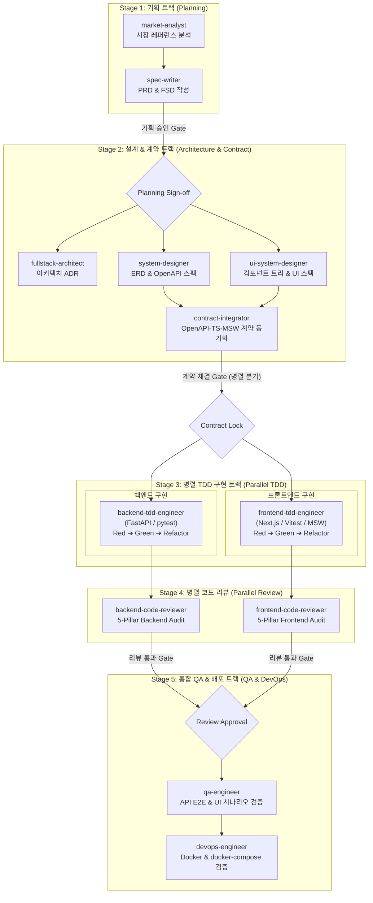

# AGENTS.md - 풀스택 개발팀 엔지니어링 하네스 (Fullstack Team Harness)

본 프로젝트는 기획부터 아키텍처 설계, API 컨트랙트 확정, 프론트/백엔드 병렬 TDD 구현, 코드 리뷰, 통합 QA, 배포 검증까지 **전 과정을 자율적이고 유기적으로 수행하는 풀스택 개발팀 하네스**에 의해 운영됩니다.

---

## 1. 하네스 핵심 원칙 (Core Harness Principles)

1. **하네스 엔지니어링 (Harness Engineering)**:
   - 단일 범용 에이전트가 아닌, 각 도메인별 전문 역할을 담당하는 **12인의 전문 서브에이전트**로 구성된 협업 팀으로 운영됩니다.
2. **독립 산출물 격리 규약 (`docs/{sub-agent}/`)**:
   - 모든 서브에이전트의 산출물은 반드시 `docs/{sub-agent}/` 하위에 규정된 파일명으로만 작성됩니다.
   - 모든 문서는 `docs/templates/`에 사전 정의된 표준 템플릿 구조를 엄격히 준수해야 합니다.
3. **컨트랙트 기반 완벽한 병렬 처리 (Contract-First Parallelization)**:
   - 기획 및 아키텍처 단계 이후 `contract-integrator`가 API 계약(OpenAPI, TypeScript, MSW)을 확정하면, **프론트엔드와 백엔드는 서로를 기다리지 않고 완벽하게 병렬 TDD에 착수**합니다.
4. **엄격한 하드 퀄리티 게이트 (Hard Quality Gates)**:
   - 각 단계는 정의된 필수 산출물과 통과 기준(Exit Criteria)을 충족해야만 다음 단계로 전이됩니다.
5. **언어별 환경변수 및 설정값 Best Practice 준수**:
   - 백엔드는 Python `pydantic-settings` 기반의 타입 세이프한 설정 관리, 프론트엔드는 Zod 기반 런타임 환경변수 검증 규약을 엄격히 적용합니다.
6. **간결하고 기능에 충실한 코드 작성 (Simplicity & Pragmatic Engineering - KISS/YAGNI)**:
   - 불필요하게 복잡한 오버엔지니어링, 과도한 계층 분리, 불필요한 추상화 레이어를 배제하고, 요구사항과 기능에 충실하게 가장 직관적이고 간결한 코드로 구현합니다.

---

## 2. 풀스택 개발팀 조직도 (Fullstack Team Roles)

| 트랙 | 서브에이전트 (`.agents/subagents/`) | 역할 및 책임 | 산출물 디렉토리 |
| :--- | :--- | :--- | :--- |
| **기획** | `market-analyst` | 시장 및 경쟁사 레퍼런스 분석, 킬러 기능 및 페인포인트 도출 | `docs/market-analyst/` |
| | `spec-writer` | 요구사항 정의서(PRD), 모듈러 상세기능정의서(FSD), 비즈니스 정책 | `docs/spec-writer/` |
| **설계 & 계약** | `fullstack-architect` | 풀스택 기술 스택 및 아키텍처 결정 레코드(ADR) 수립 | `docs/fullstack-architect/` |
| | `system-designer` | 백엔드 시스템 설계, ERD 데이터 모델링, RESTful API 규격 | `docs/system-designer/` |
| | `ui-system-designer` | 컴포넌트 계층도, RSC vs RCC 경계, 반응형 브레이크포인트, UI 상태 | `docs/ui-system-designer/` |
| | **`contract-integrator`** | **OpenAPI $\leftrightarrow$ TypeScript/Zod/MSW 핸들러 동기화 (병렬화 허브)** | `docs/contract-integrator/` |
| **병렬 구현** | `backend-tdd-engineer` | FastAPI + pytest TDD (Red ➔ Green ➔ Refactor) | `docs/backend-tdd-engineer/` |
| | `frontend-tdd-engineer` | Next.js + Vitest/RTL 컴포넌트 TDD (Red ➔ Green ➔ Refactor) | `docs/frontend-tdd-engineer/` |
| **리뷰 & 감사** | `backend-code-reviewer` | 백엔드 5-Pillar 코드 품질, 보안, ACID 트랜잭션, 성능 감사 | `docs/backend-code-reviewer/` |
| | `frontend-code-reviewer` | 프론트엔드 5-Pillar 코드 품질, a11y, Web Vitals, 번들 감사 | `docs/frontend-code-reviewer/` |
| **QA & 배포** | `qa-engineer` | API 및 UI E2E 통합 테스트, 시나리오 검증, 회귀 테스트 | `docs/qa-engineer/` |
| | `devops-engineer` | Docker, docker-compose, 환경변수 유효성 검증, 배포 명세 | `docs/devops-engineer/` |

---

## 3. 전체 라이프사이클 및 협업 파이프라인 (7-Stage Pipeline)

---

## 4. 단계별 필수 산출물 및 템플릿 매핑 (`docs/{sub-agent}/`)

모든 에이전트는 `docs/templates/`에 준비된 표준 템플릿을 기반으로 산출물을 작성합니다.

| 단계 | 담당 서브에이전트 | 적용 템플릿 (`docs/templates/`) | 최종 산출물 경로 |
| :--- | :--- | :--- | :--- |
| **Stage 1a** | `market-analyst` | `01_MARKET_BENCHMARK_TEMPLATE.md` | `docs/market-analyst/01_MARKET_BENCHMARK.md` |
| **Stage 1b** | `spec-writer` | `02_PRD_TEMPLATE.md` | `docs/spec-writer/01_PRD.md` |
| | | `03_FUNCTIONAL_SPECIFICATION_INDEX_TEMPLATE.md` | `docs/spec-writer/02_FUNCTIONAL_SPECIFICATION.md` |
| | | `fsd/DOMAIN_FSD_TEMPLATE.md` | `docs/spec-writer/fsd/{DOMAIN}_SPECIFICATION.md` |
| | | `04_POLICY_AND_EDGES_TEMPLATE.md` | `docs/spec-writer/03_POLICIES_AND_EDGES.md` |
| **Stage 2a** | `fullstack-architect` | `05_FULLSTACK_ADR_TEMPLATE.md` | `docs/fullstack-architect/01_ARCHITECTURE_ADR.md` |
| **Stage 2b** | `system-designer` | `06_SYSTEM_DESIGN_TEMPLATE.md` | `docs/system-designer/01_SYSTEM_DESIGN.md` |
| | | (OpenAPI Schema) | `docs/system-designer/02_OPENAPI_SPEC.yaml` |
| **Stage 2c** | `ui-system-designer` | `07_COMPONENT_SPEC_TEMPLATE.md` | `docs/ui-system-designer/01_COMPONENT_SPEC.md` |
| **Stage 2d** | `contract-integrator` | `08_CONTRACT_AND_MSW_TEMPLATE.md` | `docs/contract-integrator/01_CONTRACT_AND_MSW_SPEC.md` |
| **Stage 3a** | `backend-tdd-engineer`| `09_BACKEND_TDD_LOG_TEMPLATE.md` | `docs/backend-tdd-engineer/01_TDD_CYCLE_LOG.md` |
| **Stage 3b** | `frontend-tdd-engineer`| `10_FRONTEND_TDD_LOG_TEMPLATE.md` | `docs/frontend-tdd-engineer/01_TDD_CYCLE_LOG.md` |
| **Stage 4a** | `backend-code-reviewer`| `11_CODE_REVIEW_REPORT_TEMPLATE.md` | `docs/backend-code-reviewer/01_CODE_REVIEW_REPORT.md` |
| **Stage 4b** | `frontend-code-reviewer`| `11_CODE_REVIEW_REPORT_TEMPLATE.md` | `docs/frontend-code-reviewer/01_CODE_REVIEW_REPORT.md` |
| **Stage 5a** | `qa-engineer` | `12_QA_TEST_PLAN_TEMPLATE.md` | `docs/qa-engineer/01_QA_TEST_PLAN.md` |
| | | `13_QA_TEST_REPORT_TEMPLATE.md` | `docs/qa-engineer/02_QA_TEST_REPORT.md` |
| **Stage 5b** | `devops-engineer` | `14_DEPLOYMENT_SPEC_TEMPLATE.md` | `docs/devops-engineer/01_DEPLOYMENT_SPEC.md` |

---

## 5. 상세기능정의서 (FSD) 7대 상세명세 및 8대 UI 표준

`spec-writer`가 작성하는 모든 단위 기능(`FUNC-xxx-001`)은 다음 규격을 반드시 충족해야 합니다.

1. **기본 정보**: 기능 ID, 기능명, 대상 화면 코드(`SCR-xxx`), 우선순위(Must/Should), 관련 액터
2. **사전 조건 (Pre-conditions)**: 선행 데이터 상태 및 사용자 권한
3. **인터랙션 흐름 & Mermaid 플로우차트**: 사용자 액션 $\rightarrow$ 시스템 검증 $\rightarrow$ 분기 처리 $\rightarrow$ 화면 피드백 단계별 텍스트 및 `flowchart TD` 다이어그램 필수
4. **UI 데이터 항목 명세 (8대 표준 컬럼)**:
   - `[항목명 | 화면 표시/입력 | UI 컴포넌트 | 필수 여부 | 데이터 타입/제약 | 기본값 | 유효성 검증 규칙 | 노출/수정 조건]`
5. **비즈니스 규칙 (Business Rules)**: 정책 수식, 한도, 중복 방지 규칙
6. **예외 처리 및 엣지 케이스 (Edge Cases)**: 네트워크 장애, 연타 방지, 빈 화면(Empty State) 대응 가이드
7. **비즈니스 에러 코드 매핑**: 프론트엔드/API 표준 에러 코드 매핑
