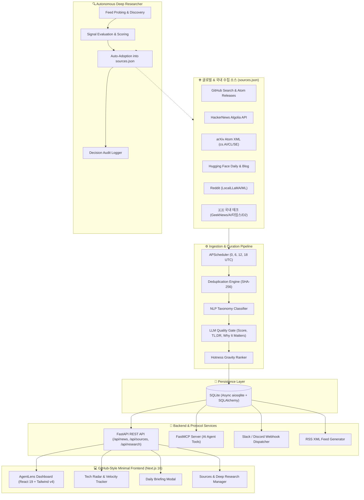

<div align="center">

# 🔭 AgentLens (에이전트렌즈)

**전세계 AI 뉴스 · Agent 기술 · 최신 하네스(Harness) 방법론 · MCP & Skills 생태계 큐레이션 플랫폼**

[](https://github.com/ozplayground/agent-lens/releases)
[](https://opensource.org/licenses/Apache-2.0)
[](https://nextjs.org/)
[](https://react.dev/)
[](https://fastapi.tiangolo.com/)
[](https://www.python.org/)
[](https://www.typescriptlang.org/)
[](https://tailwindcss.com/)
[](https://modelcontextprotocol.io/)
[](./scripts/test.sh)

<p align="center">
  <a href="#-핵심-특징">핵심 특징</a> •
  <a href="#-시스템-아키텍처">시스템 아키텍처</a> •
  <a href="#-자율-딥-리서치-autonomous-deep-research">자율 딥 리서치</a> •
  <a href="#-빠른-시작-quick-start">빠른 시작</a> •
  <a href="#-설정-및-수집원-관리">설정 & 수집원 관리</a> •
  <a href="#-mcp-model-context-protocol-연동">MCP 연동</a> •
  <a href="#-개발-및-버전-관리-하네스">개발 하네스</a>
</p>

</div>

---

## 💡 프로젝트 소개

**AgentLens**는 급변하는 인공지능과 자율 에이전트(Autonomous Agent) 생태계에서 개발자와 연구자에게 가장 중요한 기술적 시그널을 선별해 제공하는 **전문 큐레이션 & 애그리게이터 플랫폼**입니다.

단순한 일반 IT 뉴스를 넘어, **에이전트 평가 하네스(SWE-bench 등), 모델 컨텍스트 프로토콜(MCP), 멀티에이전트 오케스트레이션, 국내외 핵심 테크 연구**를 매일 4회(0, 6, 12, 18시 UTC) 정밀 수집하고 지능적으로 분류·랭킹합니다. 또한 **자율 딥 리서치 엔진(Autonomous Deep Research Engine)**을 통해 전세계의 유망한 신규 소스를 백엔드에서 스스로 발굴·검증하여 수집망에 편입합니다.

---

## ✨ 핵심 특징

### 1. 🎯 4대 핵심 테크 카테고리 자동 분류
- **하네스 & 벤치마크 (`harness`)**: SWE-bench Verified, GAIA, WebArena 등 에이전트 평가 하네스, 스캐폴딩, 격리 샌드박스 런타임, 회귀 테스트 방법론
- **MCP & Skills & Plugins (`mcp_plugins_skills`)**: Anthropic Model Context Protocol(MCP) 공식 서버/클라이언트 릴리즈, Tool Calling, Function Calling, 에이전트 스킬 플러그인 생태계
- **에이전트 기술 (`agent_tech`)**: LangGraph, CrewAI, AutoGen 등 Multi-Agent 아키텍처, 에이전트 메모리 시스템, Browser/Computer-Use
- **최신 AI 소식 (`ai_news`)**: OpenAI, Claude, Gemini, DeepSeek 등 프론티어 LLM 및 최신 추론(Reasoning) 모델 브레이크스루

### 2. 🧠 지능형 LLM 큐레이션 & 품질 게이트 (Quality Gate)
- **품질 필터링 (Score < 5.0 자동 제외)**: 단순 마케팅/홍보/클릭베이트를 사전 차단하고 엔지니어링 가치가 높은 소식만 선별
- **3줄 핵심 요약 (TL;DR)**: 기술적 맥락, 활용 모델, 핵심 벤치마크/성과 3개 불릿으로 압축
- **💡 개발자 시사점 (Why It Matters)**: 에이전트 엔지니어 입장에서 왜 이 소식이 중요한지 1~2문장 인사이트 제공
- **기술 스택 & 모델 자동 태깅**: SWE-bench, Claude 3.7, FastMCP, vLLM 등 관련 엔티티 자동 추출
- **멀티 LLM 런타임 지원**: Gemini / OpenAI / Ollama(로컬) 및 무설정 제로 비용 휴리스틱 엔진 완비

### 3. 🔍 자율 딥 리서치 엔진 (Autonomous Deep Research Engine)
- **백엔드 주기적 심층 조사**: 최신 AI/에이전트 관련 사이트, 블로그, GitHub 레포지토리, RSS 피드를 자율 탐색
- **다단계 소스 검증**: Feed Discovery → HTTP Probe → Signal Evaluation → 신뢰도/품질 채점
- **자율 수집원 편입 (Auto-Adoption)**: 임계 점수(7.0 이상)를 통과한 검증된 소스를 `sources.json`에 자율 추가
- **결정 감사 로그 (Decision Audit Log)**: 채점 근거, 채택/기각 사유를 UI에서 투명하게 실시간 열람

### 4. 🔥 실시간 에이전트 Tech Radar & Velocity 트래커
- **실시간 기술 트렌드 시각화**: 수집된 아티클에서 가장 핫하게 언급되는 기술 스택 빈도수 및 최근 24시간 증가율(Velocity) 추적
- **4대 영역별 점유율**: Harness, Tooling, Models, Infra 카테고리별 비중 분포
- **원클릭 필터링**: 급상승 기술 태그 클릭 시 해당 기술 소식만 즉시 필터링

### 5. 🌅 오늘의 AI 브리핑 & 💬 대화형 Ask AI
- **1분 AI 브리핑 리포트**: 지난 24시간 핵심 트렌드를 분석한 Executive Summary 리포트 (마크다운 복사 및 다운로드 지원)
- **Ask AI 심층 질의응답**: 각 아티클 카드마다 AI에게 "우리 팀 프로젝트에 어떻게 도입할 수 있나요?" 등 실시간 질의 가능

### 6. 🎨 GitHub 스타일 미니멀 다크 모드 UI
- 개발자에게 가장 친숙하고 가독성이 뛰어난 GitHub Dark Palette 기반의 고밀도 레이아웃
- 불필요한 색상 과시를 배제하고 기술 정보와 시그널에만 집중할 수 있는 엔지니어링 중심 설계

### 7. 🧹 원클릭 데이터 리셋 & 클린 재수집
- 웹 UI 설정 모달 및 터미널 명령어(`make reset`)를 통해 데이터베이스를 초기화하고 즉시 클린 재수집 실행

### 8. 🔔 슬랙 & 디스코드 웹훅 알림 (Webhook Dispatcher)
- 매일 정기 브리핑 발행 시 및 `⭐️ Must Read` 특종 수집 시 Slack Block Kit / Discord Embed 서식으로 자동 푸시 전송

### 9. ⏰ 0 · 6 · 12 · 18시 쿼드 크론 자동 수집기
- **정기 크론 스케줄링**: 매일 `00:00`, `06:00`, `12:00`, `18:00` (UTC 기준, 하루 4회) 백그라운드 자동 수집
  *(한국 시간 KST: 09:00, 15:00, 21:00, 03:00)*
- **온디맨드 즉시 수집**: 웹 UI 상단 `즉시 수집` 버튼 또는 CLI `make collect`로 언제든 실시간 스트리밍 수집 가능

### 10. 🔌 FastMCP 서버 내장 (Claude Desktop / Cursor 연동)
- AgentLens 자체가 **Model Context Protocol(MCP) 서버**로 동작하여, Claude Desktop이나 AI 코딩 에이전트가 직접 최신 하네스 방법론과 MCP 소식을 쿼리할 수 있는 전용 도구(Tool) 제공


---

## 🏗️ 시스템 아키텍처



---

## 🔍 자율 딥 리서치 (Autonomous Deep Research)

AgentLens는 고정된 수집원에 머무르지 않고, 백엔드에서 정기적으로 웹을 탐색하여 양질의 신규 소스를 자율 발굴합니다.

```
[후보 소스 탐색] ──> [RSS/Atom 자동 추출] ──> [신호 강도 & 최신성 검증] ──> [품질 채점 (≥7.0)] ──> [sources.json 자동 편입]
```

- **발굴 대상**: GitHub 유망 에이전트 리포지토리 릴리즈, 핵심 AI 연구자 블로그, 신생 테크 미디어
- **다단계 검증 파이프라인**:
  1. **HTTP Probe**: RSS/Atom XML 엔드포인트 도달 가능성 및 포맷 유효성 검증
  2. **Signal Density**: 최근 30일 내 업데이트 주기, 에이전트/하네스/MCP 전문 키워드 밀도 채점
  3. **Auto Adoption**: 평가 점수 7.0 이상 통과 시 `sources.json`의 활성 피드로 자동 승격
- **결정 감사 로그 (Audit Log)**: 모든 탐색 이력과 채택/기각 판단 근거는 웹 UI 상단 **수집원 관리 > 딥 리서치 엔진** 탭에서 실시간 확인 가능합니다.

---

## 📡 수집 대상 생태계 (`sources.json`)

수집 대상 목록은 코드 수정 없이 [sources.json](sources.json)에서 언제든 켜고 끄거나 추가할 수 있습니다.

| 분류 | 대상 소스 | 성격 및 수집 내용 |
|---|---|---|
| **🇰🇷 국내 테크** | GeekNews (긱뉴스) | 국내 1위 개발자·AI 트렌드 큐레이션 커뮤니티 |
| | AI타임스 | 국내 최대 인공지능 전문 뉴스 미디어 |
| | 요즘IT | 실무 개발자 기술 칼럼 및 AI 트렌드 |
| | 네이버 D2 | 네이버 AI 연구 및 엔지니어링 테크 블로그 |
| | 토스 테크 | 토스 개발팀 기술 피드 |
| **🎯 하네스/MCP 릴리즈** | SWE-bench Official | 에이전트 벤치마크/테스트 하네스 공식 GitHub Atom |
| | Model Context Protocol | Anthropic 공식 MCP 서버 및 도구 릴리즈 |
| | LangGraph Engine | 멀티에이전트 런타임 및 오케스트레이션 릴리즈 |
| | CrewAI Autonomous Agents | 자율 에이전트 프레임워크 릴리즈 |
| **🌐 글로벌 블로그/연구** | Hugging Face Blog | 오픈소스 모델, 벤치마크, 에이전트 연구 |
| | Interconnects (Nathan Lambert) | AI 벤치마크, RL 에이전트, 사후학습 심층 분석 |
| | Simon Willison Weblog | MCP, 프롬프트 엔지니어링, LLM 도구 활용 전문 |
| | OpenAI News / LangChain / Latent Space | 공식 모델 발표, 프레임워크 아키텍처 분석 |
| **🔍 글로벌 플랫폼 API** | HackerNews / Reddit / arXiv / HF Papers | 실시간 커뮤니티 디스커션 및 최신 등록 연구 논문 |

---

## 🚀 빠른 시작 (Quick Start)

### 1. 사전 요구사항
- Node.js 20+ 및 `pnpm`
- Python 3.11+ 및 `uv` (또는 `pip`)

### 2. 환경 셋업
```bash
# 가상환경 생성 및 백엔드/프론트엔드 의존성 일괄 설치
make setup
```

### 3. 하네스 테스트 검증
```bash
# 백엔드 Pytest (39건 전체) 및 프론트엔드 TypeScript 정적 검증
make test
```

### 4. 개발 서버 실행
```bash
# 백엔드(:8000)와 프론트엔드(:3001) 동시 기동
make dev
```
- **웹 대시보드**: [http://localhost:3001](http://localhost:3001)
- **API Swagger 문서**: [http://localhost:8000/docs](http://localhost:8000/docs)
- **RSS 피드**: [http://localhost:8000/api/news/feed/rss.xml](http://localhost:8000/api/news/feed/rss.xml)

### 5. CLI 데이터 관리 유틸리티
```bash
# 1. 터미널에서 즉시 전세계 수집 사이클 실행
make collect

# 2. 데이터베이스 초기화 및 즉시 클린 재수집 실행
make reset
```

---

## ⚙️ 설정 및 수집원 관리

AgentLens는 모든 설정을 코드와 완전히 분리된 JSON 파일로 관리합니다:

### 1. `config.json` (런타임 및 LLM 설정)
```json
{
  "app": {
    "project_name": "AgentLens",
    "version": "1.0.1",
    "host": "0.0.0.0",
    "port": 8000,
    "frontend_port": 3001,
    "database_url": "sqlite+aiosqlite:///./agentlens.db"
  },
  "llm": {
    "provider": "auto",
    "gemini_api_key": "",
    "gemini_model": "gemini-flash-latest",
    "openai_api_key": "",
    "ollama_base_url": "http://localhost:11434",
    "quality_cutoff_score": 5.0,
    "high_signal_threshold": 7.0
  },
  "scheduler": {
    "enabled": true,
    "crawl_hours": [0, 6, 12, 18],
    "timezone": "UTC"
  },
  "webhooks": {
    "slack_webhook_url": "",
    "discord_webhook_url": ""
  }
}
```

### 2. `sources.json` (수집 소스 및 딥 리서치 DB)
- RSS 피드, GitHub Atom, 플랫폼 API 소스의 활성화/비활성화, 수집 주기, 태그를 웹 UI 및 JSON을 통해 직접 제어할 수 있습니다.

---

## 🔌 MCP (Model Context Protocol) 연동

AgentLens는 자체 MCP 서버를 탑재하여, **Claude Desktop**, **Cursor**, **Antigravity** 등 외부 AI 코딩 에이전트가 직접 최신 하네스/MCP 정보를 도구로 쿼리할 수 있습니다.

### 설정 방법 (`claude_desktop_config.json`)
```json
{
  "mcpServers": {
    "agentlens": {
      "command": "python",
      "args": ["-m", "app.mcp.server"],
      "cwd": "/absolute/path/to/agentlens/backend"
    }
  }
}
```

### 제공되는 MCP Tools
- `get_latest_harness_methods(limit)`: SWE-bench, 샌드박스 평가, 테스트 하네스 최신 소식 조회
- `get_mcp_and_skills_ecosystem(limit)`: 트렌딩 MCP 서버, 스킬 플러그인, 도구 호출 스펙 조회
- `search_agent_news(query, category, limit)`: 키워드 및 카테고리별 글로벌 AI 소식 검색
- `trigger_agentlens_crawl()`: 전세계 소스 즉시 수집 트리거

---

## 📂 프로젝트 구조

```
agentlens/
├── AGENTS.md                     # 에이전트 개발 하네스 가이드 및 규약
├── Makefile                      # 프로젝트 하네스 CLI 엔트리포인트 (setup, dev, test, reset)
├── README.md                     # 프로젝트 종합 문서
├── config.json                   # 애플리케이션, LLM, 크롤러 통합 설정
├── sources.json                  # 외부 수집 소스 정의 및 자율 리서치 DB
├── .env.example                  # 환경 변수 템플릿
├── LICENSE                       # Apache License Version 2.0
├── docs/                         # 기획 및 설계 하네스 문서
│   ├── prd.md                   # 요구사항 정의서 (PRD)
│   └── architecture.md          # 시스템 및 데이터 아키텍처
├── scripts/                      # 하네스 자동화 스크립트
│   ├── dev.sh                   # 프론트(:3001) + 백엔드(:8000) 동시 기동
│   ├── test.sh                  # Pytest(39건) + TypeScript 타입 검증
│   └── test_headless_browser.mjs# 헤드리스 브라우저 E2E 검증 스크립트
├── backend/                      # Python FastAPI 백엔드 & 수집기
│   ├── app/
│   │   ├── main.py              # FastAPI 앱 엔트리포인트 및 라이프사이클
│   │   ├── config.py            # JSON/환경변수 동적 로더
│   │   ├── database.py          # SQLAlchemy 비동기 DB 엔진
│   │   ├── scheduler.py         # 0, 6, 12, 18시 APScheduler 크론
│   │   ├── mcp/server.py        # FastMCP 서버
│   │   ├── models/news.py       # NewsItem, CrawlLog 모델
│   │   ├── schemas/news.py      # Pydantic 데이터 검증 스키마
│   │   ├── collectors/          # 소스별 수집기, 중복 제거, 카테고라이저
│   │   ├── services/            # 핵심 비즈니스 로직
│   │   │   ├── deep_researcher.py  # ⭐️ 자율 딥 리서치 & 자동 편입 엔진
│   │   │   ├── source_researcher.py# URL 탐색 및 신호 평가기
│   │   │   ├── sources_service.py  # sources.json CRUD 관리자
│   │   │   ├── llm_processor.py    # LLM 품질 게이트 & 요약 엔진
│   │   │   ├── briefing_service.py # 일일 브리핑 리포트 생성기
│   │   │   ├── trend_service.py    # Tech Radar Velocity 분석기
│   │   │   └── webhook_service.py  # Slack/Discord 웹훅 디스패처
│   │   └── api/                 # REST API 엔드포인트 라우터
│   └── tests/                   # 39개 통합/단위 테스트 슈트
└── frontend/                     # Next.js 16 프론트엔드 대시보드
    ├── src/
    │   ├── app/
    │   │   ├── page.tsx         # 메인 피드 대시보드
    │   │   └── layout.tsx       # GitHub 스타일 다크 테마 레이아웃
    │   └── components/
    │       ├── Header.tsx       # 네비게이션, 라이브 상태, 즉시 수집
    │       ├── NewsCard.tsx     # TL;DR, Why It Matters, Ask AI 카드
    │       ├── TechRadar.tsx    # 에이전트 기술 레이더 & Velocity
    │       ├── SourcesModal.tsx # ⭐️ 수집원 관리 & 딥 리서치 감사 로그 모달
    │       ├── DailyBriefingModal.tsx # 오늘의 AI 브리핑 모달
    │       ├── NewsDetailModal.tsx    # 소식 상세 및 원문 링크 모달
    │       ├── WebhookSettingsModal.tsx# 웹훅 설정 모달
    │       └── McpModal.tsx     # MCP 클라이언트 연동 모달
    └── package.json
```

---

## 🛠️ 개발 및 버전 관리 하네스

AgentLens는 안정적인 품질 유지와 체계적인 배포 관리를 위해 [AGENTS.md](AGENTS.md)에 정의된 **개발 하네스 규약**을 엄격히 준수합니다:

1. **작업 브랜치 기반 개발**: 모든 기능 구현 및 수정은 반드시 작업 브랜치(`feat/*`, `fix/*`, `docs/*` 등)를 생성하여 진행합니다.
2. **`main` 브랜치 보호**: 자체 하네스 검증(`make test`) 통과 후, **사용자(USER)의 직접 테스트 및 명시적 지시가 있을 때만** `main` 브랜치로 머지합니다.
3. **버전 관리 체계 (Semantic Versioning `1.11.111` 형식)**:
   - **Patch (+0.0.1)**: 단일 작업/태스크 완료, 문서 업데이트, 버그 수정 시 증가
   - **Minor (+0.1.0)**: 완결된 새로운 기능(Feature) 추가 시 증가 (Patch 0 리셋)
   - **Major (+1.0.0)**: 아키텍처 개편 및 대규모 업데이트 시 증가 (Minor, Patch 0 리셋)
4. **릴리즈 및 태그 생성**: `main` 브랜치 머지 및 정식 릴리즈 시점마다 GitHub 태그(예: `v1.0.0`) 및 GitHub Release를 발행합니다.

---

## 📄 라이선스 (License)

이 프로젝트는 [Apache License Version 2.0](LICENSE)에 따라 배포됩니다.
자유롭게 사용, 수정, 배포할 수 있으며 자세한 내용은 [LICENSE](LICENSE) 파일을 참조하세요.
