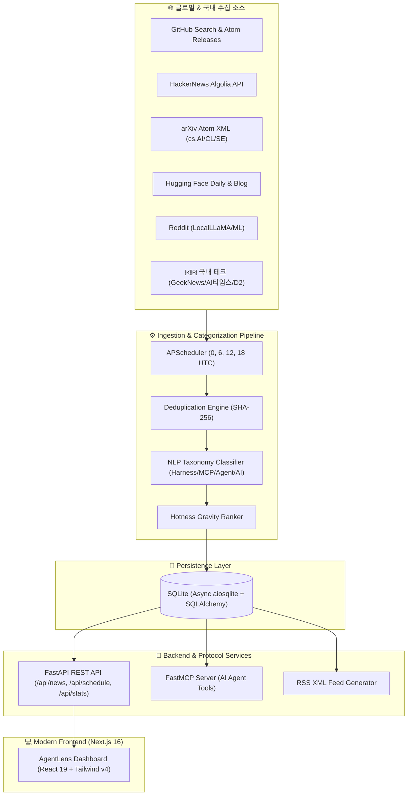

<div align="center">

# 🔭 AgentLens (에이전트렌즈)

**전세계 AI 뉴스 · Agent 기술 · 최신 하네스(Harness) 방법론 · MCP & Skills 생태계 큐레이션 플랫폼**

[](https://nextjs.org/)
[](https://react.dev/)
[](https://fastapi.tiangolo.com/)
[](https://www.python.org/)
[](https://www.typescriptlang.org/)
[](https://tailwindcss.com/)
[](https://modelcontextprotocol.io/)

<p align="center">
  <a href="#-핵심-특징">핵심 특징</a> •
  <a href="#-시스템-아키텍처">시스템 아키텍처</a> •
  <a href="#-수집-대상-생태계">수집 대상 생태계</a> •
  <a href="#-빠른-시작-quick-start">빠른 시작</a> •
  <a href="#-mcp-model-context-protocol-연동">MCP 연동</a> •
  <a href="#-프로젝트-구조">프로젝트 구조</a>
</p>

</div>

---

## 💡 프로젝트 소개

**AgentLens**는 급변하는 인공지능과 자율 에이전트(Autonomous Agent) 생태계에서 개발자와 연구자에게 가장 중요한 시그널을 선별해 제공하는 **전문 큐레이션 & 애그리게이터 플랫폼**입니다.

단순한 일반 IT 뉴스를 넘어, **에이전트 평가 하네스(SWE-bench 등), 모델 컨텍스트 프로토콜(MCP), 멀티에이전트 오케스트레이션, 국내외 핵심 테크 연구**를 매일 4회(0, 6, 12, 18시 UTC) 정밀 수집하고 지능적으로 분류·랭킹합니다.

---

## ✨ 핵심 특징

### 1. 🎯 4대 핵심 테크 카테고리 자동 분류
- **하네스 & 벤치마크 (`harness`)**: SWE-bench Verified, GAIA, WebArena 등 에이전트 평가 하네스, 스캐폴딩, 격리 샌드박스 런타임, 회귀 테스트 방법론
- **MCP & Skills & Plugins (`mcp_plugins_skills`)**: Anthropic Model Context Protocol(MCP) 공식 서버/클라이언트 릴리즈, Tool Calling, Function Calling, 스킬 플러그인 생태계
- **에이전트 기술 (`agent_tech`)**: LangGraph, CrewAI, AutoGen 등 Multi-Agent 아키텍처, 에이전트 메모리 시스템, Browser/Computer-Use
- **최신 AI 소식 (`ai_news`)**: OpenAI, Claude, Gemini, DeepSeek 등 프론티어 LLM 및 최신 추론(Reasoning) 모델 브레이크스루

### 2. 🧠 지능형 LLM 큐레이션 & 품질 게이트 (Quality Gate)
- **품질 필터링 (Score < 5.0 자동 제외)**: 단순 마케팅/홍보/클릭베이트를 사전 차단하고 엔지니어링 가치가 높은 소식만 선별
- **3줄 핵심 요약 (TL;DR)**: 기술적 맥락, 활용 모델, 핵심 벤치마크/성과 3개 불릿으로 압축
- **💡 개발자 시사점 (Why It Matters)**: 에이전트 엔지니어 입장에서 왜 이 소식이 중요한지 1~2문장 인사이트 제공
- **기술 스택 & 모델 자동 태깅**: SWE-bench, Claude 3.7, FastMCP, vLLM 등 관련 엔티티 자동 추출

### 3. 🔥 실시간 에이전트 Tech Radar & Velocity 트래커
- **실시간 기술 트렌드 시각화**: 수집된 아티클에서 가장 핫하게 언급되는 기술 스택 빈도수 및 최근 24시간 증가율(Velocity) 추적
- **4대 영역별 점유율**: Harness, Tooling, Models, Infra 카테고리별 비중 분포
- **원클릭 필터링**: 급상승 기술 태그 클릭 시 해당 기술 소식만 즉시 필터링

### 4. 🌅 오늘의 AI 브리핑 & 💬 대화형 Ask AI
- **1분 AI 브리핑 리포트**: 지난 24시간 핵심 트렌드를 분석한 Executive Summary 리포트 (마크다운 복사 및 다운로드 지원)
- **Ask AI 심층 질의응답**: 각 아티클 카드마다 AI에게 "우리 팀 프로젝트에 어떻게 도입할 수 있나요?" 등 실시간 질의 가능

### 5. 🔔 슬랙 & 디스코드 웹훅 알림 (Webhook Dispatcher)
- 매일 정기 브리핑 발행 시 및 `⭐️ Must Read` 특종 수집 시 Slack Block Kit / Discord Embed 서식으로 자동 푸시 전송

### 6. ⏰ 0 · 6 · 12 · 18시 쿼드 크론 자동 수집기
- **정기 크론 스케줄링**: 매일 `00:00`, `06:00`, `12:00`, `18:00` (UTC 기준, 하루 4회) 백그라운드 자동 수집
  *(한국 시간 KST: 09:00, 15:00, 21:00, 03:00)*
- **온디맨드 즉시 수집**: 웹 UI 상단 `즉시 수집` 버튼 또는 CLI `make collect`로 언제든 실시간 수집 가능

### 7. 🇰🇷 글로벌 + 국내 주요 테크 피드 융합
- 해외 커뮤니티(HackerNews, Reddit)와 논문(arXiv), 허브(GitHub, Hugging Face)뿐만 아니라, **GeekNews(긱뉴스), AI타임스, 요즘IT, 네이버 D2, 토스 테크** 등 국내 양질의 소식을 탭 하나로 분리·통합 조회 가능

### 8. 🔌 FastMCP 서버 내장 (Claude Desktop / Cursor 연동)
- AgentLens 자체가 **Model Context Protocol(MCP) 서버**로 동작하여, Claude Desktop이나 AI 코딩 에이전트가 직접 최신 하네스 방법론과 MCP 소식을 쿼리할 수 있는 전용 도구(Tool) 제공

---

## 🏗️ 시스템 아키텍처



---

## 📡 수집 대상 생태계 (`sources.json`)

수집 대상 목록은 코드 수정 없이 [`backend/app/config/sources.json`](backend/app/config/sources.json)에서 유연하게 추가 및 관리할 수 있습니다.

| 분류 | 대상 소스 | 성격 및 수집 내용 |
|---|---|---|
| **🇰🇷 국내 테크** | GeekNews (긱뉴스) | 국내 1위 개발자·AI 트렌드 큐레이션 커뮤니티 |
| | AI타임스 | 국내 최대 인공지능 전문 뉴스 미디어 |
| | 요즘IT | 실무 개발자 기술 칼럼 및 AI 트렌드 |
| | 네이버 D2 | 네이버 AI 연구 및 엔지니어링 테크 블로그 |
| | 토스 테크 | 토스 개발팀 기술 피드 |
| **🎯 하네스/MCP 릴리즈** | SWE-bench Official | 에이전트 벤치마크/테스트 하네스 공식 GitHub Atom |
| | Model Context Protocol | Anthropic 공식 MCP 서버 및 도구 릴리즈 |
| | LangGraph Engine | 멀티에이전트 런타임 및 오케스트레이션 릴리즈 |
| | CrewAI Autonomous Agents | 자율 에이전트 프레임워크 릴리즈 |
| **🌐 글로벌 블로그/연구** | Hugging Face Blog | 오픈소스 모델, 벤치마크, 에이전트 연구 |
| | Interconnects (Nathan Lambert) | AI 벤치마크, RL 에이전트, 사후학습 심층 분석 |
| | Simon Willison Weblog | MCP, 프롬프트 엔지니어링, LLM 도구 활용 전문 |
| | OpenAI News / LangChain / Latent Space | 공식 모델 발표, 프레임워크 아키텍처 분석 |
| **🔍 글로벌 플랫폼 API** | HackerNews / Reddit / arXiv / HF Papers | 실시간 커뮤니티 디스커션 및 최신 등록 연구 논문 |

---

## 🚀 빠른 시작 (Quick Start)

### 1. 사전 요구사항
- Node.js 20+ 및 `pnpm`
- Python 3.11+ 및 `uv` (또는 `pip`)

### 2. 환경 셋업
```bash
# 가상환경 생성 및 백엔드/프론트엔드 의존성 일괄 설치
make setup
```

### 3. 하네스 테스트 검증
```bash
# 백엔드 Pytest (13건) 및 프론트엔드 TypeScript 정적 검증
make test
```

### 4. 개발 서버 실행
```bash
# 백엔드(:8000)와 프론트엔드(:3000) 동시 기동
make dev
```
- **웹 대시보드**: [http://localhost:3000](http://localhost:3000)
- **API Swagger 문서**: [http://localhost:8000/docs](http://localhost:8000/docs)
- **RSS 피드**: [http://localhost:8000/api/news/feed/rss.xml](http://localhost:8000/api/news/feed/rss.xml)

### 5. CLI를 통한 즉시 데이터 수집
```bash
# 서버 없이 터미널에서 즉시 글로벌 수집 사이클 실행
make collect
```

---

## 🔌 MCP (Model Context Protocol) 연동

AgentLens는 자체 MCP 서버를 탑재하여, **Claude Desktop**, **Cursor**, **Antigravity** 등 외부 AI 에이전트가 직접 도구로 최신 정보를 쿼리할 수 있습니다.

### 설정 방법 (`claude_desktop_config.json`)
```json
{
  "mcpServers": {
    "agentlens": {
      "command": "python",
      "args": ["-m", "app.mcp.server"],
      "cwd": "/absolute/path/to/agentlens/backend"
    }
  }
}
```

### 제공되는 MCP Tools
- `get_latest_harness_methods(limit)`: SWE-bench, 샌드박스 평가, 테스트 하네스 최신 소식 조회
- `get_mcp_and_skills_ecosystem(limit)`: 트렌딩 MCP 서버, 스킬 플러그인, 도구 호출 스펙 조회
- `search_agent_news(query, category, limit)`: 키워드 및 카테고리별 글로벌 AI 소식 검색
- `trigger_agentlens_crawl()`: 전세계 소스 즉시 수집 트리거

---

## 📂 프로젝트 구조

```
agentlens/
├── AGENTS.md                     # 에이전트 개발 하네스 가이드라인
├── Makefile                      # 프로젝트 하네스 CLI 엔트리포인트
├── README.md                     # 프로젝트 종합 문서
├── docs/                         # 기획 및 설계 하네스 문서
│   ├── prd.md                   # 요구사항 정의서 (PRD)
│   └── architecture.md          # 시스템 및 데이터 아키텍처
├── scripts/                      # 하네스 자동화 스크립트
│   ├── dev.sh                   # 프론트+백엔드 동시 실행 스크립트
│   └── test.sh                  # Pytest + Typecheck 통합 검증 스크립트
├── backend/                      # Python FastAPI 백엔드 & 수집기
│   ├── app/
│   │   ├── main.py              # FastAPI 앱 엔트리포인트 및 라이프사이클
│   │   ├── config.py            # 환경 설정
│   │   ├── database.py          # SQLAlchemy 비동기 DB 설정
│   │   ├── config/sources.json  # ⭐️ 수집 소스 중앙 관리 설정 파일
│   │   ├── models/news.py       # NewsItem 및 CrawlLog DB 모델
│   │   ├── schemas/news.py      # Pydantic 입출력 스키마
│   │   ├── collectors/
│   │   │   ├── manager.py       # 수집 오케스트레이터 및 중복 제거
│   │   │   ├── categorizer.py   # 다국어 NLP 카테고리 분류기 & Hotness 계산기
│   │   │   └── sources/         # GitHub, HN, arXiv, HF, Reddit, RSS 수집기
│   │   ├── scheduler.py         # 0, 6, 12, 18시 APScheduler 크론
│   │   ├── mcp/server.py        # FastMCP 서버
│   │   └── api/                 # REST API 라우터 (/news, /schedule, /stats, /mcp)
│   ├── tests/                   # Pytest 테스트 슈트 (13건)
│   └── requirements.txt
└── frontend/                     # Next.js 16 프론트엔드 대시보드
    ├── src/
    │   ├── app/
    │   │   ├── page.tsx         # 메인 피드 대시보드
    │   │   ├── layout.tsx       # 다크 테마 레이아웃
    │   │   └── globals.css      # Tailwind v4 스타일
    │   ├── components/
    │   │   ├── Header.tsx       # 헤더, 카운트다운 타이머, 즉시 수집 트리거
    │   │   ├── CategoryFilter.tsx # 4대 카테고리 필터 탭
    │   │   ├── SourceFilter.tsx # 국내 테크 / GitHub / arXiv 등 소스 필터
    │   │   ├── NewsCard.tsx     # 핫니스 뱃지 및 메타데이터 카드
    │   │   ├── ScheduleModal.tsx# 수집 스케줄 현황 모달
    │   │   └── McpModal.tsx     # MCP 연동 가이드 모달
    │   └── lib/api.ts           # 백엔드 연동 클라이언트
    └── package.json
```

---

## 📄 라이선스 (License)

이 프로젝트는 [MIT License](LICENSE)에 따라 자유롭게 사용 및 수정할 수 있습니다.
