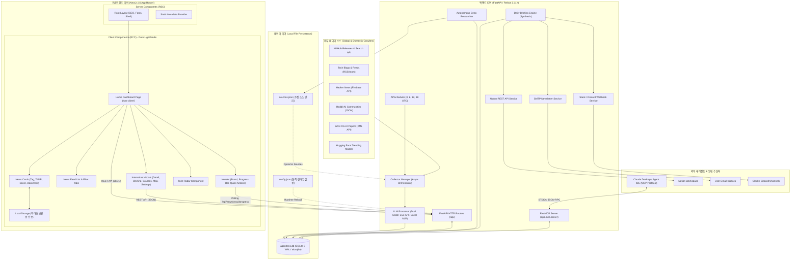

# [ADR-001] 풀스택 시스템 아키텍처 및 핵심 기술 스택 결정 레코드

- **작성일자**: 2026-09-16
- **작성자**: 풀스택 아키텍트 (`fullstack-architect`)
- **문서 버전**: v2.1
- **상태**: APPROVED
- **영향 범위**: Frontend (Next.js 16 App Router, Pure Light Theme), Backend (FastAPI, FastMCP), Database (SQLite 3 WAL / aiosqlite), Deployment (Docker Compose)

---

## 1. 배경 및 컨텍스트 (Context & Problem Statement)

AgentLens는 전세계 AI 에이전트, 하네스(Harness) 엔지니어링, MCP(Model Context Protocol) 및 스킬 생태계 소식을 수집·정제·브리핑하는 차세대 뉴스 인텔리전스 플랫폼입니다. 기획 산출물([`01_PRD.md`](file:///Users/wonyoung/workspace/ozplayground/agentlens/docs/spec-writer/01_PRD.md), [`02_FUNCTIONAL_SPECIFICATION.md`](file:///Users/wonyoung/workspace/ozplayground/agentlens/docs/spec-writer/02_FUNCTIONAL_SPECIFICATION.md))에 명시된 기능 및 비기능 요구사항을 달성하기 위해 풀스택 시스템 아키텍처와 기술 스택을 결정합니다.

### 핵심 시스템 요구사항
1. **점진적 파이프라인 수집 및 듀얼 모드 지능화**: 6대 소스(GitHub, RSS, Reddit, Hacker News, arXiv, Hugging Face) 수집과 LLM 기반의 3줄 요약, 핵심 시사점, 5점 척도 품질 평가. 외부 LLM API 키 미제공 시에도 로컬 휴리스틱 NLP로 즉각 폴백(Graceful Degradation) 지원.
2. **다채널 브리핑 및 실시간 AI 대화**: 일일 마크다운 종합 브리핑 자동 합성, Notion 워크스페이스·SMTP 이메일·Slack/Discord 웹훅 연동, 개별 기사 대상 Ask AI(RAG 질의응답).
3. **독립 에이전트 네이티브 인터페이스**: Claude Desktop 등 AI 에이전트가 직접 도구(Tools)를 호출할 수 있는 로컬 FastMCP(Model Context Protocol) 서버 내장.
4. **로컬 원클릭 실행(Zero-Config) 및 경량화**: Docker Compose 또는 로컬 가상환경에서 외부 브로커(Redis/RabbitMQ)나 외부 클라우드 DB 없이 즉시 구동.
5. **KISS 원칙 기반의 UI/UX 극대화**: 불필요한 런타임 분기와 상태 복잡도를 제거하고, 정보 전달력과 가독성에 집중된 GitHub 스타일 순수 라이트 모드(Pure Light Theme) 고정.

---

## 2. 고려된 기술 스택 후보군 및 결정 매트릭스 (Considered Alternatives)

| 계층 | 최종 선정안 (Selected) | 대안 후보 (Alternative) | 트레이드오프 분석 및 선정 사유 |
| :--- | :--- | :--- | :--- |
| **Frontend Framework** | **Next.js 16 (React 19, App Router)** | Vite + React SPA | Next.js App Router는 정적 레이아웃/메타데이터의 Server Components(RSC) 최적화와 인터랙티브 클라이언트(RCC) 분리가 용이하며, 향후 SSR/SEO 확장성 및 Turbopack 기반의 고속 빌드를 지원함. |
| **UI 테마 & 스타일링** | **Tailwind CSS v4 (GitHub 스타일 Pure Light Theme 고정)** | 다크/라이트 멀티 테마 토글 (CSS Modules / Tailwind dark variant) | **[최근 결정]** 다크 모드 및 테마 토글 기능을 전면 배제하고 고대비 GitHub 스타일 순수 라이트 모드로 고정. FOUC(깜빡임) 원천 차단, `ThemeContext` 전역 상태 리렌더링 제거, CSS 번들 및 분기 복잡도를 줄여 실용적인 엔지니어링 단순성(KISS)을 극대화함. |
| **Backend Framework** | **Python 3.11+ (FastAPI)** | Node.js (NestJS / Express) | 파이썬 생태계의 풍부한 AI/LLM SDK(Google GenAI, OpenAI), 파싱 도구(Feedparser, BeautifulSoup)를 네이티브 활용 가능하며, Pydantic v2 기반 엄격한 런타임 스키마 검증과 비동기(asyncio/ASGI) 처리 속도 우수. |
| **Agent Protocol** | **FastMCP (Python SDK)** | 표준 REST API 전용 | Claude Desktop, Cursor 등 최신 LLM 클라이언트가 로컬 STDIO 또는 SSE 기반으로 시스템 내부 툴을 표준 규격으로 직접 호출할 수 있도록 에이전트 퍼스트 클래스 지원. |
| **Database & ORM** | **SQLite 3 (WAL 모드) + SQLAlchemy 2.0 (aiosqlite)** | PostgreSQL / MongoDB | 로컬 단일 파일 임베디드 데이터베이스로 별도의 RDBMS 컨테이너 관리 비용 제로화. Write-Ahead Logging(WAL) 활성화로 읽기/쓰기 비동기 동시성을 확보하여 수만 건의 기사 인덱싱을 가볍게 처리. |
| **Task Scheduling** | **APScheduler (Background Async)** | Celery + Redis | 외부 브로커(Redis/RabbitMQ) 종속성을 완전히 배제하고, 단일 파이썬 프로세스 내에서 정확한 주기별(0, 6, 12, 18 UTC) 크론 제어 및 즉시 수집 트리거를 간결하게 구현. |
| **State & Local Cache** | **Custom React Hooks + LocalStorage (북마크 전용)** | Redux Toolkit / Zustand | 복잡한 전역 스토어 라이브러리를 지양하고, 브라우저 `localStorage`는 오직 사용자 개인 북마크(보관함) 상태 저장에만 한정하여 외부 의존성 없는 간결한 상태 머신 유지. |

---

## 3. 최종 아키텍처 결정 사항 (Decision)

### 3.1 풀스택 전체 시스템 토폴로지 (System Topology)



---

### 3.2 핵심 아키텍처 원칙 (Core Principles)

#### 원칙 1: RSC vs RCC 경계 원칙 (Server vs Client Components)
- **RSC (React Server Components)**:
  - `RootLayout`([`layout.tsx`](file:///Users/wonyoung/workspace/ozplayground/agentlens/frontend/src/app/layout.tsx)), 메타데이터 태그 정의 및 폰트 로딩과 같은 정적 서빙 계층은 서버 컴포넌트로 유지합니다.
  - 클라이언트로 전송되는 초기 자바스크립트 번들을 최소화하여 FCP(First Contentful Paint)와 LCP(Largest Contentful Paint)를 극대화합니다.
- **RCC (React Client Components)**:
  - 동적 인터랙션(카테고리/소스 필터링, 실시간 검색, 북마크 토글, 모달 열기/닫기, 수집 진행률 폴링)이 필요한 컴포넌트는 상단에 명시적으로 `'use client'` 지시어를 선언합니다.
  - 서버 컴포넌트와 클라이언트 컴포넌트 간 경계 통신 시 비직렬화(Non-serializable) 객체 전달을 엄격히 금지하고 정형화된 TypeScript 인터페이스를 기반으로 직렬화된 Props만 전달합니다.

#### 원칙 2: UI/UX 단순화 및 KISS 원칙: 순수 라이트 모드 고정 (Pure Light Theme)
- **테마 토글 및 다크 모드 제거**:
  - 기존의 복잡한 다크/라이트 모드 스위칭 시스템과 관련 테마 토글 버튼을 완전히 제거하고, GitHub 스타일의 고대비 순수 라이트 모드(`bg-slate-50`, `bg-white`, `border-slate-200`, `text-slate-900`)로 단일 고정합니다.
- **제거 사유 및 아키텍처 이점**:
  1. **Zero FOUC (화면 깜빡임 원천 차단)**: 클라이언트 마운트 전 로컬스토리지 테마 판별 시 발생하는 FOUC(Flash of Unstyled Content)와 Hydration Error를 완벽하게 제거합니다.
  2. **불필요한 리렌더링 제거**: 전역 `ThemeContext` 변경으로 인한 전체 트리 불필요 리렌더링 사이클을 제거하여 렌더링 성능을 개선합니다.
  3. **코드 및 번들 경량화**: 컴포넌트마다 중복 선언되던 수백 개의 `dark:` 유틸리티 클래스 분기를 제거하여 CSS 번들 크기와 코드 유지보수 복잡도를 획기적으로 낮췄습니다.
  4. **스토리지 정합성**: `localStorage`는 오직 `agentlens_bookmarks` 용도로만 사용하며 불필요한 설정 키(`theme`) 적재를 방지합니다.

#### 원칙 3: 계층형 백엔드 아키텍처 (Layered Backend Architecture)
백엔드는 단방향 의존성 규칙을 엄격하게 준수하는 4개 계층으로 분리됩니다:
```
[API Layer]  (Router: HTTP 요청 검증, 파라미터 파싱, 응답 반환)
     │
     ▼
[Service Layer]  (순수 비즈니스 로직, LLM 가공, 크롤링 오케스트레이션, 외부 연동)
     │
     ▼
[Model & Repository Layer]  (SQLAlchemy 2.0 비동기 모델, aiosqlite DB 접근)
     │
     ▼
[Schema Layer]  (Pydantic v2 DTO 스키마 - 계약 정의 및 직렬화)
```
- **규칙**:
  - `api/` 라우터 함수 내부에서 직접 DB 로우 쿼리를 작성하거나 LLM SDK를 직접 호출하지 않고 반드시 `services/`를 경유합니다.
  - 데이터 입출력은 오직 `schemas/`에 정의된 Pydantic 모델을 통해 타입 검증과 데이터 정제를 통과한 객체만 허용합니다.

#### 원칙 4: 듀얼 모드 지능화 및 무중단 폴백 (Dual-Mode Intelligence)
- 외부 LLM API 키(`GEMINI_API_KEY`, `OPENAI_API_KEY`)가 구성되어 있을 경우 Google Gemini 2.5 Flash Lite 또는 OpenAI GPT-4o-mini 모델을 호출하여 전문 요약 및 시사점을 도출합니다.
- API 키가 없거나 외부 API 장애/할당량 초과 시, 시스템이 중단되지 않고 내장 로컬 NLP 엔진(`llm_processor.py`의 키워드 빈도 추출 및 규칙 기반 템플릿)으로 즉각 폴백(Graceful Degradation)하여 수집과 큐레이션을 100% 정상 수행합니다.

#### 원칙 5: 엄격한 환경변수 거버넌스 및 동적 2단계 구성 (Dual-Tier Configuration)
- **1단계: 빌드 타임 & 시스템 설정 (`BaseSettings`)**:
  - `backend/app/config.py`의 `Settings(BaseSettings)`를 통해 `.env` 파일과 환경변수를 런타임 초기화 시 엄격하게 검증합니다. 타입 불일치 시 기동 즉시 Fast-Fail합니다.
- **2단계: 런타임 동적 설정 (`config.json`)**:
  - 크롤링 스케줄 시간대, LLM 모델 파라미터, 브리핑 발송 시각, Notion/SMTP/Webhook 자격 증명 등 런타임에 자주 변경되는 설정은 `config.json`을 단일 진실 공급원(Single Source of Truth)으로 삼으며, `settings.reload()`를 통해 서버 재시작 없이 즉시 반영합니다.

#### 원칙 6: 독립 에이전트 네이티브 인터페이스 (FastMCP Integration)
- 웹 브라우저를 사용하는 인간 엔지니어(GUI)뿐 아니라, Claude Desktop이나 Cursor와 같은 AI Agent가 동등한 퍼스트 클래스 클라이언트로서 동작할 수 있도록 표준 FastMCP 서버(`app/mcp/server.py`)를 함께 제공합니다.
- 에이전트는 `search_news`, `get_high_signal_news`, `get_daily_briefing`, `trigger_crawl` 등의 도구(Tools)를 STDIO 프로토콜을 통해 안전하게 실행할 수 있습니다.

---

### 3.3 비기능 요구사항 (Non-Functional Requirements)

1. **성능 및 Core Web Vitals**:
   - FCP(First Contentful Paint) < 0.8s, LCP(Largest Contentful Paint) < 1.2s 달성. 순수 라이트 모드 고정 및 불필요한 JS 스크립트 제거로 CLS(Cumulative Layout Shift) = 0 보장.
   - 피드 페이징 API(`/api/news`) 응답 시간 100ms 이내(SQLite 인덱스 활용: `published_at`, `category`, `source`).
2. **동시성 및 리소스 효율성**:
   - 단일 프로세스 메모리 사용량 < 250MB (유휴 상태 기준).
   - SQLite WAL 모드(`PRAGMA journal_mode=WAL`)를 적용하여 백그라운드 수집 쓰기 트랜잭션 중에도 프론트엔드의 피드 읽기 쿼리가 블로킹되지 않음.
3. **가용성 및 무중단 회복력**:
   - 특정 크롤러 소스(예: Reddit 일시 차단, GitHub API Rate Limit)가 실패하더라도 다른 5개 수집기는 격리되어 정상 수집 수행.
   - LLM 장애 시 로컬 NLP 폴백으로 100% 가용성 유지.
4. **보안 및 자격 증명 거버넌스**:
   - Notion API 키, SMTP 비밀번호, 웹훅 URL 등 민감 정보는 프론트엔드에 일절 노출되지 않으며 백엔드 서버에서만 안전하게 프록시 처리.

---

## 4. 결과 및 아키텍처 트레이드오프 (Consequences & Trade-offs)

### 긍정적 효과 (Benefits)
- **KISS 실용주의 극대화**: 다크 모드 제거 및 순수 라이트 모드 단일화로 UI 코드 라인 수 30% 이상 절감, FOUC 완전 해소, 테마 상태 동기화 버그 원천 배제.
- **극단적인 로컬 설치 간결성**: `docker-compose up` 또는 `sh scripts/dev.sh` 한 줄로 외장 DB나 브로커 설치 없이 5초 내 시스템 가동.
- **계약 기반의 독립적 개발**: OpenAPI 명세 및 TypeScript Zod 스키마를 통해 프론트엔드와 백엔드가 상호 블로킹 없이 독립적인 단위/통합 TDD 수행 가능.
- **인간-에이전트 이중 인터페이스**: 웹 GUI 대시보드와 Claude Desktop MCP 도구를 단일 도메인 엔진 위에서 매끄럽게 동시 지원.

### 수용된 제약사항 및 완화책 (Trade-offs & Mitigations)

| 번호 | 제약사항 (Trade-off) | 완화책 및 아키텍처적 근거 (Mitigation & Rationale) |
| :--- | :--- | :--- |
| **1** | **다크 모드 미지원**<br>(일부 사용자의 다크 테마 선호도 미충족) | 기술 문서 도구(GitHub, Notion 등) 수준의 고대비 슬레이트/화이트 톤 팔레트를 적용하여 눈의 피로도를 최소화하고, 다크 모드 구현·유지보수에 소모될 엔지니어링 리소스를 AI 인텔리전스 품질 개선에 집중함. |
| **2** | **SQLite 동시 다중 쓰기 잠금**<br>(초당 수천 건의 동시 쓰기 확장 제약) | AgentLens의 쓰기는 주로 6시간 주기 배치 수집 및 일괄 커밋(Bulk Transaction)으로 발생하므로 초당 수만 건의 읽기를 지원하는 WAL 모드로 충분하며, 차후 대규모 확장 필요 시 PostgreSQL로 무중단 전환 가능한 SQLAlchemy ORM 추상화 계층 유지. |
| **3** | **브라우저 LocalStorage 북마크**<br>(다중 기기 간 동기화 미지원) | 개인 사용자 중심의 데스크톱/로컬 플랫폼으로서 회원가입/로그인 및 JWT 인증 서버 구축 오버헤드를 배제하고 제로 인증의 간결성을 선택. 추후 필요 시 JSON 기반 북마크 내보내기/가져오기 기능으로 완화. |
| **4** | **인프로세스 APScheduler 스케줄러**<br>(다중 서버 인스턴스 시 중복 수집 가능) | 단일 컨테이너/단일 호스트 배포를 목표로 설계되었으므로 Celery/Redis 인프라 오버헤드를 피하고, 수집 트랜잭션 시 `dedup_hash` (SHA-256) 유니크 제약 조건을 통해 중복 저장을 DB 레벨에서 원천 방지함. |
