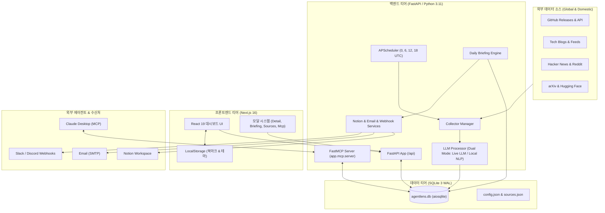

# [ADR-001] 풀스택 시스템 아키텍처 및 핵심 기술 스택 결정 레코드

- **작성일자**: 2026-09-15
- **작성자**: 풀스택 아키텍트 (`fullstack-architect`)
- **문서 버전**: v2.0
- **상태**: APPROVED
- **영향 범위**: Frontend (Next.js 16 App Router), Backend (FastAPI, FastMCP), Database (SQLite/aiosqlite), Deployment (Docker Compose)

---

## 1. 배경 및 컨텍스트 (Context & Problem Statement)
- 기획 산출물(`01_PRD.md`, `02_FUNCTIONAL_SPECIFICATION.md`)에 정의된 지능형 AI 에이전트 뉴스 인텔리전스 플랫폼 요구사항을 충족하기 위한 아키텍처 결정입니다.
- 주기적인 크롤링 수집, LLM 큐레이션 및 품질 평가, 고성능 피드 검색, 실시간 AI 질의응답(Ask AI), 일일 브리핑 생성 및 서드파티(Notion, SMTP, 슬랙/디스코드) 연동, Claude Desktop 연동 FastMCP 도구를 단일 시스템으로 매끄럽게 지원해야 합니다.
- 동시에 로컬 원클릭 실행(Docker Compose / Makefile)의 가벼움과 컨트랙트 기반의 높은 생산성을 보장해야 합니다.

---

## 2. 고려된 기술 스택 후보군 (Considered Alternatives)

| 계층 | 후보 1 (최종 선정안) | 후보 2 (대안) | 장단점 비교 및 선정 사유 |
| :--- | :--- | :--- | :--- |
| **Frontend Framework** | **Next.js 16 (React 19, TypeScript)** | Vite + React SPA | Next.js App Router의 빠른 빌드 속도(Turbopack), 모듈러 컴포넌트 생태계, 향후 SEO 및 서버 사이드 렌더링 확장성 우위 |
| **Styling & Icons** | **Tailwind CSS v4 + Lucide React** | CSS Modules / MUI | Tailwind v4의 고성능 CSS 컴파일, 다크/라이트 모드 유연성, 직관적인 유틸리티 클래스로 경량 번들 유지 |
| **Backend Framework** | **Python 3.11+ (FastAPI)** | Node.js (NestJS / Express) | 파이썬 생태계의 AI/LLM SDK(Google GenAI, OpenAI), NLP 도구(BeautifulSoup, Feedparser)의 강력한 지원 및 비동기 ASGI 성능 |
| **Agent Protocol** | **FastMCP (mcp Python SDK)** | 표준 REST API 전용 | Claude Desktop, Cursor 등 최신 AI 에이전트 클라이언트가 직접 소식을 검색·활용할 수 있는 공식 MCP 표준 프로토콜 완벽 지원 |
| **Database & ORM** | **SQLite (WAL 모드) + SQLAlchemy 2.0 (aiosqlite)** | PostgreSQL / MongoDB | 로컬 단일 컨테이너 및 데스크톱 배포의 간결성, 제로 설정(Zero-config), WAL 모드를 통한 읽기/쓰기 비동기 동시성 확보 |
| **Task Scheduling** | **APScheduler (Background Async)** | Celery + Redis | 외부 브로커(Redis/RabbitMQ) 없이도 파이썬 프로세스 내에서 정확한 주기별(0, 6, 12, 18 UTC) 크론 제어 가능 (단순성 극대화) |

---

## 3. 최종 아키텍처 결정 사항 (Decision)

### 3.1 풀스택 전체 시스템 토폴로지

### 3.2 핵심 아키텍처 원칙
1. **듀얼 모드 LLM 큐레이션 (Dual-Mode Intelligence)**:
   - 외부 API 키(`GEMINI_API_KEY`, `OPENAI_API_KEY`)가 없을 때도 시스템이 완전 정지하지 않고, 내장 로컬 NLP 엔진(어휘 중요도 분석, 규칙 기반 시사점 추출)으로 즉시 무중단 폴백(Graceful Degradation)합니다.
2. **계층형 아키텍처 (Layered Architecture)**:
   - `api/` (엔드포인트 라우팅 및 HTTP 규격) $\rightarrow$ `services/` (순수 비즈니스 로직) $\rightarrow$ `models/` (DB 스키마) $\rightarrow$ `schemas/` (Pydantic DTO) 철저 분리.
3. **독립 에이전트 네이티브 인터페이스 (FastMCP Integration)**:
   - 웹 브라우저를 통한 사용자 경험(GUI)뿐 아니라, Claude Desktop 등 AI 에이전트가 직접 도구(Tools)를 호출할 수 있는 로컬 MCP 서버 프로세스를 동등한 퍼스트 클래스 시민으로 제공합니다.
4. **KISS & YAGNI 실용주의 엔지니어링**:
   - 불필요한 마이크로서비스나 외부 큐 브로커를 도입하지 않고, 단일 SQLite 파일과 비동기 코루틴 풀을 활용해 가장 간결하고 빠르며 유지보수가 용이한 구조를 유지합니다.

---

## 4. 결과 및 트레이드오프 (Consequences)

### 긍정적 효과 (Benefits)
- **제로 의존성 로컬 구동**: 복잡한 클라우드 DB나 Redis 없이 `docker compose up` 또는 `make dev` 한 줄로 5초 내 전체 시스템 구동 완료.
- **높은 확장성**: FastAPI의 비동기 처리(asyncio)와 SQLAlchemy 2.0 비동기 세션을 통해 수만 건의 기사 인덱싱 및 빠른 응답 보장.
- **타입 안정성**: 프론트엔드 TypeScript와 백엔드 Pydantic v2 간의 엄격한 계약(Contract) 동기화로 런타임 오류 원천 차단.

### 수용된 제약사항 및 완화책 (Trade-offs & Mitigations)
- **SQLite 동시 쓰기 잠금**:
  - 완화책: SQLite WAL(`PRAGMA journal_mode=WAL`) 활성화 및 백그라운드 수집 시 일괄 트랜잭션(Bulk Commit) 처리로 읽기 작업 블로킹을 방지합니다.
- **클라이언트 사이드 북마크**:
  - 개인 보관함은 인증 없는 간결성을 위해 브라우저 `localStorage`에 저장되며, 추후 다중 기기 동기화 필요 시 계정 시스템 도입을 검토합니다.
