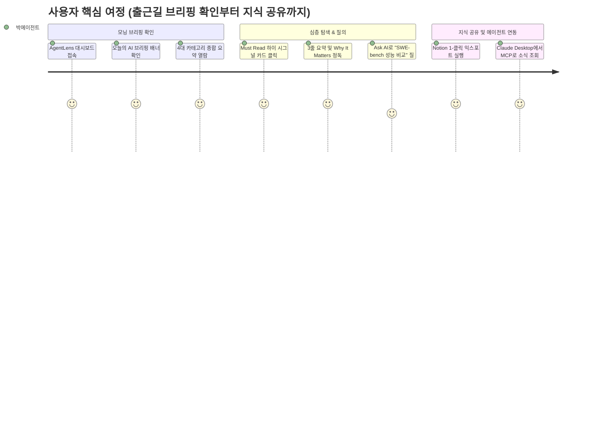

# AgentLens 제품 요구사항 정의서 (Product Requirements Document - PRD)

- **작성일자**: 2026-09-15
- **작성자**: 기획 명세 작성가 (`spec-writer`)
- **문서 버전**: v2.0
- **상태**: Approved

---

## 1. 프로덕트 비전 및 문제 정의 (Problem Statement & Vision)

### 1.1 배경 (Background)
생성형 AI 및 자율 에이전트(Autonomous Agent) 기술이 가속화되면서, 엔지니어와 연구자들은 일주일에 수백 개에 달하는 오픈소스 릴리즈(SWE-bench, LangGraph, AutoGen), 논문(arXiv), 프로토콜(MCP, FastMCP, Skills) 업데이트를 추적해야 합니다. 그러나 정보가 GitHub, Twitter(X), HackerNews, Reddit, 개인 블로그 등에 흩어져 있어 파편화가 심각합니다.

### 1.2 문제 정의 (Problem Statement)
1. **신호 대 잡음비(Signal-to-Noise Ratio)의 극심한 저하**: 단순 마케팅, 홍보성 아티클, 클릭베이트 기사로 인해 엔지니어가 가치 있는 기술적 진보를 발견하기 어렵습니다.
2. **개발자 관점 인사이트의 부재**: 기존 요약 도구는 원문 단순 요약에 그쳐, "이것이 나의 AI 에이전트 아키텍처에 어떤 실질적 영향을 미치는지(Why It Matters)"를 알려주지 못합니다.
3. **지식 공유 및 에이전트 연동의 단절**: 팀원과의 공유(Notion, 이메일, 슬랙) 과정이 수동적이며, 로컬 AI 에이전트(Claude Desktop 등)가 최신 기술 소식을 프로그래밍 방식으로 질의할 표준 인터페이스(MCP)가 부족합니다.

### 1.3 프로덕트 비전 (Vision)
**AgentLens**는 단순한 뉴스 수집기를 넘어, **"AI 에이전트·하네스·MCP 생태계 전문 지능형 인텔리전스 허브"**로서, 노이즈 없는 고품질 기술 소식을 선별하고, 실질적인 개발자 시사점(Why It Matters)과 일일 브리핑을 제공하며, 인간과 AI 에이전트가 함께 소비하는 지식 인프라를 지향합니다.

---

## 2. 타깃 페르소나 및 유저 저니 맵 (Personas & User Journey)

### 2.1 대표 페르소나
- **페르소나 1**: 박에이전트 (31세, AI 에이전트 플랫폼 리드 엔지니어)
  - **주요 목표**: 최신 에이전트 하네스/벤치마크 기법과 신규 MCP 도구를 빠르게 파악하여 사내 에이전트에 도입.
  - **페인포인트**: 매일 아침 수십 개 사이트를 일일이 뒤질 시간이 없으며, 가짜 벤치마크 마케팅 글에 지침.
- **페르소나 2**: 이연구 (28세, LLM 추론 및 자율 워크플로우 연구원)
  - **주요 목표**: arXiv 최신 논문과 탑티어 오픈소스 구현체 트렌드를 실시간 모니터링하고 핵심만 요약 추출.
  - **페인포인트**: 논문 전체를 읽지 않고도 핵심 기여점과 벤치마크 지표를 즉각 확인하고 싶음.

### 2.2 핵심 유저 저니 (User Journey Map)

---

## 3. 기능 요구사항 및 MoSCoW 우선순위 매트릭스 (Feature Requirements)

| 요구사항 ID | 도메인 | 요구사항 명칭 및 상세 설명 | 우선순위 (MoSCoW) | 대응 비즈니스 가치 |
| :--- | :--- | :--- | :---: | :--- |
| `REQ-FEED-001` | 뉴스 피드 | 다차원 카테고리(하네스, MCP, 에이전트, 일반AI) 및 출처별 필터링 | **Must Have** | 정보 구조화 및 노이즈 격리 |
| `REQ-FEED-002` | 뉴스 피드 | LLM 3-Bullet TL;DR, Why It Matters, 기술 스택 추출 및 고신호 뱃지 | **Must Have** | 핵심 큐레이션 가치 제공 |
| `REQ-FEED-003` | 뉴스 피드 | 특정 아티클 대상 대화형 AI 심층 질의응답 (Ask AI) | **Must Have** | 심층 정보 습득 지원 |
| `REQ-FEED-004` | 뉴스 피드 | 북마크 저장 및 개인 읽기 목록 관리 (LocalStorage) | **Should Have** | 사용자 편의성 및 리텐션 |
| `REQ-BRIEF-001`| 브리핑 | 24시간 내 수집된 주요 소스 기반 오늘의 AI 브리핑 자동 생성 | **Must Have** | 일일 요약 인텔리전스 |
| `REQ-BRIEF-002`| 브리핑 | Notion 페이지 1-클릭 생성 및 SMTP 이메일 자동 발송 | **Must Have** | 사내 지식 공유 자동화 |
| `REQ-SRC-001`  | 수집원 관리| 웹 UI 기반 RSS 피드 및 GitHub 모니터링 저장소 추가/토글/삭제 | **Must Have** | 수집 대상 유연성 확보 |
| `REQ-SRC-002`  | 수집원 관리| 자율 소스 리서처(Deep Researcher) 기반 신규 소스 자동 발굴/채택 | **Should Have** | 수집 커버리지 자동 확장 |
| `REQ-SETT-001` | 설정/운영 | 크론 주기(0, 6, 12, 18 UTC) 확인 및 즉시 수동 수집 트리거 | **Must Have** | 운영 자동화 및 온디맨드 대응 |
| `REQ-SETT-002` | 설정/운영 | 슬랙 및 디스코드 웹훅 연동을 통한 브리핑 자동 알림 | **Should Have** | 외부 메신저 협업 연동 |
| `REQ-MCP-001`  | MCP 프로토콜 | Claude Desktop 연동 FastMCP 도구 세트 제공 | **Must Have** | 에이전트-네이티브 통합 |

---

## 4. 핵심 성공 지표 (KPI / Success Metrics)

| 지표명 | 측정 방식 / 기준 | 목표치 (Target) |
| :--- | :--- | :--- |
| **정보 탐색 시간 단축률** | 기존 다중 사이트 방문 대비 소식 파악 소요 시간 | $\ge 75\%$ 단축 (일평균 15분 이내) |
| **품질 필터링 유효도** | 전체 수집 건 중 Quality Score 5.0 미만 노이즈 필터링율 | $\ge 35\%$ 컷오프 |
| **일일 브리핑 활용도** | 주간 브리핑 열람 및 Notion/이메일 익스포트 전환율 | DAU 대비 $\ge 60\%$ |
| **Ask AI 응답 만족도** | 아티클 상세 모달 진입 후 Ask AI 사용 세션 비율 | $\ge 25\%$ |
| **API 가용성 & 응답 속도**| 메인 피드 API p95 응답 속도 | $\le 150\text{ms}$ |

---

## 5. 비기능적 요구사항 (Non-Functional Requirements)
- **성능 (Performance)**: 메인 피드 18개 카드 렌더링 LCP 1.2초 이내, 무한 스크롤/페이지네이션 지연 없는 비동기 페칭.
- **안정성 (Reliability)**: 외부 RSS/사이트의 일시적 장애 발생 시 타 소스 수집에 영향을 주지 않는 격리 실행(Fault-tolerant).
- **확장성 (Scalability)**: SQLite WAL 모드 및 비동기 aiosqlite 풀링을 통한 동시성 확보, 향후 PostgreSQL 전환 용이성 유지.
- **보안 (Security)**: Notion API Key 및 LLM API Key, SMTP 비밀번호 등 민감 자격증명은 서버 측 환경변수 및 안전한 JSON 설정으로 격리 보관.
