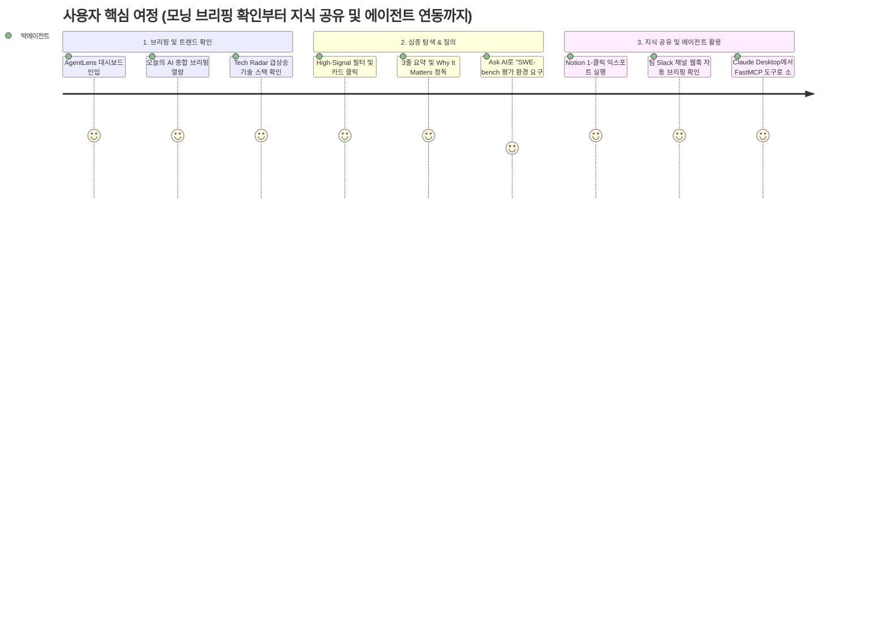

# AgentLens 제품 요구사항 정의서 (Product Requirements Document - PRD)

- **작성일자**: 2026-09-16
- **작성자**: 기획 명세 작성가 (`spec-writer`)
- **문서 버전**: v2.1
- **상태**: Approved

---

## 1. 프로덕트 비전 및 문제 정의 (Problem Statement & Vision)

### 1.1 배경 (Background)
생성형 AI 및 자율 에이전트(Autonomous Agent) 기술이 급격히 발전함에 따라, AI 엔지니어와 연구자들은 주당 수백 개에 달하는 오픈소스 릴리즈(SWE-bench, LangGraph, AutoGen), 학술 논문(arXiv), 상호운용성 프로토콜(MCP, FastMCP, Skills) 업데이트를 지속적으로 추적해야 하는 환경에 놓여 있습니다. 그러나 정보가 GitHub, Twitter(X), HackerNews, Reddit, 개인 엔지니어링 블로그 등에 파편화되어 있어 체계적인 수집과 검증이 어렵습니다.

### 1.2 문제 정의 (Problem Statement)
1. **신호 대 잡음비(Signal-to-Noise Ratio)의 저하**: 단순 마케팅 및 클릭베이트성 게시글의 범람으로 인해 실질적인 기술 진보와 벤치마크 데이터를 담은 핵심 정보를 발굴하는 데 막대한 시간이 소모됩니다.
2. **개발자 관점 실무 인사이트 부재**: 기존 뉴스 리더나 요약 툴은 원문 텍스트를 단순 축약하는 수준에 머물러, 해당 변경사항이 실제 AI 에이전트 아키텍처 및 파이프라인에 미치는 시사점(Why It Matters)을 제공하지 못합니다.
3. **지식 공유 및 에이전트 연동의 단절**: 팀 단위 지식 자산화(Notion, 이메일, 메신저)가 수동적 캡처에 의존하고 있으며, 인간 사용자뿐 아니라 로컬 자율 에이전트(Claude Desktop 등)가 신뢰할 수 있는 기술 소식을 프로그래밍 방식으로 인출할 수 있는 표준 프로토콜 인터페이스가 결여되어 있습니다.

### 1.3 프로덕트 비전 (Vision)
**AgentLens**는 단순한 RSS 수집기를 넘어, **"AI 에이전트·하네스·MCP 생태계 전문 지능형 인텔리전스 허브"**로서 다음 가치를 제공합니다:
- **노이즈 없는 고품질 큐레이션**: 자동화된 품질 평가(Quality Score) 기반으로 고신호(High Signal) 정보만을 선별합니다.
- **실천적 개발자 시사점 제공**: 3-Bullet TL;DR과 Why It Matters, 그리고 기술 스택 태깅을 통해 즉각적인 도입 타당성을 제시합니다.
- **실시간 기술 트렌드 조망**: 에이전트 Tech Radar를 통해 생태계 내 급상승 기술 스택 및 도메인 점유율을 한눈에 파악합니다.
- **인간과 에이전트의 공존 인터페이스**: 일일 종합 브리핑의 외부 채널(Notion, 이메일, Webhook) 자동 전송과 FastMCP 표준 도구를 통해 인간 개발자와 AI 에이전트가 동시에 소비하는 지식 인프라를 구축합니다.

---

## 2. 타깃 페르소나 및 유저 저니 맵 (Personas & User Journey)

### 2.1 대표 페르소나
- **페르소나 1**: 박에이전트 (31세, AI 에이전트 플랫폼 리드 엔지니어)
  - **주요 목표**: 최신 에이전트 평가 하네스(SWE-bench 등) 및 신규 MCP 도구를 신속히 검토하여 사내 프로덕션 파이프라인에 적용.
  - **핵심 페인포인트**: 매일 아침 수십 개 사이트를 일일이 탐색할 여유가 없으며, 정량적 검증이 결여된 홍보성 글에 피로감을 느낌.
- **페르소나 2**: 이연구 (28세, LLM 추론 및 자율 워크플로우 연구원)
  - **주요 목표**: arXiv 최신 논문과 글로벌 오픈소스 구현 트렌드를 지속 모니터링하고 관심 기술 스택의 출현 빈도를 추적.
  - **핵심 페인포인트**: 긴 논문 전문을 읽기 전에 핵심 기여점과 벤치마크 지표를 즉각 확인하고 사내 팀원들에게 공유할 마크다운 리포트가 필요함.

### 2.2 핵심 유저 저니 (User Journey Map)

---

## 3. 기능 요구사항 및 MoSCoW 우선순위 매트릭스 (Feature Requirements)

| 요구사항 ID | 도메인 | 요구사항 명칭 및 상세 설명 | 우선순위 (MoSCoW) | 대응 비즈니스 가치 |
| :--- | :--- | :--- | :---: | :--- |
| `REQ-FEED-001` | 뉴스 피드 | 다차원 카테고리(하네스, MCP, 에이전트, AI소식) 및 출처별 필터링, 검색 | **Must Have** | 정보 구조화 및 노이즈 격리 |
| `REQ-FEED-002` | 뉴스 피드 | 3-Bullet TL;DR, Why It Matters 시사점, 기술 스택 태그 및 고신호 뱃지 부여 | **Must Have** | 핵심 큐레이션 및 시간 절감 |
| `REQ-FEED-003` | 뉴스 피드 | 개별 아티클 본문/요약 컨텍스트 기반 대화형 질의응답 (Ask AI) | **Must Have** | 심층 정보 습득 지원 |
| `REQ-FEED-004` | 뉴스 피드 | 브라우저 로컬 저장소 기반 개인 북마크 보관 및 필터링 | **Should Have** | 사용자 리텐션 및 재방문 가치 |
| `REQ-RADAR-001`| 트렌드 분석 | 24시간 급상승 기술 스택, 카테고리 점유율, 태그 클라우드 (Tech Radar) | **Must Have** | 기술 생태계 거시적 조망 |
| `REQ-BRIEF-001`| 일일 브리핑 | 24시간 수집 소식 기반 일일 종합 브리핑 생성 및 마크다운 다운로드 | **Must Have** | 일일 요약 인텔리전스 |
| `REQ-BRIEF-002`| 일일 브리핑 | Notion 페이지 1-클릭 생성 및 SMTP 이메일 발송 연동 | **Must Have** | 팀 지식 공유 자동화 |
| `REQ-SRC-001`  | 수집원 관리 | 신규 RSS 피드 및 GitHub 저장소 등록, 소스별 활성화 토글/삭제 관리 | **Must Have** | 수집 대상 유연성 및 커버리지 |
| `REQ-SRC-002`  | 수집원 관리 | AI Deep Researcher 기반 신규 기술 소스 자율 탐색 및 적합도 자동 채택 | **Should Have** | 수집 소스 자율 확장 |
| `REQ-SETT-001` | 시스템 운영 | 정기 크론 스케줄 모니터링 및 온디맨드 즉시 수동 수집 트리거 | **Must Have** | 운영 자동화 및 실시간 동기화 |
| `REQ-SETT-002` | 시스템 운영 | 슬랙 및 디스코드 웹훅 연동을 통한 브리핑/하이 시그널 실시간 알림 | **Should Have** | 팀 협업 메신저 즉시 전달 |
| `REQ-RESET-001`| 시스템 운영 | 수집 데이터 전체 초기화 및 클린 재수집 기능 (Reset & Recollect) | **Must Have** | 데이터 정합성 보장 및 장애 복원 |
| `REQ-MCP-001`  | 에이전트 연동 | Claude Desktop 등 AI 에이전트 연동용 FastMCP 표준 도구 인터페이스 | **Must Have** | 에이전트-네이티브 지식 공급 |

---

## 4. 핵심 성공 지표 (KPI / Success Metrics)

| 지표명 | 측정 방식 / 기준 | 목표치 (Target) |
| :--- | :--- | :--- |
| **정보 탐색 시간 단축률** | 기존 복수 커뮤니티 개별 방문 대비 일일 주요 기술 동향 파악 소요 시간 | $\ge 75\%$ 단축 (일평균 15분 이내) |
| **품질 필터링 유효도** | 전체 수집 건 중 품질 점수(Quality Score) 5.0 미만 노이즈 필터링율 | $\ge 35\%$ 컷오프 |
| **일일 브리핑 활용도** | 일일 활성 사용자(DAU) 중 종합 브리핑 열람 또는 익스포트(Notion/이메일) 실행 비율 | $\ge 60\%$ |
| **Tech Radar 탐색 전환율** | 메인 화면 진입자 중 Tech Radar 태그 클릭을 통한 연계 피드 필터링 사용률 | $\ge 30\%$ |
| **Ask AI 질의 만족도** | 상세 모달 진입 세션 중 Ask AI 사용 비율 및 질의 응답 성공률 | 사용률 $\ge 25\%$, 성공률 $\ge 98\%$ |
| **API 가용성 & 응답 속도** | 메인 피드 및 브리핑 조회 API의 95th 백분위수(p95) 응답 소요 시간 | $\le 200\text{ms}$ |

---

## 5. 비기능적 요구사항 (Non-Functional Requirements)

- **성능 (Performance)**:
  - 메인 대시보드 진입 시 최초 콘텐츠 렌더링(LCP)은 1.5초 이내여야 합니다.
  - 피드 카드 그리드 스크롤 및 페이지 전환 시 지연 없는 비동기 페칭과 가상화 처리를 지원해야 합니다.
- **신뢰성 및 격리성 (Reliability & Fault-Tolerance)**:
  - 외부 RSS 제공처 또는 GitHub API의 일시적 장애(404, 5xx, 네트워크 단절)가 발생해도 타 소스 수집 및 전체 시스템 운영에 영향을 주지 않아야 합니다.
  - 외부 LLM 서비스 장애 시 내장 로컬 분석 엔진으로 자동 폴백(Fallback)하여 서비스 중단이 없어야 합니다.
- **데이터 무결성 및 영속성 (Data Integrity & Persistence)**:
  - 동시 수집 및 읽기 요청 환경에서도 데이터 정합성이 보장되어야 합니다.
  - 수집 데이터 초기화(Reset & Recollect) 시 원자적 처리가 보장되어 데이터 불일치 상태가 발생하지 않아야 합니다.
- **보안 (Security)**:
  - 노션 API 키, 메일 서버 비밀번호, LLM 서비스 인증키 등 모든 민감 자격증명은 서버 측 안전 영역에 격리 보관되어야 하며 클라이언트 조회 시 마스킹 처리되어야 합니다.
  - 원문 스크래핑 텍스트 및 외부 입력 텍스트는 렌더링 전 XSS 방어 살균(Sanitization) 처리를 필수로 거쳐야 합니다.
- **반응형 호환성 (Compatibility)**:
  - 모바일(375px 이상), 태블릿(768px 이상), 데스크톱(1024px 이상) 전 해상도에서 깨짐 없는 반응형 레이아웃을 완전 지원해야 합니다.
