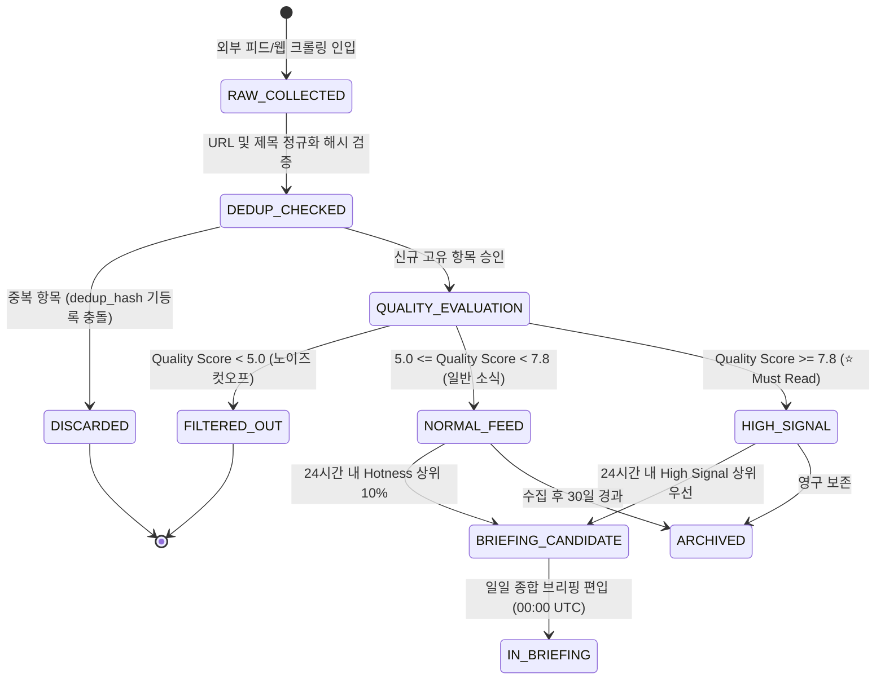
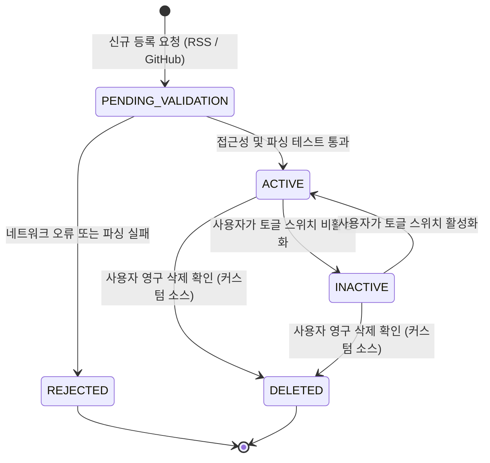
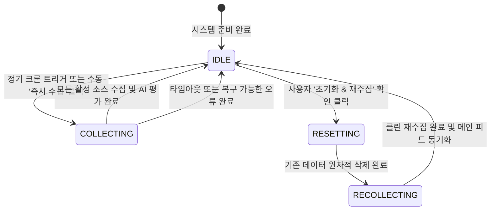

# AgentLens 비즈니스 정책 및 전역 예외 처리 명세서 (Policy & Edge Cases)

- **작성일자**: 2026-09-16
- **작성자**: 기획 명세 작성가 (`spec-writer`)
- **문서 버전**: v2.1
- **상태**: Approved

---

## 1. 핵심 엔티티 상태 전이 머신 (State Machine Policies)

AgentLens의 3대 핵심 도메인 엔티티인 **NewsItem(뉴스 아이템)**, **Source(수집 소스)**, **CollectionSession(수집 및 리셋 세션)**의 수명주기 및 전이 조건을 수학적으로 명확하게 규정합니다.

### 1.1 뉴스 아이템(NewsItem) 수명주기 상태 머신

#### 뉴스 아이템 상태 전이 매트릭스 및 권한 규칙
| 현재 상태 | 대상 상태 | 전이 트리거 이벤트 | 필수 사전 조건 | 실행 주체 |
| :--- | :--- | :--- | :--- | :--- |
| `RAW_COLLECTED` | `DEDUP_CHECKED` | 크롤러 수집 스트림 인입 | URL 프로토콜 정규화 및 제목 트림 완료 | 수집 파이프라인 |
| `DEDUP_CHECKED` | `DISCARDED` | 중복 판정 | 동일 `dedup_hash`가 이미 존재함 | 중복 방지 엔진 |
| `DEDUP_CHECKED` | `QUALITY_EVALUATION` | 신규 판정 | 고유한 식별자 검증 통과 | 수집 파이프라인 |
| `QUALITY_EVALUATION` | `FILTERED_OUT` | 품질 평가 완료 | `Quality Score < 5.0` | AI 큐레이션 엔진 |
| `QUALITY_EVALUATION` | `NORMAL_FEED` | 품질 평가 완료 | `5.0 <= Quality Score < 7.8` | AI 큐레이션 엔진 |
| `QUALITY_EVALUATION` | `HIGH_SIGNAL` | 품질 평가 완료 | `Quality Score >= 7.8` | AI 큐레이션 엔진 |
| `HIGH_SIGNAL` | `IN_BRIEFING` | 정기 브리핑 생성 (00:00 UTC) | 최근 24시간 내 수집 & 카테고리별 상위 3~5위 | 브리핑 엔진 |
| `NORMAL_FEED` | `ARCHIVED` | 데이터 보관 정책 | 생성 시각 기준 30일 경과 | 시스템 배치 |

---

### 1.2 수집 소스(Source) 수명주기 상태 머신

#### 소스 상태 전이 매트릭스 및 권한 규칙
| 현재 상태 | 대상 상태 | 전이 트리거 이벤트 | 필수 사전 조건 | 권한 / 주체 |
| :--- | :--- | :--- | :--- | :--- |
| `PENDING_VALIDATION` | `ACTIVE` | 등록 검증 성공 | 유효한 XML/RSS 파싱 확인 또는 공개 GitHub 저장소 확인 | 시스템 검증기 |
| `PENDING_VALIDATION` | `REJECTED` | 등록 검증 실패 | 404 Not Found 또는 XML 파싱 구문 오류 | 시스템 검증기 |
| `ACTIVE` | `INACTIVE` | 활성화 토글 클릭 | 비활성화 후에도 최소 1개 이상 활성 소스 존재 | 사용자 / 운영자 |
| `INACTIVE` | `ACTIVE` | 활성화 토글 클릭 | 소스 접근성 유효 상태 | 사용자 / 운영자 |
| `ACTIVE`/`INACTIVE` | `DELETED` | 영구 삭제 확인 | 기본 내장(Built-in) 소스가 아님 | 사용자 / 운영자 |

---

### 1.3 수집 및 리셋 세션(CollectionSession) 상호 배제 상태 머신

#### 세션 상태 전이 규칙 (Mutual Exclusion)
- **MUTEX-001**: `COLLECTING` 또는 `RESETTING` 상태에서는 신규 수집 또는 리셋 요청이 인입될 경우 즉시 거절(`409 Conflict`)된다.
- **MUTEX-002**: `RESETTING` 진입 시 기존 데이터베이스의 모든 소식, 중복 해시, 수집 로그가 원자적으로 삭제된 후 즉시 `RECOLLECTING` 단계로 자동 전이된다.

---

## 2. 공통 비즈니스 제약 및 알고리즘 정책 (Global Business Policies)

### 2.1 텍스트 정규화 및 보안 살균(Sanitization) 정책
- **XSS 방어 및 스크립트 제거**: 외부에서 수집된 모든 제목, 원문, 마크다운 텍스트는 인입 즉시 스크립트 태그(`<script>`, `javascript:`, `onload=` 등)를 원천 살균 처리한다.
- **URL 정규화 및 추적 파라미터 제거**: 기사 URL에서 분석 및 추적용 파라미터(`utm_source`, `utm_medium`, `utm_campaign`, `fbclid`, `gclid`)를 완전 제거한 후 정규화된 URL을 생성한다.
- **공백 및 길이 제약**: 제목 및 검색어의 시작과 끝 공백(Trim)은 인입 시 자동 제거되며, 연속된 다중 공백은 단일 공백으로 치환한다.

### 2.2 시간, 타임존 및 크론 스케줄 정책
- **저장 타임존**: 모든 생성 일시(`created_at`), 발행 일시(`published_at`), 실행 일시(`run_at`)는 **UTC 기준 ISO 8601** 형식(`YYYY-MM-DDTHH:mm:ssZ`)으로 저장한다.
- **표시 타임존**: 사용자 화면 표시는 브라우저의 로컬 타임존(한국 사용자 기준 KST `UTC+9`)으로 변환하며, 24시간 이내의 소식은 상대 시간("방금 전", "3시간 전"), 24시간 초과 소식은 절대 시간("YYYY-MM-DD")으로 표기한다.
- **정기 크론 주기**: 매일 UTC 기준 `00:00, 06:00, 12:00, 18:00` (한국 시간 `09:00, 15:00, 21:00, 03:00`)에 정기 수집 파이프라인을 가동한다.

### 2.3 정량적 알고리즘 산출 공식

#### 1) 품질 점수 (Quality Score: $S_{quality}$)
AI 큐레이션 모델 또는 로컬 분석 엔진에 의해 1.0에서 10.0 사이의 실수로 산출된다:
$$S_{quality} = w_1 \cdot \text{기술적 신규성} + w_2 \cdot \text{구현 구체성} + w_3 \cdot \text{벤치마크 신뢰도} - w_4 \cdot \text{홍보성 노이즈}$$
- $S_{quality} < 5.0$: 노이즈로 간주되어 메인 피드에서 영구 제외(`FILTERED_OUT`).
- $S_{quality} \ge 7.8$: 고신호 아티클(`HIGH_SIGNAL`, ⭐️ Must Read)로 자동 승격.

#### 2) 추천도 점수 (Hotness Score: $S_{hot}$)
품질 점수와 시간 경과에 따른 감쇠(Decay)를 결합하여 산출된다:
$$S_{hot} = S_{quality} \times 0.4 + \left(\max\left(0, 10 - \frac{\Delta t}{3600 \times 6}\right)\right) \times 0.6$$
(단, $\Delta t$는 현재 시각과 발행 시각 사이의 경과 시간(초)이다.)

#### 3) Tech Radar 급상승 속도 (Surging Velocity: $V$)
특정 기술 태그의 최근 24시간 언급 빈도($C_{recent}$)와 직전 24시간 언급 빈도($C_{prev}$)의 증감률로 계산된다:
$$V = \begin{cases} 
\frac{C_{recent} - C_{prev}}{\max(1, C_{prev})} \times 100\% & (C_{recent} \ge 2) \\
0\% & (C_{recent} < 2)
\end{cases}$$
- $V \ge +20\%$이고 최근 24시간 내 최소 2회 이상 언급된 태그를 `Surging Tag`로 발탁한다.

---

## 3. 전역 엣지 케이스 및 장애 복구 UX 가이드 (Global Edge Cases)

| 장애 / 예외 시나리오 | 감지 메커니즘 | 시스템 처리 및 사용자 경험(UX) 복구 방식 |
| :--- | :--- | :--- |
| **외부 LLM API 할당량 소진 또는 5xx 장애** | HTTP 429 / 5xx 응답 또는 8초 타임아웃 | 내장 로컬 NLP 분석 엔진으로 자동 전환(Graceful Degradation). 서비스 중단 없이 요약 및 키워드 제공 |
| **특정 RSS 피드 호스트 다운 / 404** | 수집기 HTTP 연결 실패 또는 404 반환 | 해당 소스만 실패 로그로 기록하고 스킵. 타 정상 소스의 수집 및 피드 반영은 정상 완료 |
| **클라이언트 네트워크 단절 (오프라인)** | 브라우저 `navigator.onLine === false` | 메인 피드 상단에 오프라인 경고 배너 표시, 로컬 저장소 기반 북마크 탭으로 즉시 열람 유도 |
| **온디맨드 수동 수집 버튼 연타** | 세션 상태 `is_collecting === true` | 최초 클릭 시 버튼 즉시 비활성화(Debounce/Lock), 409 Conflict 응답 시 "수집 진행 중" 안내 토스트 |
| **데이터 리셋과 수집의 동시 충돌** | 수집 실행 중 리셋 요청 인입 | 리셋 요청 거부(`ERR_RESET_CONFLICT`), "수집 작업이 완료된 후 초기화할 수 있습니다" 모달 경고 |
| **검색 결과 0건 (Empty Search)** | 검색 API 반환 건수 0건 | 빈 화면 대신 추천 검색어 칩(SWE-bench, LangGraph, FastMCP) 및 "필터 초기화" 버튼 노출 |
| **Notion API 토큰 무효화 / 권한 오류** | Notion 블록 생성 시 401/403 응답 | "Notion API 토큰 권한을 확인해주세요" 안내 토스트 및 연동 설정 모달 원클릭 오픈 버튼 제공 |
| **모바일 저사양 기기 대량 렌더링** | 뷰포트 너비 < 640px | 1열 반응형 배치 및 페이지당 18개 엄격 제한으로 DOM 노드 수 최적화, 스크롤 버벅임 방지 |
