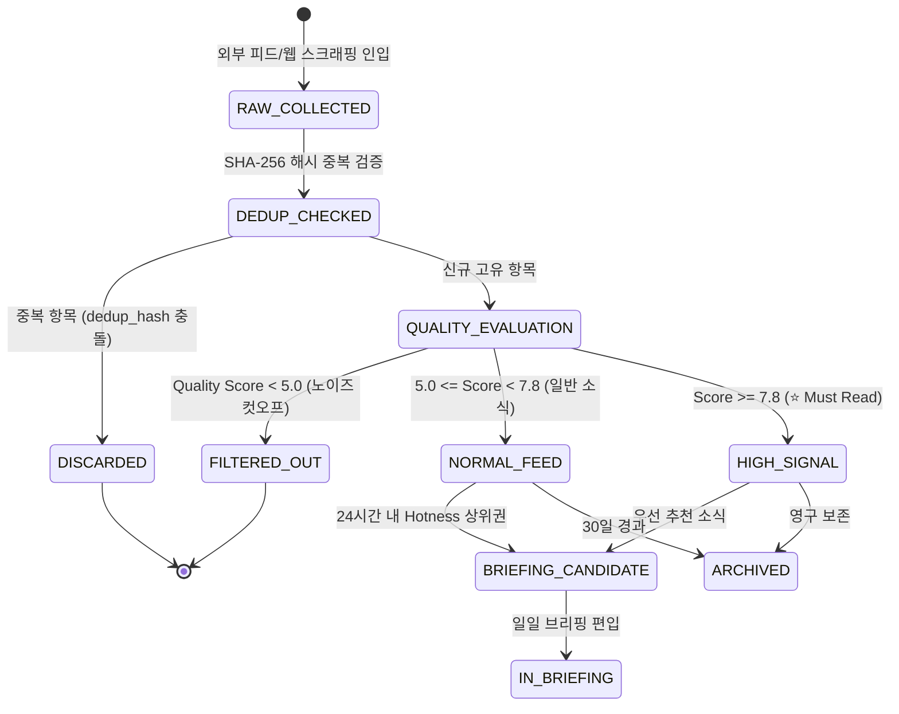

# AgentLens 비즈니스 정책 및 전역 예외 처리 명세서 (Policy & Edge Cases)

- **작성일자**: 2026-09-15
- **작성자**: 기획 명세 작성가 (`spec-writer`)
- **문서 버전**: v2.0
- **상태**: Approved

---

## 1. 핵심 엔티티 상태 전이 머신 (State Machine Policies)

AgentLens의 핵심 엔티티인 **NewsItem(뉴스 아이템)** 및 **Source(수집 소스)**의 수명주기와 전이 조건을 명세합니다.

### 1.1 뉴스 아이템 수명주기 상태 머신

### 상태 전이 매트릭스 및 권한 규칙
| 현재 상태 | 대상 상태 | 전이 트리거 이벤트 | 필수 사전 조건 | 권한/주체 |
| :--- | :--- | :--- | :--- | :--- |
| `RAW_COLLECTED` | `DEDUP_CHECKED` | 크롤러 수집 완료 | URL 및 제목 정규화 완료 | 시스템 크롤러 |
| `DEDUP_CHECKED` | `QUALITY_EVALUATION` | DB 고유성 확인 | `dedup_hash` 미존재 | 시스템 파이프라인 |
| `QUALITY_EVALUATION` | `FILTERED_OUT` | 품질 평가 완료 | `quality_score < 5.0` | LLM Processor |
| `QUALITY_EVALUATION` | `HIGH_SIGNAL` | 품질 평가 완료 | `quality_score >= 7.8` | LLM Processor |
| `HIGH_SIGNAL` | `IN_BRIEFING` | 일일 브리핑 크론 (00:00 UTC) | 24시간 이내 수집 소식 | Briefing Engine |

---

## 2. 공통 비즈니스 제약 및 유효성 검증 정책 (Global Business Policies)

### 2.1 문자열 및 텍스트 정규화 정책
- **HTML 태그 제거 및 XSS 방어**: 스크래핑된 원문 및 요약 텍스트는 BeautifulSoup 기반으로 악성 스크립트 태그를 철저히 제거하며, React Markdown 렌더링 시 XSS 공격을 자동 차단합니다.
- **제목 및 URL 정규화**: URL 내의 추적 파라미터(`utm_source`, `utm_medium`, `fbclid` 등)를 자동 제거한 후 SHA-256 해시를 산출하여 동일 기사의 중복 수집을 방지합니다.
- **다국어 처리**: 한국어와 영어를 기본 지원하며, 요약문 및 시사점(Why It Matters)은 한국어(KO)를 기본 언어로 합성합니다.

### 2.2 시간 및 타임존 정책
- **데이터베이스 저장**: 모든 `published_at`, `created_at` 필드는 **UTC 기준 ISO 8601** 형식(`YYYY-MM-DDTHH:mm:ssZ`)으로 기록합니다.
- **화면 표시**: 사용자의 브라우저 로컬 타임존(한국 사용자 기준 KST `UTC+9`)으로 변환하여 "방금 전", "3시간 전", "YYYY-MM-DD" 형태로 상대적/절대적 시간을 병기합니다.
- **수집 크론 스케줄**: UTC 기준 `00:00, 06:00, 12:00, 18:00` (한국 시간 기준 `09:00, 15:00, 21:00, 03:00`)에 정기 가동합니다.

---

## 3. 전역 엣지 케이스 및 장애 복구 UX 가이드 (Global Edge Cases)

| 장애 / 예외 유형 | 감지 방식 | 사용자 경험(UX) 복구 처리 방식 |
| :--- | :--- | :--- |
| **외부 LLM API 장애 / 할당량 소진** | HTTP 429 / 5xx 또는 타임아웃 | 내장 로컬 NLP 휴리스틱 엔진으로 자동 전환(Graceful Degradation). 서비스 중단 없음 |
| **특정 RSS 피드 먹통 / 404** | 크롤링 시 Connection/HTTP Error | 개별 피드만 실패 로그 기록 후 스킵, 나머지 피드는 정상 수집 완료 |
| **네트워크 단절 / 오프라인** | 클라이언트 `navigator.onLine == false` | 메인 피드 상단에 오프라인 알림 표시, 로컬스토리지 북마크 탭으로 자동 유도 |
| **온디맨드 수동 수집 연타** | `collector_manager.is_running == true` | 409 Conflict 반환, 클라이언트는 즉시 버튼 로딩 상태 전환 및 "수집 진행 중" 토스트 |
| **피드 검색 결과 0건** | API 반환 `items.length === 0` | 빈 화면 대신 추천 검색어 칩(SWE-bench, LangGraph, MCP) 및 필터 초기화 버튼 노출 |
| **Notion API 권한 오류** | Notion 블록 생성 시 401/403/404 | "Notion Integration 권한을 확인해주세요" 가이드 모달 즉시 팝업 |
| **대용량 목록 렌더링** | 페이지당 18개 제한 초과 시 | 페이지네이션 처리로 DOM 노드 수를 일정하게 유지하여 렌더링 버벅임 방지 |
