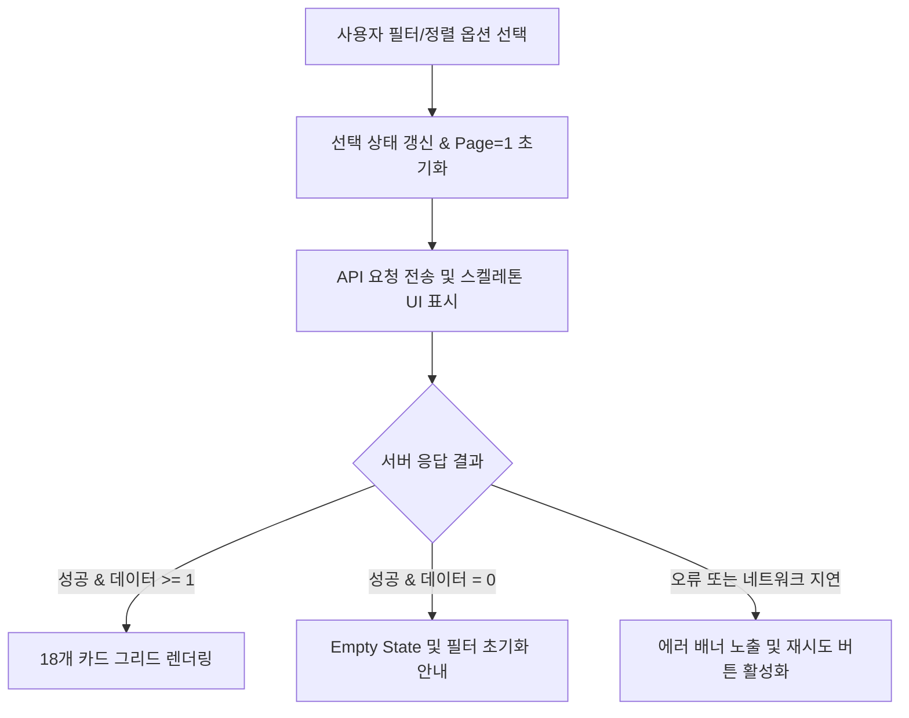
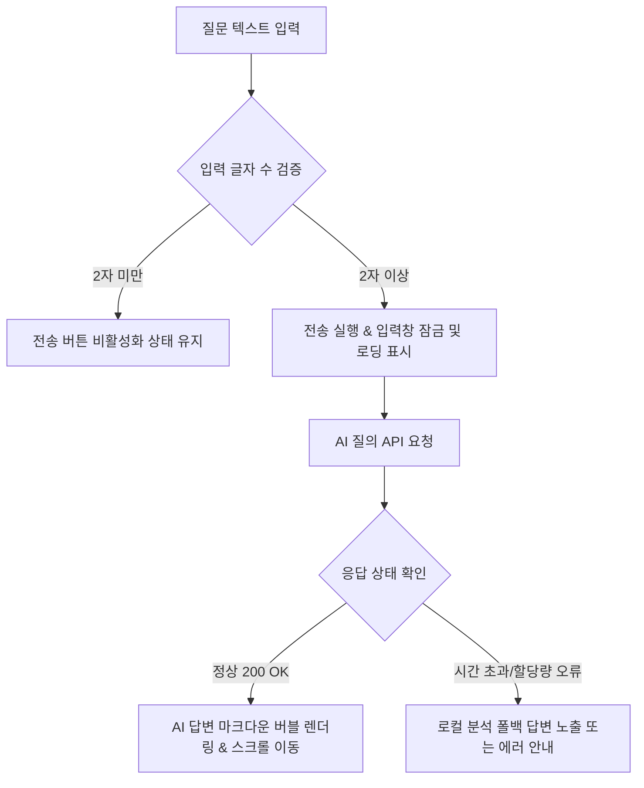
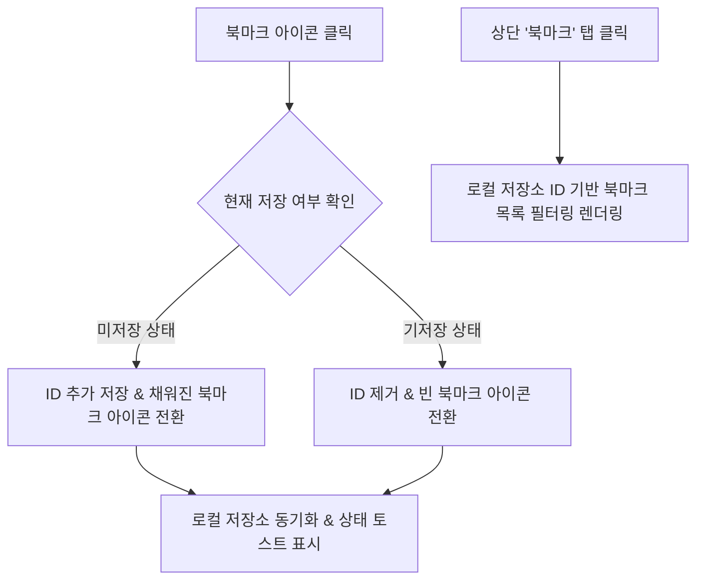

# 뉴스 피드, 큐레이션 및 Tech Radar 상세기능정의서 (News Feed & Tech Radar FSD)

- **도메인**: 뉴스 피드 브라우징, 검색, 상세 큐레이션, Ask AI, 북마크, Tech Radar
- **작성자**: 기획 명세 작성가 (`spec-writer`)
- **문서 버전**: v2.1
- **상태**: Approved

---

## 단위 기능 상세 명세 (단위기능별 7대 상세 명세 완비)

---

### [FUNC-FEED-001] 다차원 피드 필터링 및 카드 목록 조회

#### 1. 기본 정보
- **기능명**: 다차원 카테고리/출처/고신호 필터링 및 피드 카드 목록 조회
- **기능 ID**: `FUNC-FEED-001`
- **대응 요구사항 ID**: `REQ-FEED-001`
- **대상 화면 코드**: `SCR-FEED-001` (메인 피드 화면)
- **우선순위**: Must Have
- **관련 액터 (Actor)**: 일반 엔지니어 / AI 연구원

#### 2. 사전 조건 (Pre-conditions)
1. 사용자가 메인 웹 대시보드(`SCR-FEED-001`)에 정상 진입한 상태.
2. 백엔드 뉴스 조회 API가 정상 가동 중인 상태.

#### 3. 사용자 인터랙션 및 시스템 동작 흐름과 플로우차트 (Step-by-Step Flow & Flowchart)
1. 사용자가 상단 카테고리 버튼(`harness`, `mcp_plugins_skills`, `agent_tech`, `ai_news`, `all`), 출처 탭(GitHub, ArXiv, GeekNews 등), 또는 "⭐️ Must Read Only" 토글 스위치를 클릭한다.
2. 정렬 옵션 드롭다운에서 `hot`(추천순), `latest`(최신순), `quality`(품질점수순) 중 하나를 선택한다.
3. 클라이언트는 선택 상태를 갱신하고 현재 페이지를 1페이지로 초기화한다.
4. 클라이언트는 비동기 API 요청을 전송하고 카드 그리드 영역에 스켈레톤 로더를 노출한다.
5. 서버 응답 수신 시 스켈레톤을 해제하고 18개의 뉴스 카드를 그리드로 렌더링한다. 데이터가 0건인 경우 Empty State를 렌더링한다.



#### 4. 화면 표시 및 입력 데이터 항목 명세 (UI Data Elements - 8대 표준 컬럼)
| 항목명 | 화면 표시/입력 구분 | UI 컴포넌트 | 필수 여부 | 데이터 타입 / 제약 | 기본값 | 유효성 검증 규칙 (Validation) | 노출/수정 조건 |
| :--- | :---: | :--- | :---: | :--- | :---: | :--- | :--- |
| `category` | 사용자 선택 | Button Group | 선택 | Enum (`all`, `harness`, `mcp_plugins_skills`, `agent_tech`, `ai_news`) | `all` | 정의된 5개 카테고리 중 1개 선택 | 상시 활성화 |
| `source` | 사용자 선택 | Source Pill Tabs | 선택 | String / 영문 소문자 | `all` | 등록된 활성 소스 ID 매칭 | 상시 활성화 |
| `sort` | 사용자 선택 | Select Dropdown | 선택 | Enum (`hot`, `latest`, `quality`) | `hot` | 정의된 정렬 기준 매칭 | 상시 활성화 |
| `high_signal_only` | 사용자 선택 | Toggle Switch Button | 선택 | Boolean | `false` | true/false 불리언 | 상시 활성화 |
| `page` | 시스템 제어 | Pagination Bar | 필수 | Integer (>= 1) | 1 | 1 이상의 자연수 | 18건 초과 시 노출 |
| `title` | 노출 전용 | Card Heading Link | 필수 | String / 최대 500자 | - | XSS 살균 검증 완료 | 카드 렌더링 시 |
| `quality_score` | 노출 전용 | Number Badge | 필수 | Float (1.0 ~ 10.0) | 6.0 | 소수점 첫째 자리 표기 | 카드 렌더링 시 |
| `is_high_signal` | 노출 전용 | Star Icon Badge | - | Boolean | false | quality_score >= 7.8 시 true | 조건 충족 시 배지 노출 |

#### 5. 비즈니스 규칙 (Business Rules)
- **BR-FEED-001-1 (하이 시그널 판정 기준)**: `is_high_signal` 플래그는 `quality_score >= 7.8` 조건을 만족하는 아티클에 부여되며, UI 카드 상단에 노란색 별표 배지로 강조 표시된다.
- **BR-FEED-001-2 (기본 정렬 공식)**: `sort=hot`인 경우 `hotness_score DESC, published_at DESC` 복합 정렬을 적용한다.
- **BR-FEED-001-3 (페이지네이션 단위)**: 1페이지당 노출 카드 수는 18개(`size=18`)로 고정하며, 총 아티클 수가 18개 이하일 경우 페이지네이션 바를 숨긴다.

#### 6. 예외 처리 및 엣지 케이스 (Edge Cases & Exception Handling)
| 발생 상황 (Edge Case Scenario) | 화면 반응 및 시스템 처리 방식 | 사용자 안내 메시지 |
| :--- | :--- | :--- |
| 선택한 복합 필터 조건의 아티클이 0건인 경우 | 카드 영역에 Empty State 일러스트 및 필터 초기화 버튼 노출 | "선택한 조건에 맞는 최신 소식이 없습니다. 필터를 재설정해보세요." |
| 네트워크 단절 또는 서버 응답 시간 초과 (5초 초과) | 스켈레톤 로더 종료 후 재시도 버튼이 포함된 Alert 카드 표시 | "데이터를 불러오지 못했습니다. 네트워크 상태를 확인한 후 다시 시도해주세요." |
| 모바일 화면 너비 진입 (너비 < 640px) | 3열 카드 그리드 레이아웃을 1열 카드 피드로 자동 반응형 전환 | (시각적 최적화) |

#### 7. 비즈니스 에러 코드 매핑
| 비즈니스 에러 코드 | 발생 사유 | HTTP 상태 코드 매핑 | 클라이언트 표시 형태 |
| :--- | :--- | :---: | :--- |
| `ERR_FEED_FETCH_FAILED` | 서버 내부 오류 또는 연결 지연 | 500 Internal Server Error | 피드 상단 경고 배너 및 "재시도" 버튼 |
| `ERR_INVALID_PAGE_PARAM` | 음수 또는 유효하지 않은 page/size 요청 | 400 Bad Request | 기본값(page=1)으로 자동 강제 보정 |

---

### [FUNC-FEED-002] 실시간 키워드 및 기술 태그 검색

#### 1. 기본 정보
- **기능명**: 실시간 키워드 및 기술 태그 검색
- **기능 ID**: `FUNC-FEED-002`
- **대응 요구사항 ID**: `REQ-FEED-001`
- **대상 화면 코드**: `SCR-FEED-001` (메인 피드 상단 검색바)
- **우선순위**: Must Have
- **관련 액터 (Actor)**: 일반 엔지니어 / AI 연구원

#### 2. 사전 조건 (Pre-conditions)
1. 메인 대시보드 검색창이 활성화된 상태.

#### 3. 사용자 인터랙션 및 시스템 동작 흐름과 플로우차트 (Step-by-Step Flow & Flowchart)
1. 사용자가 상단 검색창에 키워드(예: `LangGraph`, `SWE-bench`, `FastMCP`)를 입력한다.
2. 입력 이벤트 발생 시 300ms 디바운스(Debounce) 타이머가 작동한다.
3. 입력값이 2자 이상인 경우 시스템은 자동으로 검색 질의를 서버로 전송한다.
4. 사용자가 검색어 입력창 우측의 `X` 버튼을 클릭하거나 빈 문자열로 변경하면 검색 필터가 즉시 해제되고 전체 목록으로 복귀한다.

```mermaid
flowchart TD
    A[사용자 키워드 입력] --> B{입력 문자열 길이}
    B -- 0자 (초기화) --> C[검색 조건 해제 & 전체 피드 복귀]
    B -- 1자 --> D[입력 대기 (검색 미트리거)]
    B -- 2자 이상 --> E[300ms 디바운스 대기]
    E --> F[검색 API 호출 & 로딩 스피너 표시]
    F --> G[검색 결과 매칭 카드 렌더링]
```

#### 4. 화면 표시 및 입력 데이터 항목 명세 (UI Data Elements - 8대 표준 컬럼)
| 항목명 | 화면 표시/입력 구분 | UI 컴포넌트 | 필수 여부 | 데이터 타입 / 제약 | 기본값 | 유효성 검증 규칙 (Validation) | 노출/수정 조건 |
| :--- | :---: | :--- | :---: | :--- | :---: | :--- | :--- |
| `search_query` | 사용자 입력 | Search Input with Icon | 선택 | String / 최대 100자 | "" | 트림 처리 후 특수 기호 살균 | 상시 활성화 |
| `clear_search` | 사용자 조작 | Clear Button (X icon) | - | Button | - | 입력값 존재 시만 활성화 | `search_query.length > 0` |
| `tag_filter` | 사용자 선택 | Tag Chip | 선택 | String / 최대 50자 | "" | 클릭 시 검색창 바인딩 | 태그 클릭 시 활성화 |

#### 5. 비즈니스 규칙 (Business Rules)
- **BR-FEED-002-1 (검색 유효 길이)**: 의미 있는 검색 품질을 위해 최소 2자 이상 입력 시에만 자동 검색 쿼리를 실행한다.
- **BR-FEED-002-2 (검색 범위)**: 검색어는 아티클의 `title`, `summary`, `tech_stack` 태그 배열 전체를 대상으로 대소문자 구분 없이(Case-Insensitive) 부분 일치 매칭된다.

#### 6. 예외 처리 및 엣지 케이스 (Edge Cases & Exception Handling)
| 발생 상황 | 화면 반응 | 사용자 안내 메시지 |
| :--- | :--- | :--- |
| 검색 결과가 0건인 경우 | 검색어 유지 상태에서 빈 결과 일러스트 및 추천 검색어 칩 제공 | "'[검색어]'에 일치하는 소식이 없습니다. 추천 키워드로 검색해보세요." |
| 100자 초과 텍스트 복사 붙여넣기 | 100자에서 자동 잘림(Truncate) 처리 및 포커스 유지 | (시스템 자동 제한) |

#### 7. 비즈니스 에러 코드 매핑
| 비즈니스 에러 코드 | 발생 사유 | HTTP 상태 코드 매핑 | 클라이언트 표시 형태 |
| :--- | :--- | :---: | :--- |
| `ERR_INVALID_SEARCH_KEYWORD` | 금지된 특수문자 또는 빈 공백만 입력 | 400 Bad Request | 검색창 하단 툴팁 안내 |

---

### [FUNC-FEED-003] 아티클 3줄 요약 및 Why It Matters 상세 모달

#### 1. 기본 정보
- **기능명**: 아티클 3-Bullet TL;DR 및 개발자 시사점(Why It Matters) 상세 모달 조회
- **기능 ID**: `FUNC-FEED-003`
- **대응 요구사항 ID**: `REQ-FEED-002`
- **대상 화면 코드**: `SCR-FEED-002` (아티클 상세 모달)
- **우선순위**: Must Have
- **관련 액터 (Actor)**: 일반 엔지니어 / AI 연구원

#### 2. 사전 조건 (Pre-conditions)
1. 피드 카드 목록에서 특정 아티클 카드를 클릭한 상태.
2. 해당 아티클의 데이터가 유효한 고유 식별자를 보유한 상태.

#### 3. 사용자 인터랙션 및 시스템 동작 흐름과 플로우차트 (Step-by-Step Flow & Flowchart)
1. 사용자가 피드 카드를 클릭한다.
2. 화면 중앙에 `NewsDetailModal` 오버레이가 팝업되며 브라우저 배경 스크롤이 잠긴다.
3. 모달 상단에 제목, 출처 배지, 발행 시각, 원문 보기 링크, 북마크 토글 버튼이 표시된다.
4. AI가 추출한 핵심 3줄 불릿 요약(`tldr_bullets`)과 개발자 시사점(`why_it_matters`) 하이라이트 박스가 렌더링된다.
5. 하단에는 원문 요약 텍스트, 추출된 기술 스택 태그 목록, 대화형 질의 패널(Ask AI)이 배치된다.
6. 모달 닫기 버튼, 배경 딤(Dim) 영역 클릭, 또는 `ESC` 키 입력 시 모달이 닫힌다.

```mermaid
flowchart TD
    A[뉴스 카드 클릭] --> B[상세 모달 오버레이 오픈 & 배경 스크롤 잠금]
    B --> C[3-Bullet TL;DR 파싱 & 체크 아이콘 불릿 렌더링]
    C --> D[Why It Matters 개발자 시사점 박스 표시]
    D --> E[기술 스택 태그 & 원문 링크 렌더링]
    E --> F[Ask AI 질의 패널 대기]
    F --> G{사용자 닫기 액션 (ESC / 배경 클릭 / X 버튼)}
    G --> H[모달 닫힘 & 배경 스크롤 복원]
```

#### 4. 화면 표시 및 입력 데이터 항목 명세 (UI Data Elements - 8대 표준 컬럼)
| 항목명 | 화면 표시/입력 구분 | UI 컴포넌트 | 필수 여부 | 데이터 타입 / 제약 | 기본값 | 유효성 검증 규칙 (Validation) | 노출/수정 조건 |
| :--- | :---: | :--- | :---: | :--- | :---: | :--- | :--- |
| `tldr_bullets` | 노출 전용 | Bullet List with Checkmark | 필수 | Array[String] / 3개 요소 | [] | 요소별 1문장 요약 검증 | 모달 상단 배치 |
| `why_it_matters` | 노출 전용 | Indigo Highlight Box | - | String / 1~2문장 | "" | 비어있을 경우 박스 숨김 | 내용 존재 시 노출 |
| `summary` | 노출 전용 | Paragraph Text | - | String | "" | 줄바꿈 보존 렌더링 | 모달 중단 배치 |
| `tech_stack` | 노출 전용 | Pill Badge List | - | Array[String] | [] | 쉼표 기준 태그 분할 | 태그 존재 시 노출 |
| `url` | 노출 전용 | External Link Button | 필수 | String / Valid URL | - | `https://` 보안 프로토콜 검증 | 클릭 시 새 탭 오픈 |
| `source_name` | 노출 전용 | Source Badge | 필수 | String | - | 소스 이름 매핑 | 헤더 영역 노출 |

#### 5. 비즈니스 규칙 (Business Rules)
- **BR-FEED-003-1 (3-Bullet 요약 원칙)**: `tldr_bullets`는 3개의 불릿 항목으로 구성되며, 각각 (1) 핵심 기술 혁신 (2) 구현 아키텍처/방법론 (3) 성능 벤치마크 결과를 포함해야 한다.
- **BR-FEED-003-2 (상세 모달 독립성)**: 다른 카드를 클릭하여 새 모달을 열 경우, 이전 모달의 탭 상태나 미완료 입력값은 초기 상태(Summary 탭)로 리셋된다.

#### 6. 예외 처리 및 엣지 케이스 (Edge Cases & Exception Handling)
| 발생 상황 | 화면 반응 | 사용자 안내 메시지 |
| :--- | :--- | :--- |
| `tldr_bullets` 데이터가 누락된 구버전 소식인 경우 | `summary`의 상위 3개 문장을 자동 분할하여 임시 불릿으로 부드럽게 폴백(Fallback) | (시스템 내부 폴백) |
| 원본 아티클 URL이 외부에서 삭제/차단된 경우 | 새 탭 열기 유지하되 사용자 신고 링크 제공 | "원본 사이트의 정책에 따라 링크 접근이 제한될 수 있습니다." |

#### 7. 비즈니스 에러 코드 매핑
| 비즈니스 에러 코드 | 발생 사유 | HTTP 상태 코드 매핑 | 클라이언트 표시 형태 |
| :--- | :--- | :---: | :--- |
| `ERR_NEWS_NOT_FOUND` | 존재하지 않거나 삭제된 아티클 ID 참조 | 404 Not Found | 모달 닫힘 및 경고 토스트 알림 |

---

### [FUNC-FEED-004] 특정 아티클 대상 대화형 Ask AI 질의응답

#### 1. 기본 정보
- **기능명**: 특정 아티클 대상 대화형 Ask AI 질의응답
- **기능 ID**: `FUNC-FEED-004`
- **대응 요구사항 ID**: `REQ-FEED-003`
- **대상 화면 코드**: `SCR-FEED-002` (상세 모달 하단 질의 패널)
- **우선순위**: Must Have
- **관련 액터 (Actor)**: 일반 엔지니어 / AI 연구원

#### 2. 사전 조건 (Pre-conditions)
1. 아티클 상세 모달이 열려 있는 상태.
2. 질의 입력 필드에 2자 이상의 텍스트가 입력된 상태.

#### 3. 사용자 인터랙션 및 시스템 동작 흐름과 플로우차트 (Step-by-Step Flow & Flowchart)
1. 사용자가 상세 모달 내 "Ask AI" 질의창에 질문(예: "이 아키텍처의 평가 기준은 무엇인가요?")을 입력한다.
2. 전송 버튼 클릭 또는 Enter 키를 입력한다.
3. 시스템은 즉시 전송 버튼을 비활성화하고 입력창에 로딩 인디케이터를 띄운다.
4. 아티클 본문 및 요약 컨텍스트를 기반으로 AI 질의 API 요청을 전송한다.
5. 응답 수신 시 사용자의 질문 버블과 AI의 마크다운 답변 버블을 대화창에 추가하고 스크롤을 최하단으로 부드럽게 이동한다.



#### 4. 화면 표시 및 입력 데이터 항목 명세 (UI Data Elements - 8대 표준 컬럼)
| 항목명 | 화면 표시/입력 구분 | UI 컴포넌트 | 필수 여부 | 데이터 타입 / 제약 | 기본값 | 유효성 검증 규칙 (Validation) | 노출/수정 조건 |
| :--- | :---: | :--- | :---: | :--- | :---: | :--- | :--- |
| `question` | 사용자 입력 | Textarea / Input | 필수 | String / 2~500자 | "" | 트림 후 2자 이상 500자 이하 | 답변 대기 중 비활성화 |
| `answer` | 노출 전용 | Markdown Message Bubble | 필수 | Text (Markdown) | - | XSS 살균 검증 완료 | 응답 수신 시 노출 |
| `model_tag` | 노출 전용 | Model Badge | 선택 | String | "AgentLens AI" | 모델 명칭 표기 | 답변 헤더 영역 |
| `send_button` | 사용자 조작 | Submit Button | 필수 | Button | - | 2자 이상 시 활성화 | 질문 작성 시 활성화 |

#### 5. 비즈니스 규칙 (Business Rules)
- **BR-FEED-004-1 (환각 방지 컨텍스트 격리)**: AI 답변은 현재 열려 있는 아티클의 본문 및 3줄 요약 컨텍스트에 국한하여 답변을 생성하도록 프롬프트 정책을 강제한다.
- **BR-FEED-004-2 (중복 전송 차단)**: 답변 생성 중에는 추가 전송 요청을 원천 차단하여 비용 낭비 및 동시성 꼬임을 방지한다.

#### 6. 예외 처리 및 엣지 케이스 (Edge Cases & Exception Handling)
| 발생 상황 | 화면 반응 | 사용자 안내 메시지 |
| :--- | :--- | :--- |
| 외부 AI 모델 API 호출 한도 초과 또는 타임아웃 | 내장 로컬 분석 요약 기반으로 즉시 자동 폴백 전환하여 답변 제시 | "외부 AI 응답 지연으로 내장 분석 결과를 기반으로 답변합니다." |
| 빈 공백만 연속 입력 후 전송 시도 | 전송 트리거 무시 및 입력창 흔들림(Shake) 피드백 | "질문 내용을 2자 이상 입력해주세요." |

#### 7. 비즈니스 에러 코드 매핑
| 비즈니스 에러 코드 | 발생 사유 | HTTP 상태 코드 매핑 | 클라이언트 표시 형태 |
| :--- | :--- | :---: | :--- |
| `ERR_ASK_EMPTY_QUESTION` | 질문 내용 부족 (2자 미만) | 400 Bad Request | 입력창 테두리 붉은색 강조 |
| `ERR_AI_SERVICE_UNAVAILABLE` | AI 서비스 응답 실패 | 503 Service Unavailable | 인라인 경고 카드 및 "재시도" 버튼 |

---

### [FUNC-FEED-005] 브라우저 로컬 저장소 기반 개인 북마크 보관 및 열람

#### 1. 기본 정보
- **기능명**: 브라우저 로컬 저장소 기반 개인 북마크 보관 및 열람
- **기능 ID**: `FUNC-FEED-005`
- **대응 요구사항 ID**: `REQ-FEED-004`
- **대상 화면 코드**: `SCR-FEED-001` (피드 카드 및 북마크 탭)
- **우선순위**: Should Have
- **관련 액터 (Actor)**: 일반 엔지니어 / AI 연구원

#### 2. 사전 조건 (Pre-conditions)
1. 브라우저 로컬 저장소(`localStorage`) 접근이 가능한 환경.

#### 3. 사용자 인터랙션 및 시스템 동작 흐름과 플로우차트 (Step-by-Step Flow & Flowchart)
1. 사용자가 피드 카드 우측 상단 또는 상세 모달의 북마크 아이콘(북마크 리본)을 클릭한다.
2. 클라이언트는 브라우저 로컬 저장소의 `agentlens_bookmarks` 배열에 해당 아티클 ID의 추가/제거 상태를 토글한다.
3. 아이콘은 즉시 채워진 상태(Filled) 또는 빈 상태(Outline)로 변경되며 토스트 피드백이 노출된다.
4. 상단 출처/필터 바에서 "북마크" 탭을 선택하면 저장된 아티클 목록만 필터링되어 즉시 렌더링된다.



#### 4. 화면 표시 및 입력 데이터 항목 명세 (UI Data Elements - 8대 표준 컬럼)
| 항목명 | 화면 표시/입력 구분 | UI 컴포넌트 | 필수 여부 | 데이터 타입 / 제약 | 기본값 | 유효성 검증 규칙 (Validation) | 노출/수정 조건 |
| :--- | :---: | :--- | :---: | :--- | :---: | :--- | :--- |
| `is_bookmarked` | 사용자 토글 | Bookmark Icon Button | 필수 | Boolean | false | true/false 토글 | 카드 및 모달 상단 |
| `bookmark_count` | 노출 전용 | Badge on Tab | - | Integer (>= 0) | 0 | 0건일 때 배지 숨김 | 북마크 탭 상단 |

#### 5. 비즈니스 규칙 (Business Rules)
- **BR-FEED-005-1 (비로그인 로컬 영속성)**: 사용자 인증 없이도 브라우저 세션 간 유실되지 않도록 로컬 저장소에 영구 보관한다.
- **BR-FEED-005-2 (오프라인 지원)**: 네트워크 연결이 끊긴 상태에서도 이미 저장된 북마크 목록은 즉시 열람할 수 있어야 한다.

#### 6. 예외 처리 및 엣지 케이스 (Edge Cases & Exception Handling)
| 발생 상황 | 화면 반응 | 사용자 안내 메시지 |
| :--- | :--- | :--- |
| 북마크 탭 선택 시 저장된 아티클이 0건인 경우 | Empty State 일러스트 및 메인 피드 이동 버튼 표시 | "보관된 북마크가 없습니다. 관심 있는 소식을 북마크해보세요." |
| 브라우저 프라이빗 모드로 인한 로컬 저장소 용량 초과 | 인앱 알림 노출 및 세션 메모리 임시 유지 | "브라우저 저장소 용량이 부족하여 일부 북마크가 임시 저장됩니다." |

#### 7. 비즈니스 에러 코드 매핑
| 비즈니스 에러 코드 | 발생 사유 | HTTP 상태 코드 매핑 | 클라이언트 표시 형태 |
| :--- | :--- | :---: | :--- |
| `ERR_STORAGE_UNAVAILABLE` | 로컬 저장소 비활성화 환경 | 클라이언트 내부 오류 | 경고 토스트 메시지 |

---

### [FUNC-FEED-006] 에이전트 Tech Radar 실시간 트렌드 분석

#### 1. 기본 정보
- **기능명**: 에이전트 Tech Radar 실시간 트렌드 분석 및 태그 필터 연동
- **기능 ID**: `FUNC-FEED-006`
- **대응 요구사항 ID**: `REQ-RADAR-001`
- **대상 화면 코드**: `SCR-FEED-001` (메인 피드 상단 Tech Radar 영역)
- **우선순위**: Must Have
- **관련 액터 (Actor)**: AI 에이전트 개발자 / 시스템 아키텍트

#### 2. 사전 조건 (Pre-conditions)
1. 메인 대시보드에 진입한 상태.
2. 최근 24시간 내 수집된 기술 소식 기반의 트렌드 분석 데이터가 준비된 상태.

#### 3. 사용자 인터랙션 및 시스템 동작 흐름과 플로우차트 (Step-by-Step Flow & Flowchart)
1. 메인 피드 상단에 Tech Radar 바가 노출되며, 접힌 상태에서는 분석된 아티클 총 수와 상위 3개 급상승(Surging) 태그가 인라인으로 미리보여진다.
2. 사용자가 "자세히" 버튼을 클릭하면 아코디언이 펼쳐진다.
3. 펼쳐진 영역에는 다음 3가지 핵심 트렌드 뷰가 노출된다:
   - **급상승(Surging) 기술 스택**: 급상승 속도(Velocity, 예: `+85%`)와 최근 24시간 언급 횟수 배지.
   - **4대 도메인 카테고리 점유율**: Harness & Benchmark, Protocols & Tooling, Models & Reasoning, Multi-Agent 비율(%).
   - **전체 기술 태그 클라우드**: 출현 빈도순 태그 칩 목록.
4. 사용자가 특정 기술 태그 칩(예: `SWE-bench`, `FastMCP`)을 클릭하면 즉시 피드 필터가 해당 태그로 동기화되어 관련 아티클만 필터링된다.
5. "✕ 필터 초기화" 버튼을 클릭하면 태그 필터가 해제되고 전체 목록으로 복원된다.

```mermaid
flowchart TD
    A[Tech Radar 바 노출 (기본 접힘)] --> B{사용자 아코디언 조작}
    B -- 자세히 클릭 --> C[아코디언 펼침 & 상세 트렌드 뷰 표시]
    B -- 접기 클릭 --> D[아코디언 축소 & 상위 3개 태그 미리보기]
    C --> E[특정 기술 태그 클릭]
    E --> F[activeTag 상태 갱신 & 피드 목록 실시간 필터링]
    F --> G[필터 초기화 버튼 노출]
    G -- 클릭 --> H[activeTag 해제 & 전체 피드 복귀]
```

#### 4. 화면 표시 및 입력 데이터 항목 명세 (UI Data Elements - 8대 표준 컬럼)
| 항목명 | 화면 표시/입력 구분 | UI 컴포넌트 | 필수 여부 | 데이터 타입 / 제약 | 기본값 | 유효성 검증 규칙 (Validation) | 노출/수정 조건 |
| :--- | :---: | :--- | :---: | :--- | :---: | :--- | :--- |
| `total_analyzed` | 노출 전용 | Monospace Count Badge | 필수 | Integer (>= 0) | 0 | 수치 표기 | 상단 헤더 바 |
| `surging_tags` | 사용자 선택/노출 | Pill Button with Velocity | 필수 | Array[SurgingTag] | [] | 태그명, 증가율, 횟수 매핑 | 상단 및 펼침 뷰 |
| `categories` | 노출 전용 | 4-Grid Percent Card | 필수 | Array[CategoryRatio] | [] | 합계 100% 검증 | 펼침 뷰 |
| `tags` | 사용자 선택/노출 | Tag Cloud Button Group | 필수 | Array[TagItem] | [] | 빈도순 정렬 | 펼침 뷰 |
| `active_tag` | 사용자 선택 | Highlighted Tag Button | 선택 | String | "" | 선택된 태그 파란색 강조 | 클릭 시 활성화 |
| `toggle_accordion` | 사용자 조작 | Button with Chevron Icon | 필수 | Button ('자세히'/'접기') | '접기' | 클릭 시 높이 애니메이션 전환 | 상시 활성화 |

#### 5. 비즈니스 규칙 (Business Rules)
- **BR-FEED-006-1 (급상승 판정 공식)**: 직전 24시간 언급 빈도 대비 최근 24시간 언급 빈도의 증가율이 $+20\%$ 이상인 태그를 `Surging` 태그로 발탁하며, 최대 5개까지 속도(Velocity) 내림차순으로 표시한다.
- **BR-FEED-006-2 (클린 뷰 기본값)**: 정보 밀도를 유지하고 피드 탐색의 집중도를 높이기 위해 페이지 초기 진입 시 아코디언은 접힘(`isOpen=false`) 상태를 기본값으로 유지한다.
- **BR-FEED-006-3 (태그-피드 양방향 동기화)**: Tech Radar에서 태그를 클릭하면 메인 피드의 검색 쿼리 및 카드 목록이 즉각 동기화되며, 피드에서 태그를 해제하면 Tech Radar의 선택 상태도 함께 해제된다.

#### 6. 예외 처리 및 엣지 케이스 (Edge Cases & Exception Handling)
| 발생 상황 | 화면 반응 | 사용자 안내 메시지 |
| :--- | :--- | :--- |
| 초기 가동 시 24시간 내 수집 아티클이 극소수인 경우 | 데이터 부족 시 분석 대기 스켈레톤 대신 현재 수집된 소식 기준 비율 표기 | (기존 수집 데이터 기준 표시) |
| 특정 태그 클릭 시 일치 아티클이 없을 경우 | Empty State 표시 및 Tech Radar 태그 초기화 버튼 노출 | "해당 태그의 아티클이 없습니다." |

#### 7. 비즈니스 에러 코드 매핑
| 비즈니스 에러 코드 | 발생 사유 | HTTP 상태 코드 매핑 | 클라이언트 표시 형태 |
| :--- | :--- | :---: | :--- |
| `ERR_RADAR_FETCH_FAILED` | 트렌드 집계 데이터 연산 지연 | 500 Internal Server Error | Tech Radar 영역 숨김 처리 (피드 단독 노출) |
