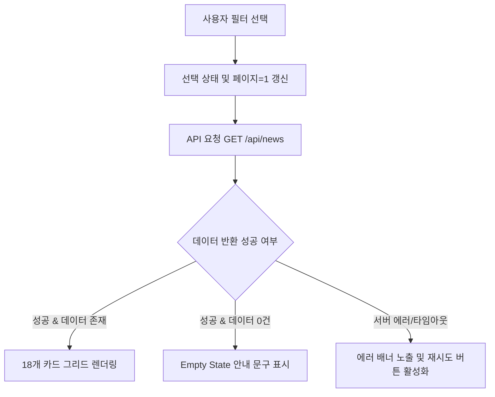
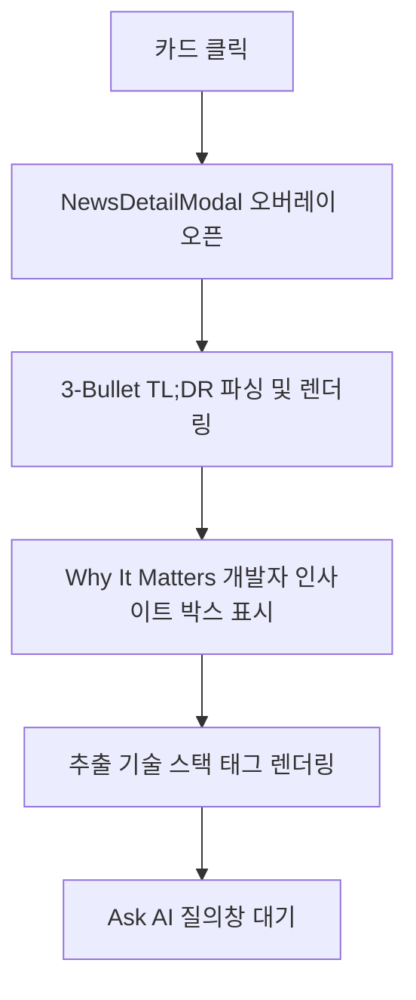
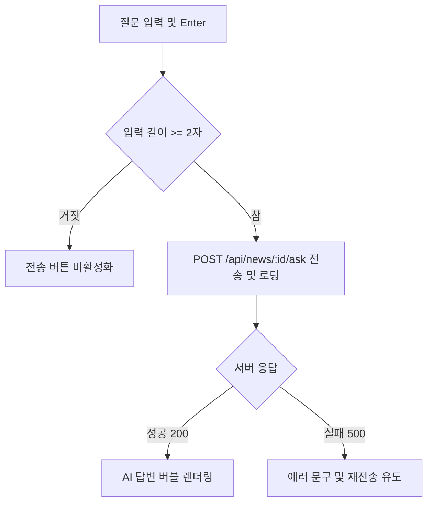

# 뉴스 피드 및 큐레이션 상세기능정의서 (News Feed & Curation FSD)

- **도메인**: 뉴스 피드 브라우징, 큐레이션, 상세 조회, Ask AI, 북마크
- **작성자**: 기획 명세 작성가 (`spec-writer`)
- **문서 버전**: v2.0
- **상태**: Approved

---

## 단위 기능 상세 명세 (7대 상세 명세 완비)

---

### [FUNC-FEED-001] 다차원 피드 필터링 및 카드 목록 조회

#### 1. 기본 정보
- **기능명**: 다차원 카테고리/출처/고신호 필터링 및 피드 카드 목록 조회
- **기능 ID**: `FUNC-FEED-001`
- **대응 요구사항 ID**: `REQ-FEED-001`
- **대상 화면 코드**: `SCR-FEED-001` (메인 피드 화면)
- **우선순위**: Must Have
- **관련 액터 (Actor)**: 일반 엔지니어 / AI 연구원

#### 2. 사전 조건 (Pre-conditions)
1. 사용자가 메인 웹 페이지(`SCR-FEED-001`)에 정상 진입한 상태.
2. 백엔드 API 서비스(`/api/news`)가 정상 동작하고 데이터베이스 조회가 가능한 상태.

#### 3. 사용자 인터랙션 및 시스템 동작 흐름과 플로우차트 (Step-by-Step Flow & Flowchart)
1. 사용자가 상단 카테고리 바에서 특정 카테고리(예: `harness`, `mcp_plugins_skills`)를 클릭하거나, 출처 탭(예: `GitHub`, `ArXiv`, `GeekNews`), 또는 `⭐️ Must Read Only` 토글을 클릭한다.
2. 클라이언트 컴포넌트는 선택 상태를 갱신하고 현재 페이지를 1페이지로 리셋한다.
3. 클라이언트는 `GET /api/news?category=...&source=...&high_signal_only=...&sort=...&page=1&size=18` API를 호출한다.
4. 백엔드는 조건에 부합하는 NewsItem 레코드를 쿼리하여 총 개수, 현재 페이지, 18개의 아이템 목록을 반환한다.
5. 클라이언트는 스켈레톤 로더를 해제하고 카드 그리드를 렌더링한다.

#### 4. 화면 표시 및 입력 데이터 항목 명세 (UI Data Elements - 8대 표준 컬럼)
| 항목명 | 화면 표시/입력 구분 | UI 컴포넌트 | 필수 여부 | 데이터 타입 / 제약 | 기본값 | 유효성 검증 규칙 (Validation) | 노출/수정 조건 |
| :--- | :---: | :--- | :---: | :--- | :---: | :--- | :--- |
| `category` | 사용자 선택 | Category Button Group | 선택 | Enum (`all`, `harness`, `mcp_plugins_skills`, `agent_tech`, `ai_news`) | `all` | 정의된 5개 카테고리 값 중 1개 선택 | 상시 활성화 |
| `source` | 사용자 선택 | Source Pill Tabs | 선택 | String / 영문 소문자 | `all` | 등록된 활성 소스 ID 목록 매칭 | 상시 활성화 |
| `sort` | 사용자 선택 | Dropdown / Button | 선택 | Enum (`hot`, `latest`, `quality`) | `hot` | 정렬 허용 키워드 매칭 | 상시 활성화 |
| `high_signal_only` | 사용자 선택 | Toggle Switch Button | 선택 | Boolean | `false` | true/false 불리언 | 상시 활성화 |
| `title` | 노출 전용 | Card Heading Link | - | String / 최대 500자 | - | XSS Sanitize 처리 | 카드 렌더링 시 |
| `quality_score` | 노출 전용 | Number Badge | - | Float (1.0 ~ 10.0) | 6.0 | 소수점 첫째 자리 포맷팅 | 카드 렌더링 시 |
| `is_high_signal` | 노출 전용 | Star Icon Badge | - | Boolean | false | quality_score >= 7.8 | 조건 충족 시 배지 노출 |
| `tech_stack` | 노출 전용 | Pill Badge List | - | Array[String] | [] | 쉼표 분리 후 개별 태그 바인딩 | 태그 존재 시 노출 |

#### 5. 비즈니스 규칙 (Business Rules)
- **BR-FEED-001-1 (점수 정렬)**: `sort=hot`인 경우 `hotness_score DESC, published_at DESC` 기준으로 랭킹된다.
- **BR-FEED-001-2 (하이 시그널 기준)**: `is_high_signal` 플래그는 `quality_score >= 7.8`인 아티클에 자동 부여된다.
- **BR-FEED-001-3 (페이징 크기)**: 기본 페이지 사이즈는 18개로 고정되며, 18개 초과 시 하단 번호형 페이지네이션을 노출한다.

#### 6. 예외 처리 및 엣지 케이스 (Edge Cases & Exception Handling)
| 발생 상황 (Edge Case Scenario) | 화면 반응 및 시스템 처리 방식 | 사용자 안내 메시지 |
| :--- | :--- | :--- |
| 선택한 필터 조건의 아티클이 0건인 경우 | 카드 그리드 영역에 Empty State 일러스트 노출 | "선택한 조건에 맞는 최신 소식이 없습니다. 필터를 변경해보세요." |
| 네트워크 단절 또는 백엔드 500 에러 | 스켈레톤 로더 종료 후 재시도 버튼이 포함된 Alert 카드 노출 | "데이터를 불러오지 못했습니다. 잠시 후 다시 시도해주세요." |
| 모바일 화면 너비 (375px) | 3열 카드 그리드에서 1열 반응형 카드 배치로 자동 전환 | (시각적 최적화) |

#### 7. 비즈니스 에러 코드 매핑
| 비즈니스 에러 코드 | 발생 사유 | HTTP 상태 코드 매핑 | 클라이언트 표시 형태 |
| :--- | :--- | :---: | :--- |
| `ERR_FEED_FETCH_FAILED` | 데이터베이스 연결 풀 고갈 또는 네트워크 타임아웃 | 500 Internal Server Error | 메인 화면 상단 빨간색 경고 배너 및 재시도 버튼 |
| `ERR_INVALID_PAGE_PARAM` | 음수 또는 비정상적인 page/size 파라미터 | 400 Bad Request | 기본 1페이지로 자동 강제 보정 |

---

### [FUNC-FEED-003] 아티클 3줄 요약 및 Why It Matters 상세 모달

#### 1. 기본 정보
- **기능명**: 아티클 3-Bullet TL;DR 및 개발자 시사점(Why It Matters) 상세 모달 조회
- **기능 ID**: `FUNC-FEED-003`
- **대응 요구사항 ID**: `REQ-FEED-002`
- **대상 화면 코드**: `SCR-FEED-002` (아티클 상세 모달)
- **우선순위**: Must Have
- **관련 액터 (Actor)**: 일반 엔지니어 / AI 연구원

#### 2. 사전 조건 (Pre-conditions)
1. 피드 카드 목록에서 특정 아티클 카드를 클릭한 상태.
2. 해당 아티클의 `NewsItem` 객체가 유효한 `id`를 보유한 상태.

#### 3. 사용자 인터랙션 및 시스템 동작 흐름과 플로우차트 (Step-by-Step Flow & Flowchart)
1. 사용자가 피드 카드를 클릭한다.
2. 시스템은 상세 모달(`NewsDetailModal`)을 화면 중앙에 오버레이로 띄운다.
3. 모달은 아티클의 제목, 출처, 작성일, 원문 링크, 품질 점수, 추출된 기술 스택 태그를 렌더링한다.
4. LLM이 생성한 3개의 핵심 불릿 요약(`tldr_bullets`)과 개발자 시사점(`why_it_matters`)을 강조 박스 형태로 표시한다.
5. 사용자가 "원문 보기"를 클릭하면 새 탭에서 외부 원본 URL로 이동한다.

#### 4. 화면 표시 및 입력 데이터 항목 명세 (UI Data Elements - 8대 표준 컬럼)
| 항목명 | 화면 표시/입력 구분 | UI 컴포넌트 | 필수 여부 | 데이터 타입 / 제약 | 기본값 | 유효성 검증 규칙 (Validation) | 노출/수정 조건 |
| :--- | :---: | :--- | :---: | :--- | :---: | :--- | :--- |
| `tldr_bullets` | 노출 전용 | Bullet List (Check Icon) | 필수 | Array[String] / 3개 요소 | [] | JSON 파싱 오류 시 원문 요약 분할 대체 | 모달 상단 노출 |
| `why_it_matters` | 노출 전용 | Highlight Card (Indigo) | - | String / 1~2문장 | "" | 빈 문자열일 경우 박스 미노출 | 내용 존재 시 |
| `summary` | 노출 전용 | Text Paragraph | - | String | "" | 텍스트 줄바꿈 유지 | 모달 중단 노출 |
| `url` | 노출 전용 | External Link Button | 필수 | String / Valid URL | - | `https://` 스키마 검증 | 원문 보기 버튼 |

#### 5. 비즈니스 규칙 (Business Rules)
- **BR-FEED-003-1 (불릿 정합성)**: `tldr_bullets`는 3개의 독립된 불릿 포인트로 표현되며, 문맥상 핵심 기술 혁신, 성능 지표, 방법론을 포함한다.
- **BR-FEED-003-2 (모달 외부 클릭)**: 배경 딤(Dim) 영역 클릭 또는 `ESC` 키 입력 시 모달이 즉각 닫히며 스크롤 잠금이 해제된다.

#### 6. 예외 처리 및 엣지 케이스 (Edge Cases)
- `tldr_bullets`가 비어있는 구버전 데이터의 경우 `summary`의 첫 3개 문장을 정규식으로 분할하여 임시 불릿으로 부드럽게 폴백(Fallback)한다.

---

### [FUNC-FEED-004] 특정 아티클 대상 대화형 Ask AI 질의응답

#### 1. 기본 정보
- **기능명**: 특정 아티클 대상 대화형 Ask AI 질의응답
- **기능 ID**: `FUNC-FEED-004`
- **대응 요구사항 ID**: `REQ-FEED-003`
- **대상 화면 코드**: `SCR-FEED-002` (상세 모달 하단 질의 패널)
- **우선순위**: Must Have
- **관련 액터 (Actor)**: 일반 엔지니어 / AI 연구원

#### 2. 사전 조건 (Pre-conditions)
1. 아티클 상세 모달이 열려 있는 상태.
2. 사용자가 질의 입력창에 2자 이상의 질문을 입력한 상태.

#### 3. 사용자 인터랙션 및 시스템 동작 흐름과 플로우차트 (Step-by-Step Flow & Flowchart)
1. 사용자가 질문 입력창에 질문(예: "이 논문의 벤치마크 결과는?")을 입력하고 전송 버튼 또는 Enter를 누른다.
2. 시스템은 입력창을 비활성화하고 로딩 스피너를 표시한다.
3. 시스템은 `POST /api/news/{id}/ask` 페이로드 `{"question": "..."}`를 전송한다.
4. 백엔드는 아티클 본문 및 요약 컨텍스트를 주입하여 LLM(Gemini/OpenAI 또는 로컬 내장 NLP 엔진)을 통해 답변을 합성한다.
5. 시스템은 응답을 수신하여 대화 이력 버블에 추가하고 스크롤을 최하단으로 이동한다.

#### 4. 화면 표시 및 입력 데이터 항목 명세 (UI Data Elements - 8대 표준 컬럼)
| 항목명 | 화면 표시/입력 구분 | UI 컴포넌트 | 필수 여부 | 데이터 타입 / 제약 | 기본값 | 유효성 검증 규칙 (Validation) | 노출/수정 조건 |
| :--- | :---: | :--- | :---: | :--- | :---: | :--- | :--- |
| `question` | 사용자 입력 | Textarea / Input | 필수 | String / 2~500자 | "" | 트림 후 2자 이상 입력 필수 | 상시 활성화 (로딩 시 잠금) |
| `answer` | 노출 전용 | Markdown Viewer Bubble | - | Text / 마크다운 | - | XSS 방어 처리 | 답변 수신 시 노출 |
| `model_used` | 노출 전용 | Small Tag | - | String | "auto" | LLM 제공자 및 모델명 표기 | 응답 완료 시 |

#### 5. 비즈니스 규칙 (Business Rules)
- **BR-FEED-004-1 (컨텍스트 제한)**: 질문은 현재 선택된 아티클의 내용 및 요약 정보로 한정되어 환각(Hallucination)을 최소화한다.
- **BR-FEED-004-2 (중복 전송 방지)**: 답변 대기 중에는 전송 버튼이 비활성화되며 추가 입력을 차단한다.

#### 6. 예외 처리 및 엣지 케이스 (Edge Cases)
| 발생 상황 | 처리 방식 | 사용자 안내 메시지 |
| :--- | :--- | :--- |
| LLM API 할당량 초과 또는 타임아웃 | 내장 로컬 NLP 분석기로 자동 폴백하여 요약 기반 답변 제공 | "실시간 AI 응답 지연으로 로컬 분석 결과를 제공합니다." |

#### 7. 비즈니스 에러 코드 매핑
| 비즈니스 에러 코드 | 발생 사유 | HTTP 상태 | 클라이언트 형태 |
| :--- | :--- | :---: | :--- |
| `ERR_ASK_EMPTY_QUESTION` | 공백 질문 입력 | 400 | 입력창 포커스 및 인라인 경고 |
| `ERR_NEWS_NOT_FOUND` | 존재하지 않는 아티클 ID | 404 | 모달 닫힘 및 경고 토스트 |
