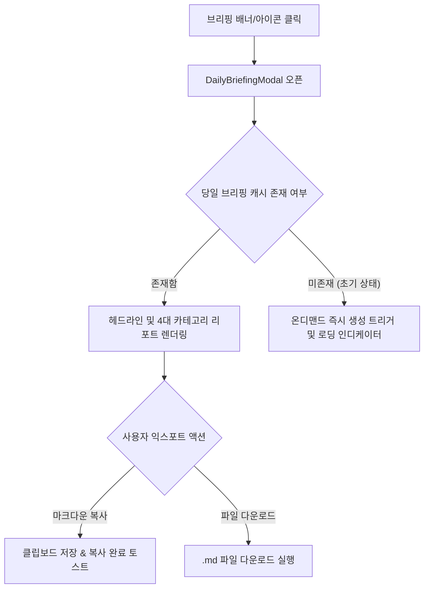
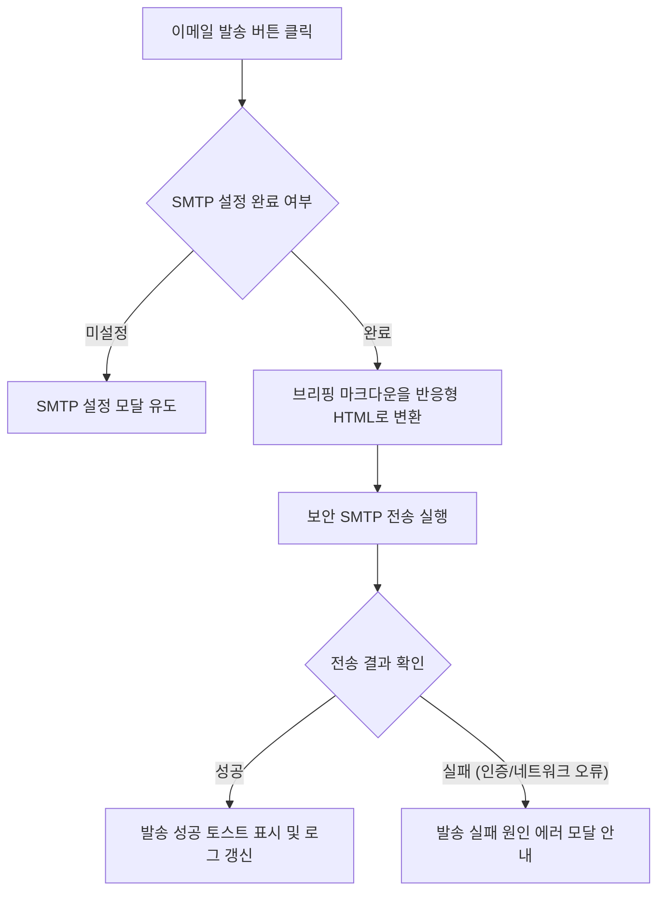

# 일일 브리핑 및 외부 지식 공유 상세기능정의서 (Daily Briefing FSD)

- **도메인**: 일일 AI 브리핑 생성, 브리핑 모달, 마크다운 익스포트, Notion 연동, 이메일 발송
- **작성자**: 기획 명세 작성가 (`spec-writer`)
- **문서 버전**: v2.1
- **상태**: Approved

---

## 단위 기능 상세 명세 (단위기능별 7대 상세 명세 완비)

---

### [FUNC-BRIEF-001] 오늘의 AI 종합 브리핑 열람 및 마크다운 다운로드

#### 1. 기본 정보
- **기능명**: 오늘의 AI 종합 브리핑 열람 및 마크다운 리포트 다운로드
- **기능 ID**: `FUNC-BRIEF-001`
- **대응 요구사항 ID**: `REQ-BRIEF-001`
- **대상 화면 코드**: `SCR-BRIEF-001` (일일 브리핑 모달)
- **우선순위**: Must Have
- **관련 액터 (Actor)**: 일반 엔지니어 / 테크 리더

#### 2. 사전 조건 (Pre-conditions)
1. 메인 대시보드 상단의 '오늘의 AI 브리핑 배너' 또는 헤더 브리핑 아이콘을 클릭한 상태.
2. 최근 24시간 동안 수집 및 분석된 일일 브리핑 리포트 데이터가 준비된 상태.

#### 3. 사용자 인터랙션 및 시스템 동작 흐름과 플로우차트 (Step-by-Step Flow & Flowchart)
1. 사용자가 메인 헤더 또는 상단 배너의 "오늘의 AI 브리핑" 버튼을 클릭한다.
2. `DailyBriefingModal`이 화면 중앙에 팝업된다.
3. 모달에는 리포트 발행 일자, 종합 헤드라인 요약문, 4대 카테고리(하네스/벤치마크, MCP/도구, 에이전트 아키텍처, AI 일반)별 하이라이트 요약 및 추천 아티클 링크 목록이 렌더링된다.
4. "마크다운 복사" 버튼 클릭 시 전체 브리핑 전문이 클립보드에 복사되고 복사 완료 토스트가 뜬다.
5. "리포트 다운로드" 버튼 클릭 시 `AgentLens_Daily_Briefing_YYYY-MM-DD.md` 파일로 브라우저 다운로드가 실행된다.



#### 4. 화면 표시 및 입력 데이터 항목 명세 (UI Data Elements - 8대 표준 컬럼)
| 항목명 | 화면 표시/입력 구분 | UI 컴포넌트 | 필수 여부 | 데이터 타입 / 제약 | 기본값 | 유효성 검증 규칙 (Validation) | 노출/수정 조건 |
| :--- | :---: | :--- | :---: | :--- | :---: | :--- | :--- |
| `headline` | 노출 전용 | Large Heading Text | 필수 | String / 1~2문장 | - | 텍스트 렌더링 | 모달 최상단 노출 |
| `date` | 노출 전용 | Date Badge | 필수 | String (YYYY-MM-DD) | 당일 일자 | ISO 날짜 포맷 | 헤드라인 상단 |
| `categories` | 노출 전용 | 4-Grid Accordion Card | 필수 | Array[CategorySection] | [] | 4개 카테고리 완비 검증 | 모달 본문 |
| `action_items` | 노출 전용 | Checklist Box | 선택 | Array[String] | [] | 추천 액션 1~3개 | 내용 존재 시 노출 |
| `copy_markdown`| 사용자 조작 | Button with Copy Icon | 필수 | Button | - | 클릭 시 클립보드 API 연동 | 상시 활성화 |
| `download_md`  | 사용자 조작 | Button with Download | 필수 | Button | - | 클릭 시 파일 스트림 다운로드 | 상시 활성화 |

#### 5. 비즈니스 규칙 (Business Rules)
- **BR-BRIEF-001-1 (발행 주기 및 기준 윈도우)**: 매일 UTC 00:00(한국 시간 09:00)에 최근 24시간 동안 수집된 아티클을 분석하여 자동 생성된다.
- **BR-BRIEF-001-2 (아티클 선별 기준)**: 각 카테고리별 `hotness_score` 및 `quality_score`가 최상위권인 아티클 3~5건을 핵심 레퍼런스로 발탁한다.
- **BR-BRIEF-001-3 (마크다운 포맷팅 규약)**: 복사 및 다운로드되는 마크다운은 GitHub Flavored Markdown(GFM) 규격을 준수하여 헤딩, 불릿, 체크리스트, 외부 링크를 올바르게 보존한다.

#### 6. 예외 처리 및 엣지 케이스 (Edge Cases & Exception Handling)
| 발생 상황 | 화면 반응 | 사용자 안내 메시지 |
| :--- | :--- | :--- |
| 24시간 내 신규 수집된 아티클이 부족한 경우 | 탐색 윈도우를 최근 72시간으로 자동 확장하여 공백 브리핑 방지 | (최근 72시간 소식 기반 브리핑 생성) |
| 클립보드 API 접근 권한이 브라우저에서 차단된 경우 | 텍스트 영역 선택(Select All) 모드로 전환하여 수동 복사 유도 | "클립보드 접근이 제한되었습니다. 전문을 직접 복사해주세요." |

#### 7. 비즈니스 에러 코드 매핑
| 비즈니스 에러 코드 | 발생 사유 | HTTP 상태 코드 매핑 | 클라이언트 표시 형태 |
| :--- | :--- | :---: | :--- |
| `ERR_BRIEFING_NOT_READY` | 브리핑 데이터 생성 진행 중 | 202 Accepted | 로딩 스피너 및 진행 안내 문구 |
| `ERR_BRIEFING_FETCH_FAILED` | 브리핑 조회 실패 | 500 Internal Server Error | 모달 내 재시도 버튼 노출 |

---

### [FUNC-BRIEF-002] Notion 1-클릭 페이지 생성 및 동기화

#### 1. 기본 정보
- **기능명**: Notion 1-클릭 페이지 생성 및 동기화
- **기능 ID**: `FUNC-BRIEF-002`
- **대응 요구사항 ID**: `REQ-BRIEF-002`
- **대상 화면 코드**: `SCR-BRIEF-002` (브리핑 연동 설정 모달)
- **우선순위**: Must Have
- **관련 액터 (Actor)**: AI 에이전트 리드 / 개발 관리자

#### 2. 사전 조건 (Pre-conditions)
1. Notion API 토큰(`secret_...`) 및 대상 상위 페이지 ID(`notion_page_id`)가 설정된 상태.
2. 유효한 일일 브리핑 리포트가 생성되어 있는 상태.

#### 3. 사용자 인터랙션 및 시스템 동작 흐름과 플로우차트 (Step-by-Step Flow & Flowchart)
1. 사용자가 브리핑 모달 상단의 "Notion 내보내기" 버튼을 클릭한다.
2. 클라이언트는 노션 연동 API 요청을 전송하고 버튼을 로딩 상태로 전환한다.
3. 시스템은 노션 API 규격에 맞춰 부모 페이지 하위에 당일 날짜 제목의 신규 페이지를 생성하고, 브리핑 내용을 구조화된 블록(제목, 콜아웃, 불릿 리스트, 북마크 링크) 형태로 기록한다.
4. 생성이 완료되면 시스템은 새로 생성된 Notion 페이지 URL을 반환한다.
5. 클라이언트는 성공 토스트와 함께 "생성된 Notion 페이지 열기" 링크 버튼을 노출한다.

```mermaid
flowchart TD
    A[Notion 내보내기 버튼 클릭] --> B{Notion 연동 설정 여부 확인}
    B -- 키 미등록 --> C[연동 설정 모달 팝업 유도]
    B -- 설정 완료 --> D[Notion 페이지 생성 API 호출 및 버튼 로딩]
    D --> E{API 연동 결과}
    E -- 200 OK & URL 반환 --> F[성공 토스트 & "Notion 열기" 링크 버튼 노출]
    E -- 401/404/실패 --> G[오류 원인 안내 토스트 & 설정 확인 유도]
```

#### 4. 화면 표시 및 입력 데이터 항목 명세 (UI Data Elements - 8대 표준 컬럼)
| 항목명 | 화면 표시/입력 구분 | UI 컴포넌트 | 필수 여부 | 데이터 타입 / 제약 | 기본값 | 유효성 검증 규칙 (Validation) | 노출/수정 조건 |
| :--- | :---: | :--- | :---: | :--- | :---: | :--- | :--- |
| `notion_api_key` | 사용자 입력 | Password Input | 필수 | String / Masked | "" | `secret_` 접두사 필수 검증 | 연동 설정 모달 |
| `notion_page_id` | 사용자 입력 | Text Input | 필수 | String (32자리 UUID) | "" | 32자 16진수 또는 UUID 포맷 | 연동 설정 모달 |
| `notion_auto_export`| 사용자 선택 | Checkbox Switch | 선택 | Boolean | false | true/false 불리언 | 연동 설정 모달 |
| `export_button` | 사용자 조작 | Export Button | 필수 | Button | - | 설정 완료 시 활성화 | 브리핑 모달 상단 |
| `notion_page_url` | 노출 전용 | External Link Link | 선택 | String / URL | "" | 생성 완료 시 URL 바인딩 | 생성 완료 후 노출 |

#### 5. 비즈니스 규칙 (Business Rules)
- **BR-BRIEF-002-1 (자격증명 보호)**: 노션 API 토큰은 클라이언트로 평문 전송되지 않으며, 항상 앞 7자리 이후 마스킹(`secret_****...`) 처리되어 표기된다.
- **BR-BRIEF-002-2 (자동 익스포트 연동)**: `notion_auto_export=true`로 설정된 경우, 매일 정기 브리핑 생성 시점에 사용자의 수동 클릭 없이도 자동으로 Notion 페이지가 생성된다.
- **BR-BRIEF-002-3 (중복 페이지 방지)**: 동일 날짜에 재익스포트 요청 시, 기존 생성된 당일 페이지 내용을 갱신(Update)하거나 접미사(v2)를 부여하여 중복 페이지 난립을 방지한다.

#### 6. 예외 처리 및 엣지 케이스 (Edge Cases & Exception Handling)
| 발생 상황 | 화면 반응 | 사용자 안내 메시지 |
| :--- | :--- | :--- |
| 노션 토큰 만료 또는 권한 오류 (401/403) | 에러 토스트 및 연동 설정 모달 자동 오픈 | "Notion API 토큰이 유효하지 않거나 대상 페이지 권한이 없습니다. 설정을 확인해주세요." |
| 부모 페이지를 찾을 수 없는 경우 (404) | 입력 필드 하단 인라인 에러 표시 | "지정된 부모 페이지 ID를 찾을 수 없습니다. 통합(Integration)이 초대되었는지 확인해주세요." |

#### 7. 비즈니스 에러 코드 매핑
| 비즈니스 에러 코드 | 발생 사유 | HTTP 상태 코드 매핑 | 클라이언트 표시 형태 |
| :--- | :--- | :---: | :--- |
| `ERR_NOTION_AUTH_FAILED` | 노션 인증 토큰 불일치 | 401 Unauthorized | 설정 입력창 경고 표시 |
| `ERR_NOTION_PAGE_NOT_FOUND` | 페이지 ID 오류 또는 권한 부재 | 404 Not Found | 인라인 에러 안내 문구 |

---

### [FUNC-BRIEF-003] SMTP 이메일 수동 발송 및 자동 예약 발송

#### 1. 기본 정보
- **기능명**: SMTP 이메일 수동 발송 및 자동 예약 발송
- **기능 ID**: `FUNC-BRIEF-003`
- **대응 요구사항 ID**: `REQ-BRIEF-002`
- **대상 화면 코드**: `SCR-BRIEF-002` (브리핑 연동 설정 모달)
- **우선순위**: Must Have
- **관련 액터 (Actor)**: AI 에이전트 리드 / 개발 관리자

#### 2. 사전 조건 (Pre-conditions)
1. SMTP 발송 서버(호스트, 포트, 계정, 암호) 및 수신 대상 이메일 주소가 등록된 상태.
2. 유효한 일일 브리핑 리포트 데이터가 존재하는 상태.

#### 3. 사용자 인터랙션 및 시스템 동작 흐름과 플로우차트 (Step-by-Step Flow & Flowchart)
1. 사용자가 연동 설정에서 "이메일 전송 테스트" 또는 브리핑 화면에서 "이메일 발송" 버튼을 클릭한다.
2. 시스템은 수신 대상 이메일 주소의 유효성을 검증한다.
3. 시스템은 당일 브리핑 리포트를 가독성 높은 반응형 HTML 뉴스레터 템플릿으로 변환한다.
4. 보안 SMTP 연결을 통해 지정된 수신처로 이메일을 발송한다.
5. 발송 성공 시 완료 토스트 메시지를 표시하고 발송 로그를 기록한다.



#### 4. 화면 표시 및 입력 데이터 항목 명세 (UI Data Elements - 8대 표준 컬럼)
| 항목명 | 화면 표시/입력 구분 | UI 컴포넌트 | 필수 여부 | 데이터 타입 / 제약 | 기본값 | 유효성 검증 규칙 (Validation) | 노출/수정 조건 |
| :--- | :---: | :--- | :---: | :--- | :---: | :--- | :--- |
| `smtp_host` | 사용자 입력 | Text Input | 필수 | String / 호스트명 | "" | 도메인 또는 IP 포맷 검증 | 설정 모달 |
| `smtp_port` | 사용자 입력 | Number Input | 필수 | Integer (1~65535) | 587 | 유효한 포트 범위 | 설정 모달 |
| `smtp_user` | 사용자 입력 | Text Input | 필수 | String / 이메일 또는 ID | "" | 공백 불가 | 설정 모달 |
| `smtp_password` | 사용자 입력 | Password Input | 필수 | String / Masked | "" | 공백 불가 (마스킹) | 설정 모달 |
| `smtp_to` | 사용자 입력 | Text Input | 필수 | String / Valid Email | "" | 표준 이메일 정규식 검증 | 설정 모달 |
| `email_auto_send`| 사용자 선택 | Checkbox Switch | 선택 | Boolean | false | true/false 불리언 | 설정 모달 |
| `send_test_email`| 사용자 조작 | Button | 필수 | Button | - | 입력값 유효 시 활성화 | 설정 모달 |

#### 5. 비즈니스 규칙 (Business Rules)
- **BR-BRIEF-003-1 (다중 수신자 지원)**: `smtp_to` 필드는 쉼표(`,`) 또는 세미콜론(`;`)으로 구분하여 최대 10개 주소까지 복수 수신자를 지정할 수 있다.
- **BR-BRIEF-003-2 (자동 발송 시점)**: `email_auto_send=true`일 경우 매일 UTC 00:00(한국시간 09:00) 일일 브리핑이 성공적으로 생성되는 즉시 수신자 목록으로 자동 발송된다.
- **BR-BRIEF-003-3 (HTML 폴백)**: 이메일 클라이언트가 HTML을 지원하지 않을 경우를 대비하여 본문에 마크다운 일반 텍스트(Plain Text)를 대체 뷰(Alternative Part)로 포함한다.

#### 6. 예외 처리 및 엣지 케이스 (Edge Cases & Exception Handling)
| 발생 상황 | 화면 반응 | 사용자 안내 메시지 |
| :--- | :--- | :--- |
| SMTP 인증 실패 (계정/비밀번호 불일치) | 에러 모달 팝업 및 입력 필드 포커스 | "SMTP 인증에 실패했습니다. 사용자 이름 및 비밀번호를 다시 확인해주세요." |
| 메일 서버 연결 시간 초과 (10초 초과) | 실패 안내 토스트 표시 | "메일 서버 연결 시간이 초과되었습니다. 호스트 주소 및 포트를 확인해주세요." |

#### 7. 비즈니스 에러 코드 매핑
| 비즈니스 에러 코드 | 발생 사유 | HTTP 상태 코드 매핑 | 클라이언트 표시 형태 |
| :--- | :--- | :---: | :--- |
| `ERR_SMTP_AUTH_FAILED` | SMTP 자격증명 불일치 | 401 Unauthorized | 에러 팝업 모달 |
| `ERR_SMTP_HOST_UNREACHABLE` | SMTP 서버 접속 불가 | 502 Bad Gateway | 상단 경고 토스트 |
| `ERR_INVALID_RECIPIENT_EMAIL` | 유효하지 않은 수신 이메일 주소 | 400 Bad Request | 입력 필드 인라인 에러 |
