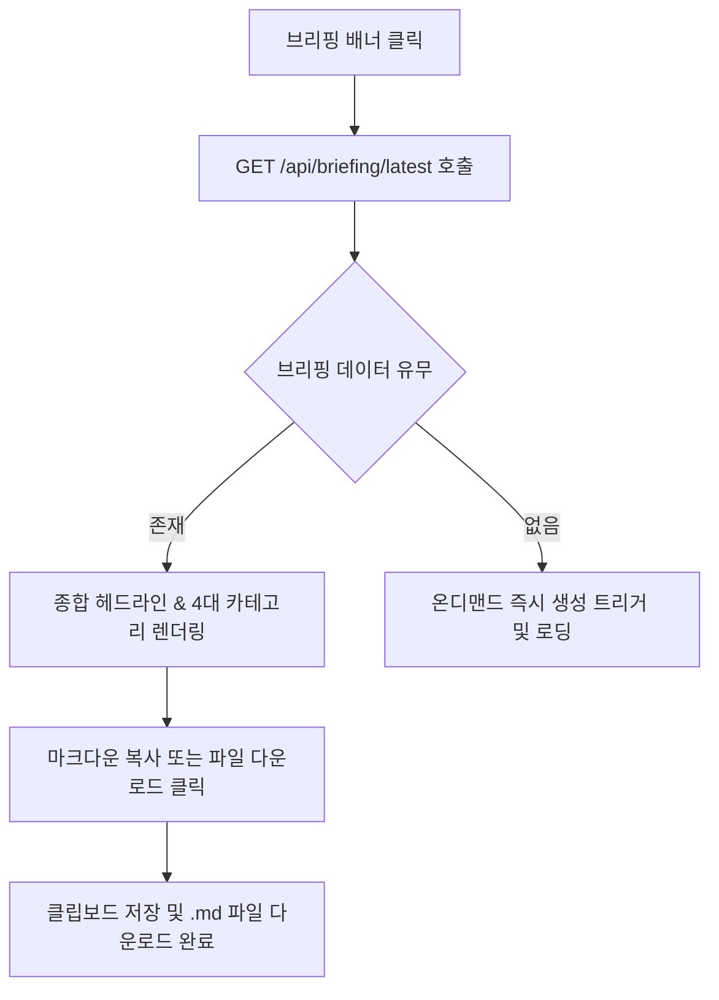
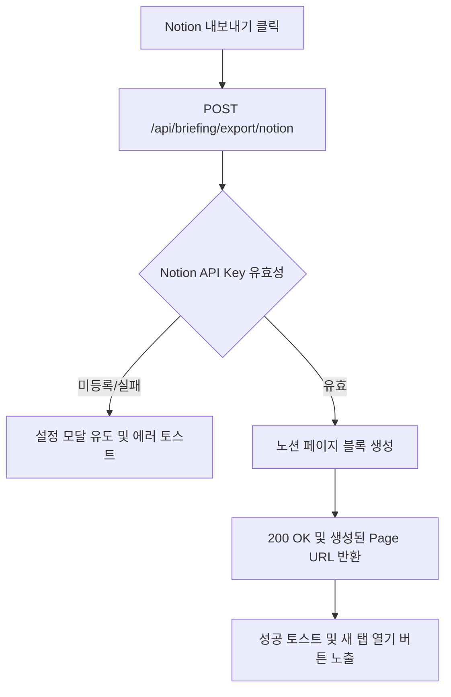

# 일일 브리핑 및 외부 채널 연동 상세기능정의서 (Daily Briefing FSD)

- **도메인**: 일일 AI 브리핑 생성, 브리핑 모달, 마크다운 익스포트, Notion 연동, 이메일 발송
- **작성자**: 기획 명세 작성가 (`spec-writer`)
- **문서 버전**: v2.0
- **상태**: Approved

---

## 단위 기능 상세 명세 (7대 상세 명세 완비)

---

### [FUNC-BRIEF-001] 오늘의 AI 종합 브리핑 열람 및 마크다운 다운로드

#### 1. 기본 정보
- **기능명**: 오늘의 AI 종합 브리핑 열람 및 마크다운 리포트 다운로드
- **기능 ID**: `FUNC-BRIEF-001`
- **대응 요구사항 ID**: `REQ-BRIEF-001`
- **대상 화면 코드**: `SCR-BRIEF-001` (일일 브리핑 모달)
- **우선순위**: Must Have
- **관련 액터 (Actor)**: 일반 엔지니어 / 테크 리더

#### 2. 사전 조건 (Pre-conditions)
1. 사용자가 메인 페이지 상단의 '오늘의 AI 브리핑 배너' 또는 헤더의 브리핑 아이콘을 클릭한 상태.
2. 백엔드에서 최근 24시간 동안 수집된 아티클을 분석한 브리핑 데이터(`GET /api/briefing/latest`)가 준비된 상태.

#### 3. 사용자 인터랙션 및 시스템 동작 흐름과 플로우차트 (Step-by-Step Flow & Flowchart)
1. 사용자가 상단 브리핑 배너를 클릭한다.
2. `DailyBriefingModal`이 열리며 오늘의 날짜, 종합 헤드라인, 4대 카테고리별(하네스, MCP, 에이전트, AI소식) 핵심 요약과 추천 아티클 카드 목록이 표시된다.
3. 사용자가 "마크다운 복사" 버튼을 클릭하면 전체 브리핑 전문이 클립보드에 복사되고 "복사 완료!" 토스트가 뜬다.
4. "리포트 다운로드" 버튼을 클릭하면 `AgentLens_Daily_Briefing_YYYY-MM-DD.md` 파일로 즉시 저장된다.

#### 4. 화면 표시 및 입력 데이터 항목 명세 (UI Data Elements - 8대 표준 컬럼)
| 항목명 | 화면 표시/입력 구분 | UI 컴포넌트 | 필수 여부 | 데이터 타입 / 제약 | 기본값 | 유효성 검증 규칙 (Validation) | 노출/수정 조건 |
| :--- | :---: | :--- | :---: | :--- | :---: | :--- | :--- |
| `headline` | 노출 전용 | Large Heading | 필수 | String / 1문장 요약 | - | 텍스트 렌더링 | 상단 메인 노출 |
| `date` | 노출 전용 | Subtitle Badge | 필수 | String (YYYY-MM-DD) | 당일 날짜 | 날짜 포맷 검증 | 헤드라인 하단 |
| `categories` | 노출 전용 | 4-Grid Accordion | 필수 | Array[CategorySection] | [] | 4개 카테고리 완비 검증 | 섹션별 순차 노출 |
| `action_items` | 노출 전용 | Checklist Box | - | Array[String] | [] | 실천 과제 1~3개 | 내용 존재 시 |
| `markdown_report` | 노출 전용 | Markdown Viewer | 필수 | Text (Markdown) | - | 마크다운 파싱 렌더링 | 모달 본문 |

#### 5. 비즈니스 규칙 (Business Rules)
- **BR-BRIEF-001-1 (브리핑 갱신 주기)**: 매일 UTC 00:00(한국시간 09:00)에 백그라운드 크론에 의해 자동 재생성되며, 사용자는 언제든 최신 캐시를 열람한다.
- **BR-BRIEF-001-2 (아티클 선별)**: 카테고리별 `hotness_score`와 `quality_score`가 가장 높은 상위 3~5개 아티클이 주요 하이라이트로 발탁된다.

#### 6. 예외 처리 및 엣지 케이스 (Edge Cases)
- 24시간 내 수집된 데이터가 매우 적은 경우(초기 상태), 최근 72시간으로 탐색 윈도우를 확장하여 빈 브리핑이 나오지 않도록 방어한다.

---

### [FUNC-BRIEF-003] Notion 1-클릭 페이지 생성 및 SMTP 이메일 자동 발송

#### 1. 기본 정보
- **기능명**: Notion 1-클릭 페이지 생성 및 SMTP 이메일 자동 발송 설정
- **기능 ID**: `FUNC-BRIEF-003`
- **대응 요구사항 ID**: `REQ-BRIEF-002`
- **대상 화면 코드**: `SCR-BRIEF-002` (브리핑 연동 설정 모달)
- **우선순위**: Must Have
- **관련 액터 (Actor)**: AI 에이전트 리드 / 개발 관리자

#### 2. 사전 조건 (Pre-conditions)
1. Notion API Key 및 부모 Page ID가 설정되었거나, SMTP 서버 정보가 등록된 상태.
2. 유효한 당일 브리핑 데이터가 생성되어 있는 상태.

#### 3. 사용자 인터랙션 및 시스템 동작 흐름과 플로우차트 (Step-by-Step Flow & Flowchart)
1. 사용자가 브리핑 모달 상단의 "Notion 내보내기" 버튼을 누른다.
2. 시스템은 `POST /api/briefing/export/notion`을 호출한다.
3. 백엔드의 `NotionService`는 노션 블록 API를 통해 하위 페이지를 생성하고 요약 블록을 마크다운 형태로 동기화한다.
4. 생성된 노션 페이지의 URL을 반환받아 클라이언트는 "Notion 페이지 열기" 버튼과 성공 토스트를 띄운다.
5. "이메일 발송" 버튼 클릭 시 수신자 주소로 포맷팅된 HTML 뉴스레터를 SMTP로 즉시 전송한다.

#### 4. 화면 표시 및 입력 데이터 항목 명세 (UI Data Elements - 8대 표준 컬럼)
| 항목명 | 화면 표시/입력 구분 | UI 컴포넌트 | 필수 여부 | 데이터 타입 / 제약 | 기본값 | 유효성 검증 규칙 (Validation) | 노출/수정 조건 |
| :--- | :---: | :--- | :---: | :--- | :---: | :--- | :--- |
| `notion_api_key` | 사용자 입력 | Password Input | 선택 | String / Masked | "" | `secret_` 접두사 검증 | 설정 모달 |
| `notion_page_id` | 사용자 입력 | Text Input | 선택 | String (32자리 UUID) | "" | 32자 16진수 또는 UUID 포맷 | 설정 모달 |
| `notion_auto_export`| 사용자 선택 | Checkbox Switch | 선택 | Boolean | false | 불리언 | 설정 모달 |
| `smtp_host` | 사용자 입력 | Text Input | 선택 | String / 도메인 | "" | 유효한 호스트명 | 설정 모달 |
| `smtp_port` | 사용자 입력 | Number Input | 선택 | Integer (1~65535) | 587 | 포트 범위 검증 | 설정 모달 |
| `smtp_to` | 사용자 입력 | Text Input | 선택 | String / Email | "" | 이메일 포맷 검증 | 설정 모달 |
| `email_auto_send` | 사용자 선택 | Checkbox Switch | 선택 | Boolean | false | 불리언 | 설정 모달 |

#### 5. 비즈니스 규칙 (Business Rules)
- **BR-BRIEF-003-1 (보안 마스킹)**: 클라이언트로 설정 조회 시 `notion_api_key`와 `smtp_password`는 마스킹(`****...`) 처리되어 전송된다.
- **BR-BRIEF-003-2 (자동 발송)**: `email_auto_send=true`일 경우 일일 브리핑이 생성되는 시점에 등록된 수신처로 이메일이 자동 발송된다.

#### 6. 예외 처리 및 엣지 케이스 (Edge Cases)
| 발생 상황 | 화면 반응 | 안내 메시지 |
| :--- | :--- | :--- |
| Notion 권한 오류 (403/404) | 실패 토스트 및 연동 설정 가이드 버튼 노출 | "Notion 페이지에 통합(Integration) 권한이 추가되었는지 확인해주세요." |
| SMTP 인증 실패 (AuthenticationFailed) | 에러 모달 노출 | "SMTP 사용자 이름 또는 비밀번호가 일치하지 않습니다." |

#### 7. 비즈니스 에러 코드 매핑
| 비즈니스 에러 코드 | 발생 사유 | HTTP 상태 | 클라이언트 표시 |
| :--- | :--- | :---: | :--- |
| `ERR_NOTION_AUTH_FAILED` | 노션 키 불일치 | 401 | 설정 팝업 유도 및 경고 문구 |
| `ERR_NOTION_PAGE_NOT_FOUND` | 페이지 ID 오류 | 404 | 인라인 에러 |
| `ERR_SMTP_CONNECTION_FAILED` | 메일 서버 접근 불가 | 502 | 상단 에러 토스트 |
