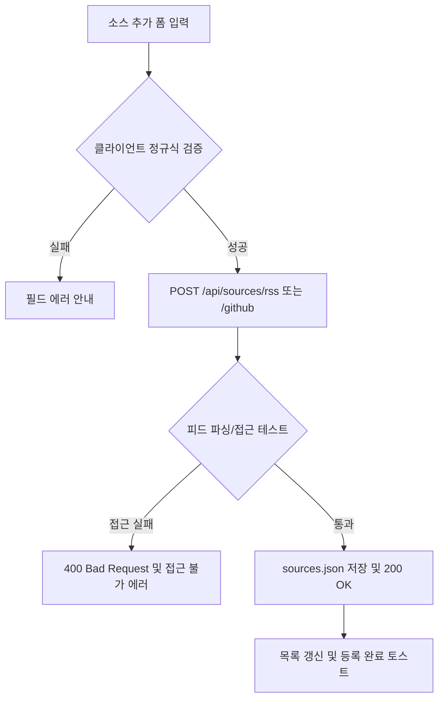
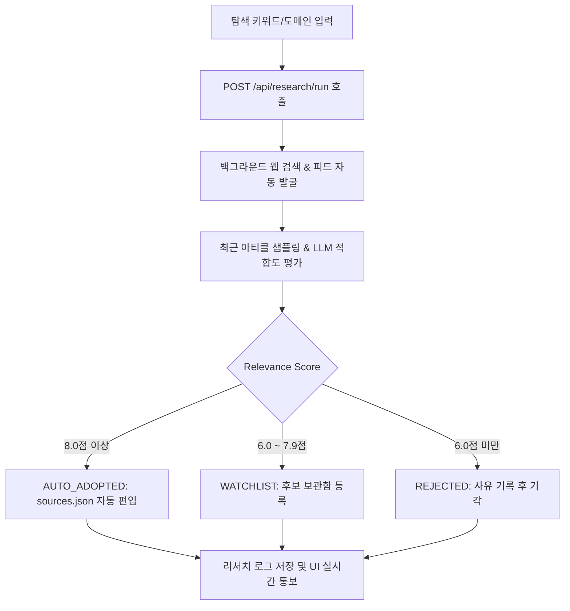

# 수집원 관리 및 딥 리서처 상세기능정의서 (Sources & Deep Researcher FSD)

- **도메인**: RSS/GitHub 소스 관리, 수집 On/Off 토글, Autonomous Deep Researcher
- **작성자**: 기획 명세 작성가 (`spec-writer`)
- **문서 버전**: v2.0
- **상태**: Approved

---

## 단위 기능 상세 명세 (7대 상세 명세 완비)

---

### [FUNC-SRC-001] 신규 수집 피드 및 GitHub 레포지토리 등록

#### 1. 기본 정보
- **기능명**: 신규 RSS/Atom 피드 및 GitHub 모니터링 저장소 등록
- **기능 ID**: `FUNC-SRC-001`
- **대응 요구사항 ID**: `REQ-SRC-001`
- **대상 화면 코드**: `SCR-SRC-001` (수집원 관리 모달)
- **우선순위**: Must Have
- **관련 액터 (Actor)**: AI 에이전트 개발자 / 시스템 운영자

#### 2. 사전 조건 (Pre-conditions)
1. 헤더의 "수집원" 관리 버튼을 클릭하여 `SourcesModal`에 진입한 상태.
2. 유효한 RSS 피드 URL 또는 GitHub 저장소 명(`owner/repo`)을 보유한 상태.

#### 3. 사용자 인터랙션 및 시스템 동작 흐름과 플로우차트 (Step-by-Step Flow & Flowchart)
1. 사용자가 "RSS 추가" 탭에서 피드명, 피드 URL, 기본 카테고리를 입력하고 등록 버튼을 누른다.
2. 클라이언트는 URL 유효성을 1차 확인하고 `POST /api/sources/rss`를 호출한다.
3. 백엔드는 피드 URL의 접근성 및 구문 분석 가능 여부를 테스트 검증한다.
4. 검증 통과 시 `sources.json` 파일에 저장하고 활성 피드 목록에 즉시 반영한다.
5. GitHub 레포 등록 시 `POST /api/sources/github`로 `owner/repo` 형식을 등록한다.

#### 4. 화면 표시 및 입력 데이터 항목 명세 (UI Data Elements - 8대 표준 컬럼)
| 항목명 | 화면 표시/입력 구분 | UI 컴포넌트 | 필수 여부 | 데이터 타입 / 제약 | 기본값 | 유효성 검증 규칙 (Validation) | 노출/수정 조건 |
| :--- | :---: | :--- | :---: | :--- | :---: | :--- | :--- |
| `name` | 사용자 입력 | Text Input | 필수 | String / 2~50자 | "" | 트림 후 필수 입력 | RSS 추가 탭 |
| `url` | 사용자 입력 | URL Input | 필수 | String / Valid URL | "" | `http://` 또는 `https://` 시작 | RSS 추가 탭 |
| `category_hint` | 사용자 선택 | Select Box | 선택 | Enum (`ai_news`, `harness`, `mcp_plugins_skills`, `agent_tech`) | `ai_news` | 정의된 카테고리 매칭 | RSS 추가 탭 |
| `country` | 사용자 선택 | Radio Button | 선택 | Enum (`KR`, `GLOBAL`) | `GLOBAL` | 2개 값 중 1개 | RSS 추가 탭 |
| `repo` | 사용자 입력 | Text Input | 필수 | String (`^[a-zA-Z0-9_.-]+/[a-zA-Z0-9_.-]+$`) | "" | `owner/repo` 슬래시 필수 | GitHub 추가 탭 |

#### 5. 비즈니스 규칙 (Business Rules)
- **BR-SRC-001-1 (중복 방지)**: 이미 등록된 URL 또는 GitHub Repo인 경우 중복 등록을 거부하고 경고 메시지를 표시한다.
- **BR-SRC-001-2 (원자적 파일 저장)**: `sources.json` 갱신 시 백업을 생성하고 원자적 쓰기(Atomic Write)를 수행한다.

#### 6. 예외 처리 및 엣지 케이스 (Edge Cases)
| 발생 상황 | 화면 반응 | 안내 메시지 |
| :--- | :--- | :--- |
| 유효하지 않은 XML/RSS 피드 주소 | 입력창 하단 경고 | "올바른 RSS/Atom 피드 주소가 아닙니다. URL을 다시 확인해주세요." |
| 존재하지 않는 GitHub 비공개 레포 | 입력창 하단 경고 | "공개된 GitHub 저장소를 찾을 수 없습니다." |

---

### [FUNC-SRC-003] AI Deep Researcher 자율 소스 분석 및 자동 채택

#### 1. 기본 정보
- **기능명**: AI Deep Researcher 기반 신규 기술 소스 자율 탐색 및 자동 채택
- **기능 ID**: `FUNC-SRC-003`
- **대응 요구사항 ID**: `REQ-SRC-002`
- **대상 화면 코드**: `SCR-SRC-002` (수집원 모달 > 자율 리서처 탭)
- **우선순위**: Should Have
- **관련 액터 (Actor)**: 시스템 운영자 / AI 엔지니어

#### 2. 사전 조건 (Pre-conditions)
1. 사용자가 수집원 모달의 "딥 리서처" 탭에 진입한 상태.
2. 탐색 키워드(예: "LangGraph agentic evaluation") 또는 후보 웹사이트 URL을 입력한 상태.

#### 3. 사용자 인터랙션 및 시스템 동작 흐름과 플로우차트 (Step-by-Step Flow & Flowchart)
1. 사용자가 키워드 또는 탐색 대상을 입력하고 "자율 탐색 시작" 버튼을 클릭한다.
2. 시스템은 `POST /api/research/run`을 호출하여 백그라운드 리서치 태스크를 실행한다.
3. 리서처는 웹 검색, 피드 탐색, 최근 아티클 3~5개를 수집하여 기술 적합도(Relevance Score)를 평가한다.
4. 적합도가 8.0 이상이면 `AUTO_ADOPTED` 판정을 내리고 자동으로 `sources.json`에 편입한다.
5. 사용자는 탐색 이력 및 판정 사유(Verdict Reason)를 UI 카드 형태로 실시간 확인한다.

#### 4. 화면 표시 및 입력 데이터 항목 명세 (UI Data Elements - 8대 표준 컬럼)
| 항목명 | 화면 표시/입력 구분 | UI 컴포넌트 | 필수 여부 | 데이터 타입 / 제약 | 기본값 | 유효성 검증 규칙 (Validation) | 노출/수정 조건 |
| :--- | :---: | :--- | :---: | :--- | :---: | :--- | :--- |
| `keyword` | 사용자 입력 | Text Input | 선택 | String / 2~100자 | "" | 빈 값 시 기본 AI 에이전트 키워드 | 리서처 탭 |
| `relevance_score` | 노출 전용 | Score Gauge Badge | - | Float (0.0 ~ 10.0) | 0.0 | 소수점 첫째 자리 | 이력 카드 |
| `verdict` | 노출 전용 | Status Pill Badge | - | Enum (`AUTO_ADOPTED`, `WATCHLIST`, `REJECTED`) | - | 상태별 색상(초록/노랑/빨강) | 이력 카드 |
| `verdict_reason` | 노출 전용 | Text Box | - | Text | - | 평가 근거 요약 | 이력 카드 |

#### 5. 비즈니스 규칙 (Business Rules)
- **BR-SRC-003-1 (자동 채택 임계치)**: 적합도 8.0점 이상이고 RSS 파싱이 성공한 소스만 즉각 자동 채택된다.
- **BR-SRC-003-2 (로깅)**: 모든 리서치 활동은 `SourceResearchLog` DB 테이블에 영구 저장된다.

#### 6. 예외 처리 및 엣지 케이스 (Edge Cases)
- 대상 웹사이트에서 RSS 피드가 발견되지 않는 경우 HTML 헤더의 `link[type="application/rss+xml"]`을 자동 탐색하고, 없을 경우 기각 처리한다.
