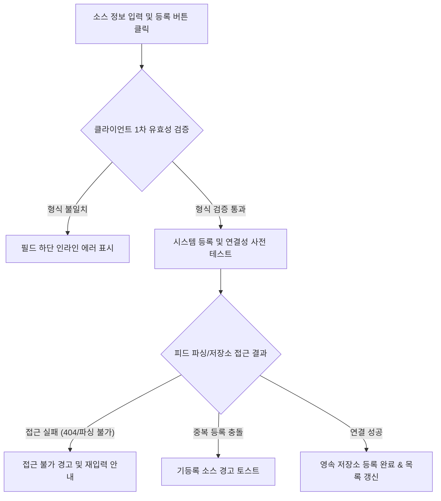
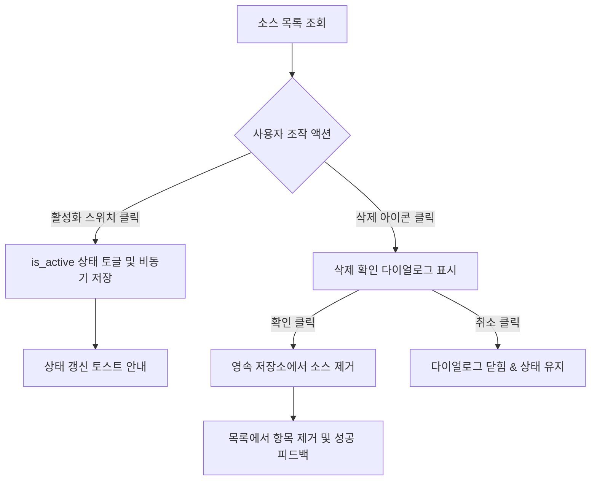
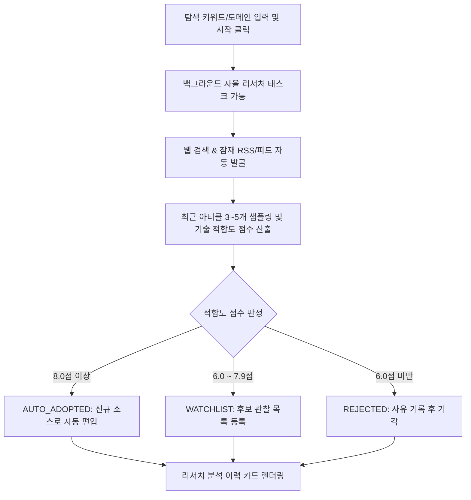

# 수집원 관리 및 딥 리서처 상세기능정의서 (Sources & Deep Researcher FSD)

- **도메인**: RSS/GitHub 소스 등록, 활성화/비활성화 토글, 영구 삭제, AI Deep Researcher 자율 소스 발굴
- **작성자**: 기획 명세 작성가 (`spec-writer`)
- **문서 버전**: v2.1
- **상태**: Approved

---

## 단위 기능 상세 명세 (단위기능별 7대 상세 명세 완비)

---

### [FUNC-SRC-001] 신규 RSS 피드 및 GitHub 레포지토리 등록

#### 1. 기본 정보
- **기능명**: 신규 RSS/Atom 피드 및 GitHub 모니터링 저장소 등록
- **기능 ID**: `FUNC-SRC-001`
- **대응 요구사항 ID**: `REQ-SRC-001`
- **대상 화면 코드**: `SCR-SRC-001` (수집원 관리 모달)
- **우선순위**: Must Have
- **관련 액터 (Actor)**: AI 에이전트 개발자 / 시스템 운영자

#### 2. 사전 조건 (Pre-conditions)
1. 메인 헤더의 "수집원" 관리 버튼을 클릭하여 `SourcesModal`에 진입한 상태.
2. 유효한 RSS/Atom 피드 URL 또는 공개된 GitHub 저장소 경로(`owner/repo`)를 보유한 상태.

#### 3. 사용자 인터랙션 및 시스템 동작 흐름과 플로우차트 (Step-by-Step Flow & Flowchart)
1. 사용자가 수집원 관리 모달에서 "RSS 추가" 또는 "GitHub 추가" 탭을 선택한다.
2. 피드 이름, URL, 카테고리 힌트, 국가(KR/GLOBAL) 또는 GitHub 저장소 명칭(`owner/repo`)을 입력한다.
3. "등록" 버튼을 클릭한다.
4. 클라이언트는 URL 형식 및 필수 입력값의 정합성을 검증한다.
5. 시스템은 대상 피드 또는 저장소의 네트워크 접근성과 유효성을 사전에 테스트 검증한다.
6. 검증 통과 시 영속 저장소에 신규 소스를 등록하고 활성 소스 목록을 즉시 갱신한다.

#### 4. 화면 표시 및 입력 데이터 항목 명세 (UI Data Elements - 8대 표준 컬럼)
| 항목명 | 화면 표시/입력 구분 | UI 컴포넌트 | 필수 여부 | 데이터 타입 / 제약 | 기본값 | 유효성 검증 규칙 (Validation) | 노출/수정 조건 |
| :--- | :---: | :--- | :---: | :--- | :---: | :--- | :--- |
| `feed_name` | 사용자 입력 | Text Input | 필수 | String / 2~50자 | "" | 트림 후 필수 입력 | RSS 추가 탭 |
| `feed_url` | 사용자 입력 | URL Input | 필수 | String / Valid URL | "" | `http://` 또는 `https://` 시작 | RSS 추가 탭 |
| `category_hint` | 사용자 선택 | Select Box | 선택 | Enum (`ai_news`, `harness`, `mcp_plugins_skills`, `agent_tech`) | `ai_news` | 정의된 카테고리 매칭 | RSS 추가 탭 |
| `country` | 사용자 선택 | Radio Button | 선택 | Enum (`KR`, `GLOBAL`) | `GLOBAL` | 정의된 2개 값 중 1개 | RSS 추가 탭 |
| `repo` | 사용자 입력 | Text Input | 필수 | String (`^[a-zA-Z0-9_.-]+/[a-zA-Z0-9_.-]+$`) | "" | `owner/repo` 슬래시 필수 | GitHub 추가 탭 |
| `submit_button` | 사용자 조작 | Submit Button | 필수 | Button | - | 필수 필드 입력 시 활성화 | 상시 활성화 |

#### 5. 비즈니스 규칙 (Business Rules)
- **BR-SRC-001-1 (중복 등록 방지)**: 동일한 피드 URL 또는 GitHub 저장소 식별자가 이미 등록되어 있는 경우 중복 등록을 거부하고 경고 메시지를 표시한다.
- **BR-SRC-001-2 (사전 연결성 검증 강제)**: 피드 주소가 유효한 XML/RSS/Atom 규격이 아니거나 대상 GitHub 저장소가 존재하지 않는 경우 등록을 차단한다.

#### 6. 예외 처리 및 엣지 케이스 (Edge Cases & Exception Handling)
| 발생 상황 | 화면 반응 | 사용자 안내 메시지 |
| :--- | :--- | :--- |
| 올바르지 않은 RSS 구조의 웹페이지 URL 입력 시 | 등록 실패 경고 및 올바른 피드 주소 확인 안내 | "올바른 RSS/Atom 피드 주소가 아닙니다. URL을 다시 확인해주세요." |
| 비공개(Private) 또는 존재하지 않는 GitHub 저장소 입력 | 인라인 붉은색 에러 표시 | "공개된 GitHub 저장소를 찾을 수 없습니다. 경로를 확인해주세요." |

#### 7. 비즈니스 에러 코드 매핑
| 비즈니스 에러 코드 | 발생 사유 | HTTP 상태 코드 매핑 | 클라이언트 표시 형태 |
| :--- | :--- | :---: | :--- |
| `ERR_DUPLICATE_SOURCE` | 이미 등록된 소스 URL 또는 저장소 | 409 Conflict | 경고 토스트 알림 |
| `ERR_INVALID_FEED_URL` | 피드 XML 파싱 실패 또는 404 | 400 Bad Request | 입력 필드 인라인 에러 |

---

### [FUNC-SRC-002] 수집 소스 항목별 수집 On/Off 토글 및 영구 삭제

#### 1. 기본 정보
- **기능명**: 수집 소스 항목별 수집 활성화/비활성화 토글 및 영구 삭제
- **기능 ID**: `FUNC-SRC-002`
- **대응 요구사항 ID**: `REQ-SRC-001`
- **대상 화면 코드**: `SCR-SRC-001` (수집원 관리 모달 > 소스 목록 탭)
- **우선순위**: Must Have
- **관련 액터 (Actor)**: AI 에이전트 개발자 / 시스템 운영자

#### 2. 사전 조건 (Pre-conditions)
1. 수집원 관리 모달의 소스 목록 탭에 진입한 상태.
2. 최소 1개 이상의 소스가 목록에 존재하는 상태.

#### 3. 사용자 인터랙션 및 시스템 동작 흐름과 플로우차트 (Step-by-Step Flow & Flowchart)
1. 사용자가 등록된 소스 목록에서 특정 소스의 활성화 토글 스위치(Switch)를 클릭한다.
2. 클라이언트는 즉시 토글 UI 상태를 변경하고 활성화 상태 갱신 요청을 전송한다.
3. 시스템은 해당 소스의 활성화 플래그(`is_active`)를 갱신하여 다음 정기 수집 시 대상 포함/제외 여부를 반영한다.
4. 사용자가 삭제 버튼(휴지통 아이콘)을 클릭하면 삭제 확인 모달이 노출된다.
5. "삭제 확인" 클릭 시 해당 소스를 영구 삭제하고 목록에서 제거한다.

#### 4. 화면 표시 및 입력 데이터 항목 명세 (UI Data Elements - 8대 표준 컬럼)
| 항목명 | 화면 표시/입력 구분 | UI 컴포넌트 | 필수 여부 | 데이터 타입 / 제약 | 기본값 | 유효성 검증 규칙 (Validation) | 노출/수정 조건 |
| :--- | :---: | :--- | :---: | :--- | :---: | :--- | :--- |
| `source_list` | 노출 전용 | Table / List Card | 필수 | Array[SourceItem] | [] | 항목별 ID 고유성 검증 | 소스 목록 탭 |
| `is_active` | 사용자 토글 | Toggle Switch | 필수 | Boolean | true | true/false 토글 | 각 소스 행 |
| `source_type` | 노출 전용 | Type Badge (RSS/GitHub) | 필수 | Enum (`RSS`, `GITHUB`, `BUILTIN`) | `RSS` | 소스 타입 식별 | 각 소스 행 |
| `delete_source`| 사용자 조작 | Trash Icon Button | 필수 | Button | - | 기본 제공 소스는 비활성화 가능 | 각 소스 행 |

#### 5. 비즈니스 규칙 (Business Rules)
- **BR-SRC-002-1 (기본 소스 보호)**: 시스템 내장 기본 소스(Built-in Sources)는 활성화/비활성화 토글은 가능하나 영구 삭제는 차단된다.
- **BR-SRC-002-2 (최소 활성 소스 보장)**: 모든 소스를 일괄 비활성화할 경우 수집 파이프라인이 중단되므로, 최소 1개 이상의 소스가 활성화 상태를 유지하도록 경고를 제공한다.

#### 6. 예외 처리 및 엣지 케이스 (Edge Cases & Exception Handling)
| 발생 상황 | 화면 반응 | 사용자 안내 메시지 |
| :--- | :--- | :--- |
| 수집이 실행 중인 상태에서 활성 소스 삭제 시도 | 삭제는 허용하되 현재 진행 중인 배치 수집 완료 후 즉각 반영 | "진행 중인 수집 완료 후 반영됩니다." |
| 삭제 확인 모달 외부 클릭 | 모달 닫힘 및 삭제 동작 취소 | (취소 처리) |

#### 7. 비즈니스 에러 코드 매핑
| 비즈니스 에러 코드 | 발생 사유 | HTTP 상태 코드 매핑 | 클라이언트 표시 형태 |
| :--- | :--- | :---: | :--- |
| `ERR_SOURCE_NOT_FOUND` | 이미 삭제된 소스 조작 시도 | 404 Not Found | 목록 자동 새로고침 |
| `ERR_CANNOT_DELETE_BUILTIN` | 기본 내장 소스 영구 삭제 시도 | 403 Forbidden | 경고 모달 알림 |

---

### [FUNC-SRC-003] AI Deep Researcher 자율 소스 분석 및 자동 채택

#### 1. 기본 정보
- **기능명**: AI Deep Researcher 기반 신규 기술 소스 자율 탐색 및 자동 채택
- **기능 ID**: `FUNC-SRC-003`
- **대응 요구사항 ID**: `REQ-SRC-002`
- **대상 화면 코드**: `SCR-SRC-002` (수집원 모달 > 자율 리서처 탭)
- **우선순위**: Should Have
- **관련 액터 (Actor)**: AI 시스템 운영자 / 엔지니어

#### 2. 사전 조건 (Pre-conditions)
1. 수집원 관리 모달의 "딥 리서처" 탭에 진입한 상태.
2. 탐색 키워드(예: "LangGraph evaluation harness") 또는 관심 기술 도메인 URL이 입력된 상태.

#### 3. 사용자 인터랙션 및 시스템 동작 흐름과 플로우차트 (Step-by-Step Flow & Flowchart)
1. 사용자가 탐색 키워드 또는 도메인 주소를 입력하고 "자율 탐색 시작" 버튼을 클릭한다.
2. 시스템은 백그라운드 자율 리서처 태스크를 가동하고 진행 상태 인디케이터를 노출한다.
3. 리서처는 웹 검색, 피드 탐색, 최근 아티클 3~5개를 샘플링 수집하여 기술 적합도(Relevance Score, 0.0~10.0)를 다각도로 평가한다.
4. 평가 점수에 따라 다음 3가지 판정으로 자동 분류한다:
   - **`AUTO_ADOPTED` (8.0점 이상)**: 신규 활성 수집 소스로 즉시 자동 편입.
   - **`WATCHLIST` (6.0 ~ 7.9점)**: 후보 관찰 목록에 등록하여 수동 검토 지원.
   - **`REJECTED` (6.0점 미만)**: 사유 기록 후 등록 기각.
5. 분석 결과 카드에 적합도 점수, 판정 결과 뱃지, 판정 사유(Verdict Reason)를 실시간으로 노출한다.

#### 4. 화면 표시 및 입력 데이터 항목 명세 (UI Data Elements - 8대 표준 컬럼)
| 항목명 | 화면 표시/입력 구분 | UI 컴포넌트 | 필수 여부 | 데이터 타입 / 제약 | 기본값 | 유효성 검증 규칙 (Validation) | 노출/수정 조건 |
| :--- | :---: | :--- | :---: | :--- | :---: | :--- | :--- |
| `keyword` | 사용자 입력 | Text Input | 선택 | String / 2~100자 | "" | 빈 값일 경우 기본 AI 에이전트 키워드 | 리서처 탭 |
| `start_research`| 사용자 조작 | Button with Radar Icon | 필수 | Button | - | 실행 중 비활성화 | 리서처 탭 |
| `relevance_score`| 노출 전용 | Score Badge (Color-coded)| 필수 | Float (0.0 ~ 10.0) | 0.0 | 소수점 첫째 자리 표기 | 이력 카드 |
| `verdict` | 노출 전용 | Status Pill Badge | 필수 | Enum (`AUTO_ADOPTED`, `WATCHLIST`, `REJECTED`) | - | 상태별 색상(초록/노랑/빨강) | 이력 카드 |
| `verdict_reason` | 노출 전용 | Text Block | 필수 | String | - | 평가 근거 1~2문장 요약 | 이력 카드 |
| `discovered_url` | 노출 전용 | Link Badge | 필수 | String / Valid URL | - | 피드 주소 렌더링 | 이력 카드 |

#### 5. 비즈니스 규칙 (Business Rules)
- **BR-SRC-003-1 (자동 편입 임계치)**: 적합도 점수가 8.0 이상이고 실제 피드 XML 파싱 테스트를 통과한 소스만 `AUTO_ADOPTED`로 판정되어 활성 수집 목록에 즉각 추가된다.
- **BR-SRC-003-2 (이력 보존)**: 모든 리서치 실행 결과 및 판정 사유는 시스템 영속성 이력 저장소에 영구 보존되어 중복 탐색을 방지한다.

#### 6. 예외 처리 및 엣지 케이스 (Edge Cases & Exception Handling)
| 발생 상황 | 화면 반응 | 사용자 안내 메시지 |
| :--- | :--- | :--- |
| 대상 웹사이트에서 RSS 피드를 전혀 찾을 수 없는 경우 | HTML 헤더의 `application/rss+xml` 자동 탐색 후 실패 시 `REJECTED` 처리 | "해당 도메인에서 유효한 RSS 피드를 찾을 수 없습니다." |
| 외부 검색 API 일시 장애 | 로컬 후보 풀 기반 리서치로 폴백하여 분석 진행 | "외부 검색 지연으로 내장 후보군을 분석합니다." |

#### 7. 비즈니스 에러 코드 매핑
| 비즈니스 에러 코드 | 발생 사유 | HTTP 상태 코드 매핑 | 클라이언트 표시 형태 |
| :--- | :--- | :---: | :--- |
| `ERR_RESEARCH_TASK_FAILED` | 리서처 태스크 비정상 중단 | 500 Internal Server Error | 이력 카드 내 실패 배지 표기 |
| `ERR_EMPTY_SEARCH_CANDIDATE` | 탐색 조건에 부합하는 소스 0건 | 404 Not Found | 결과 없음 안내 문구 |
