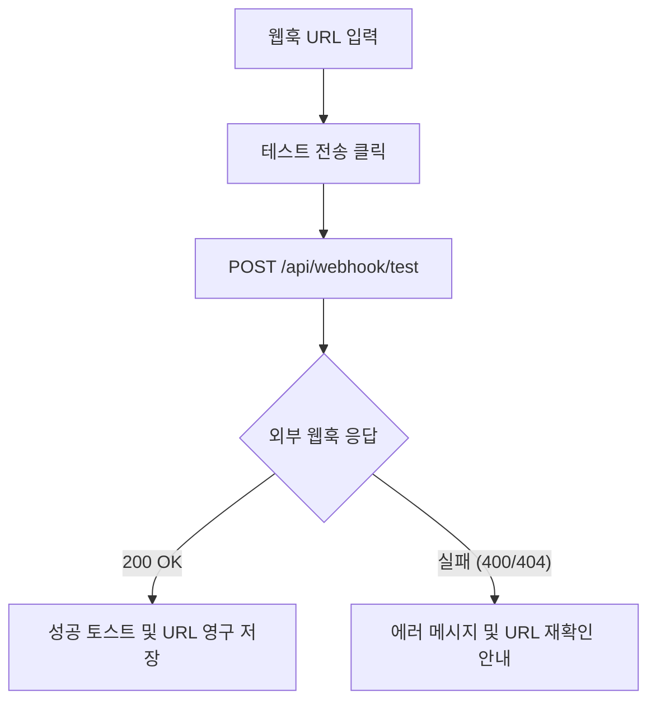
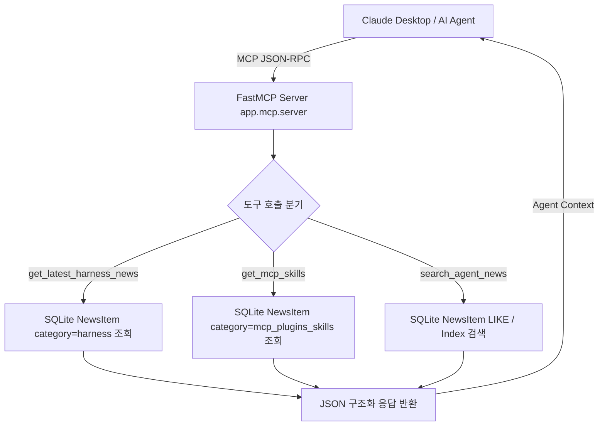

# 시스템 설정, 웹훅 및 MCP 상세기능정의서 (Settings, Webhooks & MCP FSD)

- **도메인**: 정기 수집 스케줄, 온디맨드 수집, 슬랙/디스코드 웹훅, FastMCP 인터페이스
- **작성자**: 기획 명세 작성가 (`spec-writer`)
- **문서 버전**: v2.0
- **상태**: Approved

---

## 단위 기능 상세 명세 (7대 상세 명세 완비)

---

### [FUNC-SYS-001] 정기 크론 스케줄 모니터링 및 즉시 수동 수집 트리거

#### 1. 기본 정보
- **기능명**: 정기 크론 스케줄 모니터링 및 즉시 수동 수집 트리거
- **기능 ID**: `FUNC-SYS-001`
- **대응 요구사항 ID**: `REQ-SETT-001`
- **대상 화면 코드**: `SCR-SYS-001` (스케줄 관리 모달)
- **우선순위**: Must Have
- **관련 액터 (Actor)**: 시스템 운영자 / 개발자

#### 2. 사전 조건 (Pre-conditions)
1. 사용자가 메인 헤더의 "스케줄" 버튼 또는 즉시 수집 아이콘을 클릭한 상태.
2. 백엔드 APScheduler가 백그라운드 태스크로 구동 중인 상태.

#### 3. 사용자 인터랙션 및 시스템 동작 흐름과 플로우차트 (Step-by-Step Flow & Flowchart)
1. 사용자가 `ScheduleModal`을 열면 `GET /api/schedule`을 호출하여 다음 실행 예정 시간, 최근 수집 로그, 현재 실행 여부(`is_running`)를 확인한다.
2. "지금 즉시 수집 시작" 버튼을 클릭하면 `POST /api/schedule/run-now`가 전송된다.
3. 백엔드는 동시 실행 방지 락을 획득하고 모든 활성 수집기(RSS, GitHub, ArXiv, Reddit 등)를 비동기 병렬로 가동한다.
4. 클라이언트는 로딩 스피너 및 진행 상태를 표시하고, 수집 완료 시 신규 저장 건수와 출처별 결과 요약을 토스트로 안내한다.

```mermaid
flowchart TD
    A[즉시 수집 버튼 클릭] --> B[POST /api/schedule/run-now]
    B --> C{이미 수집 중인가?}
    C -- 참 (409 Conflict) --> D["수집이 이미 진행 중입니다" 경고]
    C -- 거짓 --> E[수집 매니저 가동 & 크롤링/LLM 품질평가 실행]
    E --> F[200 OK & {total_collected, total_saved} 반환]
    F --> G[피드 목록 자동 새로고침 및 성공 토스트]
```

#### 4. 화면 표시 및 입력 데이터 항목 명세 (UI Data Elements - 8대 표준 컬럼)
| 항목명 | 화면 표시/입력 구분 | UI 컴포넌트 | 필수 여부 | 데이터 타입 / 제약 | 기본값 | 유효성 검증 규칙 (Validation) | 노출/수정 조건 |
| :--- | :---: | :--- | :---: | :--- | :---: | :--- | :--- |
| `schedule_hours` | 노출 전용 | Badge List | 필수 | Array[Int] | [0, 6, 12, 18] | 시간 포맷 (0~23) | 모달 상단 |
| `next_run` | 노출 전용 | Text Label | 필수 | String (ISO Datetime) | - | 잔여 시간(분) 변환 표시 | 모달 상단 |
| `is_running` | 노출 전용 | Status Pulse Dot | 필수 | Boolean | false | 실행 중일 때 초록 펄스 | 상시 노출 |
| `recent_logs` | 노출 전용 | Table List | - | Array[CrawlLog] | [] | 최근 10건 역순 표시 | 모달 하단 |

#### 5. 비즈니스 규칙 (Business Rules)
- **BR-SYS-001-1 (동시 실행 방지)**: 백엔드 `collector_manager.is_running` 플래그를 통해 동시 수집 트리거를 원천 차단한다.
- **BR-SYS-001-2 (수집 후 피드 동기화)**: 수동 수집이 성공적으로 완료되면 메인 화면의 뉴스 피드가 자동으로 재조회된다.

---

### [FUNC-SYS-002] 슬랙 / 디스코드 웹훅 연동 및 실시간 알림

#### 1. 기본 정보
- **기능명**: 슬랙 / 디스코드 웹훅 연동 및 테스트 알림 전송
- **기능 ID**: `FUNC-SYS-002`
- **대응 요구사항 ID**: `REQ-SETT-002`
- **대상 화면 코드**: `SCR-SYS-002` (웹훅 설정 모달)
- **우선순위**: Should Have
- **관련 액터 (Actor)**: AI 에이전트 개발팀 / 운영 관리자

#### 2. 사전 조건 (Pre-conditions)
1. 슬랙 Incoming Webhook URL 또는 디스코드 Webhook URL을 발급받은 상태.

#### 3. 사용자 인터랙션 및 시스템 동작 흐름과 플로우차트
1. 사용자가 웹훅 모달에서 URL을 입력하고 "테스트 전송"을 누른다.
2. 시스템은 `POST /api/webhook/test`를 호출하여 샘플 카드 메시지를 전송한다.
3. 슬랙/디스코드 채널에 성공적으로 수신되면 "전송 성공" 피드백을 노출하고 저장을 완료한다.
4. 향후 정기 브리핑 생성 또는 하이 시그널 아티클 수집 시 해당 웹훅으로 자동 브로드캐스트된다.



#### 4. 화면 표시 및 입력 데이터 항목 명세 (UI Data Elements - 8대 표준 컬럼)
| 항목명 | 화면 표시/입력 구분 | UI 컴포넌트 | 필수 여부 | 데이터 타입 / 제약 | 기본값 | 유효성 검증 규칙 (Validation) | 노출/수정 조건 |
| :--- | :---: | :--- | :---: | :--- | :---: | :--- | :--- |
| `slack_webhook_url` | 사용자 입력 | Text Input | 선택 | String / URL | "" | `https://hooks.slack.com/services/...` | 웹훅 모달 |
| `discord_webhook_url`| 사용자 입력 | Text Input | 선택 | String / URL | "" | `https://discord.com/api/webhooks/...` | 웹훅 모달 |

---

### [FUNC-SYS-003] FastMCP 연동 및 에이전트 네이티브 인터페이스

#### 1. 기본 정보
- **기능명**: Claude Desktop 등 AI 에이전트 연동용 FastMCP 서버 도구 제공
- **기능 ID**: `FUNC-SYS-003`
- **대응 요구사항 ID**: `REQ-MCP-001`
- **대상 화면 코드**: `SCR-SYS-003` (MCP 안내 모달)
- **우선순위**: Must Have
- **관련 액터 (Actor)**: AI 에이전트 개발자 / Claude Desktop

#### 2. 사전 조건 (Pre-conditions)
1. 로컬 환경에 Python 및 AgentLens 백엔드가 구동 가능한 상태.
2. `claude_desktop_config.json` 설정에 AgentLens MCP 서버가 등록된 상태.

#### 3. 사용자 인터랙션 및 시스템 동작 흐름
1. 사용자가 메인 헤더의 `MCP` 아이콘을 클릭하여 원클릭 설정 JSON 스니펫을 확인 및 복사한다.
2. Claude Desktop 등 MCP 클라이언트는 `app.mcp.server`를 서브프로세스로 구동한다.
3. FastMCP 서버는 다음 3대 도구를 노출한다:
   - `get_latest_harness_news`: 최신 에이전트 평가 하네스/벤치마크 소식 조회
   - `get_mcp_skills`: 최신 MCP 서버 및 도구 릴리즈 소식 조회
   - `search_agent_news`: 키워드 기반 AI 에이전트 기술 소식 검색
4. 에이전트는 대화 중 필요한 최신 정보를 실시간으로 AgentLens DB에서 로컬 RPC로 직접 인출한다.



#### 4. 비즈니스 규칙 (Business Rules)
- **BR-SYS-003-1 (Zero Latency)**: 로컬 SQLite를 직접 쿼리하여 외부 네트워크 왕복 없이 수 밀리초(ms) 내 응답한다.
- **BR-SYS-003-2 (품질 필터)**: MCP 응답에는 품질 점수(Quality Score)가 높은 하이 시그널 위주로 반환하여 에이전트의 컨텍스트 창(Context Window)을 효율적으로 보존한다.
