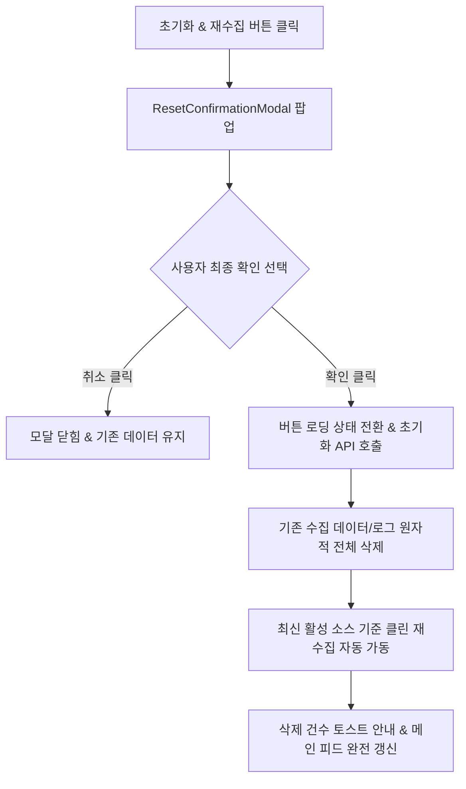
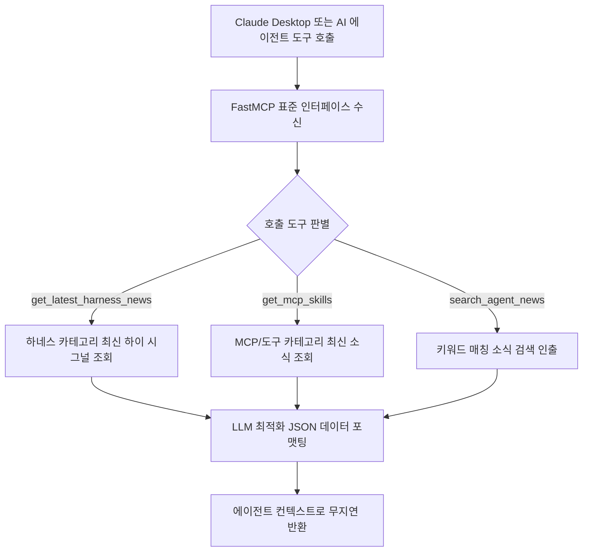

# 시스템 운영, 리셋, 웹훅 및 FastMCP 상세기능정의서 (Settings, Reset, Webhooks & MCP FSD)

- **도메인**: 정기 수집 스케줄, 온디맨드 수동 수집, 데이터 초기화(Reset & Recollect), 웹훅 연동, FastMCP 인터페이스
- **작성자**: 기획 명세 작성가 (`spec-writer`)
- **문서 버전**: v2.1
- **상태**: Approved

---

## 단위 기능 상세 명세 (단위기능별 7대 상세 명세 완비)

---

### [FUNC-SYS-001] 정기 크론 스케줄 모니터링 및 즉시 수동 수집 트리거

#### 1. 기본 정보
- **기능명**: 정기 크론 스케줄 모니터링 및 즉시 수동 수집 트리거
- **기능 ID**: `FUNC-SYS-001`
- **대응 요구사항 ID**: `REQ-SETT-001`
- **대상 화면 코드**: `SCR-SYS-001` (스케줄 관리 모달 및 헤더 상태바)
- **우선순위**: Must Have
- **관련 액터 (Actor)**: 시스템 운영자 / 개발자

#### 2. 사전 조건 (Pre-conditions)
1. 메인 헤더의 "다음 수집" 버튼 또는 "즉시 수집" 버튼을 클릭한 상태.
2. 백엔드 스케줄러 및 수집 관리 서비스가 정상 가동 중인 상태.

#### 3. 사용자 인터랙션 및 시스템 동작 흐름과 플로우차트 (Step-by-Step Flow & Flowchart)
1. 사용자가 메인 헤더의 스케줄 버튼을 클릭하면 `ScheduleModal`이 열린다.
2. 모달에는 1일 4회 정기 수집 주기(0, 6, 12, 18 UTC), 다음 수집까지의 잔여 시간, 최근 수집 로그 이력이 표시된다.
3. 사용자가 "지금 즉시 수집 시작" 버튼을 클릭한다.
4. 시스템은 현재 다른 수집 작업이 진행 중인지 확인한다.
5. 수집이 진행 중이지 않은 경우 수집 상태를 활성화하고 모든 등록된 활성 소스를 병렬 수집한다.
6. 완료 시 신규 저장 건수와 출처별 수집 결과를 안내하는 완료 토스트를 노출하고 피드 목록을 자동으로 갱신한다.

```mermaid
flowchart TD
    A[즉시 수집 버튼 클릭] --> B{현재 수집 작업 진행 여부}
    B -- 진행 중 (중복 인입) --> C[경고 토스트: "수집이 이미 진행 중입니다"]
    B -- 유휴 (Idle) --> D[수집 파이프라인 가동 & 버튼 로딩/스핀 표시]
    D --> E[활성 소스 병렬 크롤링 & AI 품질 평가]
    E --> F{수집 완료 결과}
    F -- 정상 완료 --> G[신규 소식 건수 토스트 & 메인 피드 자동 새로고침]
    F -- 오류 발생 --> H[실패 원인 안내 토스트 노출]
```

#### 4. 화면 표시 및 입력 데이터 항목 명세 (UI Data Elements - 8대 표준 컬럼)
| 항목명 | 화면 표시/입력 구분 | UI 컴포넌트 | 필수 여부 | 데이터 타입 / 제약 | 기본값 | 유효성 검증 규칙 (Validation) | 노출/수정 조건 |
| :--- | :---: | :--- | :---: | :--- | :---: | :--- | :--- |
| `schedule_hours` | 노출 전용 | Hour Badge List | 필수 | Array[Integer] | [0, 6, 12, 18] | 0~23 정수 배열 | 모달 상단 |
| `next_run_countdown`| 노출 전용 | Countdown Text | 필수 | String / "X시간 Y분 후" | - | 잔여 시간 자동 계산 | 헤더 및 모달 |
| `is_collecting` | 노출 전용 | Status Spinner / Pulse | 필수 | Boolean | false | 실행 중일 때 회전 애니메이션 | 헤더 및 모달 |
| `recent_logs` | 노출 전용 | Log Table | - | Array[CrawlLog] | [] | 최근 10건 역순 정렬 | 모달 하단 |
| `trigger_collect` | 사용자 조작 | Button with Refresh Icon| 필수 | Button | - | 수집 중일 때 비활성화 | 상시 노출 |

#### 5. 비즈니스 규칙 (Business Rules)
- **BR-SYS-001-1 (동시 수집 차단 뮤텍스)**: 수집 작업이 이미 진행 중인 상태에서 추가 수집 요청이 들어올 경우 중복 작업을 원천 차단하고 409 상태를 반환한다.
- **BR-SYS-001-2 (수집 후 피드 자동 동기화)**: 수집이 성공적으로 완료되면 클라이언트는 사용자의 별도 새로고침 없이도 최신 피드 데이터를 즉시 재조회하여 갱신한다.

#### 6. 예외 처리 및 엣지 케이스 (Edge Cases & Exception Handling)
| 발생 상황 | 화면 반응 | 사용자 안내 메시지 |
| :--- | :--- | :--- |
| 수동 수집 버튼 연타 시 | 1차 클릭 즉시 버튼 비활성화 및 로딩 스피너 적용 | (시스템 차단으로 중복 요청 방지) |
| 수집 대상 소스 전체의 네트워크 장애 | 실패 결과 안내 토스트 및 최근 정상 로그 상태 유지 | "외부 소스에 접근할 수 없어 수집을 완료하지 못했습니다." |

#### 7. 비즈니스 에러 코드 매핑
| 비즈니스 에러 코드 | 발생 사유 | HTTP 상태 코드 매핑 | 클라이언트 표시 형태 |
| :--- | :--- | :---: | :--- |
| `ERR_COLLECTION_IN_PROGRESS` | 이미 수집이 진행 중인 상태에서 중복 호출 | 409 Conflict | 노란색 경고 토스트 알림 |
| `ERR_COLLECTION_FAILED` | 파이프라인 내부 치명적 에러 | 500 Internal Server Error | 빨간색 실패 토스트 알림 |

---

### [FUNC-SYS-002] 수집 데이터 전체 초기화 및 클린 재수집 (Reset & Recollect)

#### 1. 기본 정보
- **기능명**: 수집 데이터 전체 초기화 및 클린 재수집 (Reset & Recollect)
- **기능 ID**: `FUNC-SYS-002`
- **대응 요구사항 ID**: `REQ-RESET-001`
- **대상 화면 코드**: `SCR-SYS-002` (초기화 확인 다이얼로그)
- **우선순위**: Must Have
- **관련 액터 (Actor)**: 시스템 관리자 / 엔지니어

#### 2. 사전 조건 (Pre-conditions)
1. 메인 헤더의 "초기화 & 재수집" 위험 액션(Danger Action) 버튼을 클릭한 상태.
2. 진행 중인 수집 작업이 없는 유휴(Idle) 상태.

#### 3. 사용자 인터랙션 및 시스템 동작 흐름과 플로우차트 (Step-by-Step Flow & Flowchart)
1. 사용자가 메인 헤더의 빨간색 "초기화 & 재수집" 버튼을 클릭한다.
2. 데이터 전체 영구 삭제의 위험성을 경고하는 `ResetConfirmationModal`이 화면 중앙에 오버레이로 팝업된다.
3. 사용자가 "취소"를 누르면 작업이 즉시 중단되고 모달이 닫힌다.
4. 사용자가 "전체 삭제 후 다시 수집" 버튼을 클릭하면 버튼이 로딩 상태로 전환되고 비활성화된다.
5. 시스템은 기존에 저장된 모든 뉴스 아이템, 중복 해시 이력, 수집 로그를 완전 초기화(Wipe)한 후, 등록된 최신 활성 소스를 기준으로 즉시 클린 재수집 파이프라인을 실행한다.
6. 완료 시 삭제된 건수와 초기화 완료 안내 메시지를 반환하고 모달을 닫으며 메인 피드를 1페이지로 완전히 새로고침한다.



#### 4. 화면 표시 및 입력 데이터 항목 명세 (UI Data Elements - 8대 표준 컬럼)
| 항목명 | 화면 표시/입력 구분 | UI 컴포넌트 | 필수 여부 | 데이터 타입 / 제약 | 기본값 | 유효성 검증 규칙 (Validation) | 노출/수정 조건 |
| :--- | :---: | :--- | :---: | :--- | :---: | :--- | :--- |
| `reset_modal_trigger` | 사용자 조작 | Danger Button (Red) | 필수 | Button | - | 수집 중일 때 비활성화 | 헤더 상단 |
| `warning_message` | 노출 전용 | Alert Text Box | 필수 | String | - | 영구 삭제 경고 문구 | 모달 본문 |
| `cancel_button` | 사용자 조작 | Secondary Button | 필수 | Button | - | 처리 중일 때 비활성화 | 모달 하단 |
| `confirm_reset` | 사용자 조작 | Destructive Button | 필수 | Button | - | 클릭 시 단일 요청 보장 | 모달 하단 |
| `deleted_count` | 노출 전용 | Toast Notification | 선택 | Integer (>= 0) | 0 | 삭제된 레코드 수 안내 | 완료 시 노출 |

#### 5. 비즈니스 규칙 (Business Rules)
- **BR-SYS-002-1 (원자적 초기화 및 연계 재수집)**: 데이터 삭제와 신규 수집 가동은 트랜잭션 수준의 원자성을 유지해야 하며, 삭제만 완료되고 신규 수집이 누락되는 상태를 방지한다.
- **BR-SYS-002-2 (진행 중 수집과의 상호 배제)**: 현재 일반 수집이 진행 중인 동안에는 리셋 버튼이 비활성화되며, 반대로 리셋 처리 중에는 일반 수집 트리거를 허용하지 않는다.

#### 6. 예외 처리 및 엣지 케이스 (Edge Cases & Exception Handling)
| 발생 상황 | 화면 반응 | 사용자 안내 메시지 |
| :--- | :--- | :--- |
| 수집 진행 중에 강제로 리셋 호출 인입 시 | 모달 진입 차단 및 409 에러 토스트 표시 | "수집 작업이 진행 중일 때는 초기화를 실행할 수 없습니다." |
| 초기화 중 브라우저 창 닫힘 | 서버 측 백그라운드 태스크로 정상 완료 보장 | (백그라운드 지속 실행) |

#### 7. 비즈니스 에러 코드 매핑
| 비즈니스 에러 코드 | 발생 사유 | HTTP 상태 코드 매핑 | 클라이언트 표시 형태 |
| :--- | :--- | :---: | :--- |
| `ERR_RESET_CONFLICT` | 수집 중 리셋 시도 | 409 Conflict | 경고 토스트 알림 |
| `ERR_RESET_EXECUTION_FAILED` | 데이터 삭제 중 오류 발생 | 500 Internal Server Error | 위험 경고 모달 알림 |

---

### [FUNC-SYS-003] 슬랙 및 디스코드 웹훅 연동 및 실시간 알림

#### 1. 기본 정보
- **기능명**: 슬랙 및 디스코드 웹훅 연동 및 실시간 알림
- **기능 ID**: `FUNC-SYS-003`
- **대응 요구사항 ID**: `REQ-SETT-002`
- **대상 화면 코드**: `SCR-SYS-003` (웹훅 설정 모달)
- **우선순위**: Should Have
- **관련 액터 (Actor)**: AI 에이전트 개발팀 / 운영 관리자

#### 2. 사전 조건 (Pre-conditions)
1. 슬랙 수신 웹훅 URL(`https://hooks.slack.com/...`) 또는 디스코드 웹훅 URL(`https://discord.com/api/webhooks/...`)을 보유한 상태.

#### 3. 사용자 인터랙션 및 시스템 동작 흐름과 플로우차트 (Step-by-Step Flow & Flowchart)
1. 사용자가 헤더의 설정 메뉴에서 "웹훅 연동"을 선택하여 모달을 오픈한다.
2. Slack 또는 Discord 웹훅 주소를 입력한다.
3. "테스트 전송" 버튼을 클릭한다.
4. 시스템은 각 메신저의 카드/임베드 메시지 규격에 맞춰 샘플 환영 알림 페이로드를 전송한다.
5. 외부 웹훅 엔드포인트에서 정상 응답(200 OK) 수신 시 "전송 성공" 토스트를 노출하고 설정을 영속 저장한다.
6. 이후 일일 브리핑이 발행되거나 품질점수 8.5 이상의 초고신호(High Signal) 소식 수집 시 웹훅 채널로 자동 알림이 전송된다.

```mermaid
flowchart TD
    A[웹훅 URL 입력 및 테스트 전송 클릭] --> B{URL 규격 검증 (Slack/Discord)}
    B -- 유효하지 않은 형식 --> C[입력창 하단 에러 문구 표시]
    B -- 형식 유효 --> D[외부 메신저 웹훅 API 테스트 호출]
    D --> E{외부 수신 응답 확인}
    E -- 200 OK 성공 --> F[성공 토스트 & 웹훅 설정 영속 저장]
    E -- 400/404/실패 --> G[실패 안내 토스트 & URL 재확인 안내]
```

#### 4. 화면 표시 및 입력 데이터 항목 명세 (UI Data Elements - 8대 표준 컬럼)
| 항목명 | 화면 표시/입력 구분 | UI 컴포넌트 | 필수 여부 | 데이터 타입 / 제약 | 기본값 | 유효성 검증 규칙 (Validation) | 노출/수정 조건 |
| :--- | :---: | :--- | :---: | :--- | :---: | :--- | :--- |
| `slack_webhook_url` | 사용자 입력 | Text Input | 선택 | String / URL | "" | `hooks.slack.com` 도메인 검증 | 웹훅 모달 |
| `discord_webhook_url`| 사용자 입력 | Text Input | 선택 | String / URL | "" | `discord.com/api/webhooks` 검증 | 웹훅 모달 |
| `notify_on_briefing`| 사용자 선택 | Checkbox Switch | 선택 | Boolean | true | true/false 불리언 | 웹훅 모달 |
| `notify_on_high_signal`| 사용자 선택 | Checkbox Switch | 선택 | Boolean | false | true/false 불리언 | 웹훅 모달 |
| `test_webhook_btn` | 사용자 조작 | Button | 필수 | Button | - | URL 입력 시 활성화 | 웹훅 모달 |

#### 5. 비즈니스 규칙 (Business Rules)
- **BR-SYS-003-1 (알림 포맷 최적화)**: Slack은 Block Kit 포맷, Discord는 Embed 포맷으로 각각 변환하여 헤드라인, 3줄 요약, 원문 링크가 한눈에 보이도록 가독성을 보장한다.
- **BR-SYS-003-2 (스팸 방지 스로틀링)**: 하이 시그널 알림의 경우 연속 다량 수집 시 1시간당 최대 5건을 초과하지 않도록 전송 빈도를 자동 제한한다.

#### 6. 예외 처리 및 엣지 케이스 (Edge Cases & Exception Handling)
| 발생 상황 | 화면 반응 | 사용자 안내 메시지 |
| :--- | :--- | :--- |
| 삭제되거나 무효화된 웹훅 채널 URL 입력 시 | 테스트 전송 실패 토스트 및 입력 필드 에러 강조 | "웹훅 주소가 올바르지 않거나 삭제된 채널입니다." |
| 외부 메신저 서비스 일시 지연 | 최대 2회 지수 백오프 재시도 후 실패 처리 | "외부 메신저 서버 응답이 지연되고 있습니다." |

#### 7. 비즈니스 에러 코드 매핑
| 비즈니스 에러 코드 | 발생 사유 | HTTP 상태 코드 매핑 | 클라이언트 표시 형태 |
| :--- | :--- | :---: | :--- |
| `ERR_INVALID_WEBHOOK_URL` | 지원되지 않는 웹훅 형식 | 400 Bad Request | 입력 필드 인라인 에러 |
| `ERR_WEBHOOK_DELIVERY_FAILED`| 외부 웹훅 수신 거절 | 502 Bad Gateway | 상단 에러 토스트 |

---

### [FUNC-SYS-004] FastMCP 에이전트 인터페이스 및 도구 제공

#### 1. 기본 정보
- **기능명**: Claude Desktop 등 AI 에이전트 연동용 FastMCP 표준 도구 인터페이스
- **기능 ID**: `FUNC-SYS-004`
- **대응 요구사항 ID**: `REQ-MCP-001`
- **대상 화면 코드**: `SCR-SYS-004` (FastMCP 연동 안내 모달)
- **우선순위**: Must Have
- **관련 액터 (Actor)**: AI 에이전트 개발자 / Claude Desktop / 자율 에이전트

#### 2. 사전 조건 (Pre-conditions)
1. AgentLens 서비스가 가동 중인 환경.
2. 클라이언트 또는 사용자가 FastMCP 설정 모달을 열었거나 에이전트 프로세스가 연결을 시도하는 상태.

#### 3. 사용자 인터랙션 및 시스템 동작 흐름과 플로우차트 (Step-by-Step Flow & Flowchart)
1. 사용자가 메인 헤더의 `MCP` 아이콘을 클릭하여 FastMCP 연동 모달을 오픈한다.
2. 모달에는 Claude Desktop의 설정 파일(`claude_desktop_config.json`)에 바로 붙여넣을 수 있는 원클릭 JSON 설정 스니펫과 제공 도구 목록이 표시된다.
3. 사용자가 "설정 JSON 복사" 버튼을 클릭하여 클립보드에 저장한다.
4. Claude Desktop 또는 로컬 AI 에이전트가 표준 MCP 프로토콜을 통해 연결되면 다음 3대 도구를 호출할 수 있다:
   - `get_latest_harness_news`: 최신 에이전트 평가 하네스 및 벤치마크 소식 조회
   - `get_mcp_skills`: 최신 MCP 서버 및 도구 릴리즈 소식 조회
   - `search_agent_news`: 특정 키워드 기반 AI 에이전트 소식 검색
5. 에이전트의 도구 호출 시 시스템은 품질 점수 기준 고신호(High Signal) 위주의 요약된 JSON 구조화 데이터를 즉각 반환한다.



#### 4. 화면 표시 및 입력 데이터 항목 명세 (UI Data Elements - 8대 표준 컬럼)
| 항목명 | 화면 표시/입력 구분 | UI 컴포넌트 | 필수 여부 | 데이터 타입 / 제약 | 기본값 | 유효성 검증 규칙 (Validation) | 노출/수정 조건 |
| :--- | :---: | :--- | :---: | :--- | :---: | :--- | :--- |
| `mcp_config_json` | 노출 전용 | Code Block with Syntax Highlighting | 필수 | Text (JSON) | - | 유효한 JSON 포맷 검증 | FastMCP 모달 |
| `copy_config_btn` | 사용자 조작 | Button with Clipboard | 필수 | Button | - | 클릭 시 클립보드 복사 | FastMCP 모달 |
| `tool_list_preview`| 노출 전용 | Tool Description Cards | 필수 | Array[McpToolInfo] | [] | 3대 도구 시그니처 표기 | FastMCP 모달 |
| `server_status_badge`| 노출 전용 | Green Active Badge | 필수 | Enum (`READY`, `OFFLINE`) | `READY` | 서버 준비 상태 반영 | 모달 상단 |

#### 5. 비즈니스 규칙 (Business Rules)
- **BR-SYS-004-1 (컨텍스트 창 효율화)**: MCP 도구 반환 페이로드는 불필요한 원문 HTML을 제거하고 3줄 요약, 시사점(Why It Matters), 핵심 태그만 간결하게 직렬화하여 에이전트의 컨텍스트 창(Context Window) 소비를 최소화한다.
- **BR-SYS-004-2 (품질 필터 우선 원칙)**: 별도의 점수 필터 인자가 주어지지 않는 한 `quality_score >= 7.0` 이상의 유의미한 소식을 기본 반환한다.
- **BR-SYS-004-3 (Zero Network Latency)**: 로컬 저장소 직접 질의 구조를 채택하여 외부 네트워크 왕복 없는 수 밀리초(ms) 단위의 즉각적인 응답을 보장한다.

#### 6. 예외 처리 및 엣지 케이스 (Edge Cases & Exception Handling)
| 발생 상황 | 화면 반응 및 시스템 처리 | 사용자 안내 메시지 |
| :--- | :--- | :--- |
| 에이전트의 검색 키워드 매칭 결과가 0건일 경우 | 빈 배열(`[]`)과 함께 추천 카테고리 힌트 필드를 담은 JSON 응답 반환 | (에이전트에게 힌트 제공) |
| 클라이언트 클립보드 복사 차단 | 코드 블록 전체 선택 활성화로 수동 복사 지원 | "설정 코드를 직접 복사해주세요." |

#### 7. 비즈니스 에러 코드 매핑
| 비즈니스 에러 코드 | 발생 사유 | HTTP 상태 코드 매핑 | 클라이언트 표시 형태 |
| :--- | :--- | :---: | :--- |
| `ERR_MCP_INVALID_TOOL_ARG` | 유효하지 않거나 누락된 인자 | 400 Bad Request | MCP JSON-RPC 에러 응답 반환 |
| `ERR_MCP_TOOL_EXECUTION_FAILED` | 도구 질의 처리 실패 | 500 Internal Server Error | MCP JSON-RPC 에러 응답 반환 |
