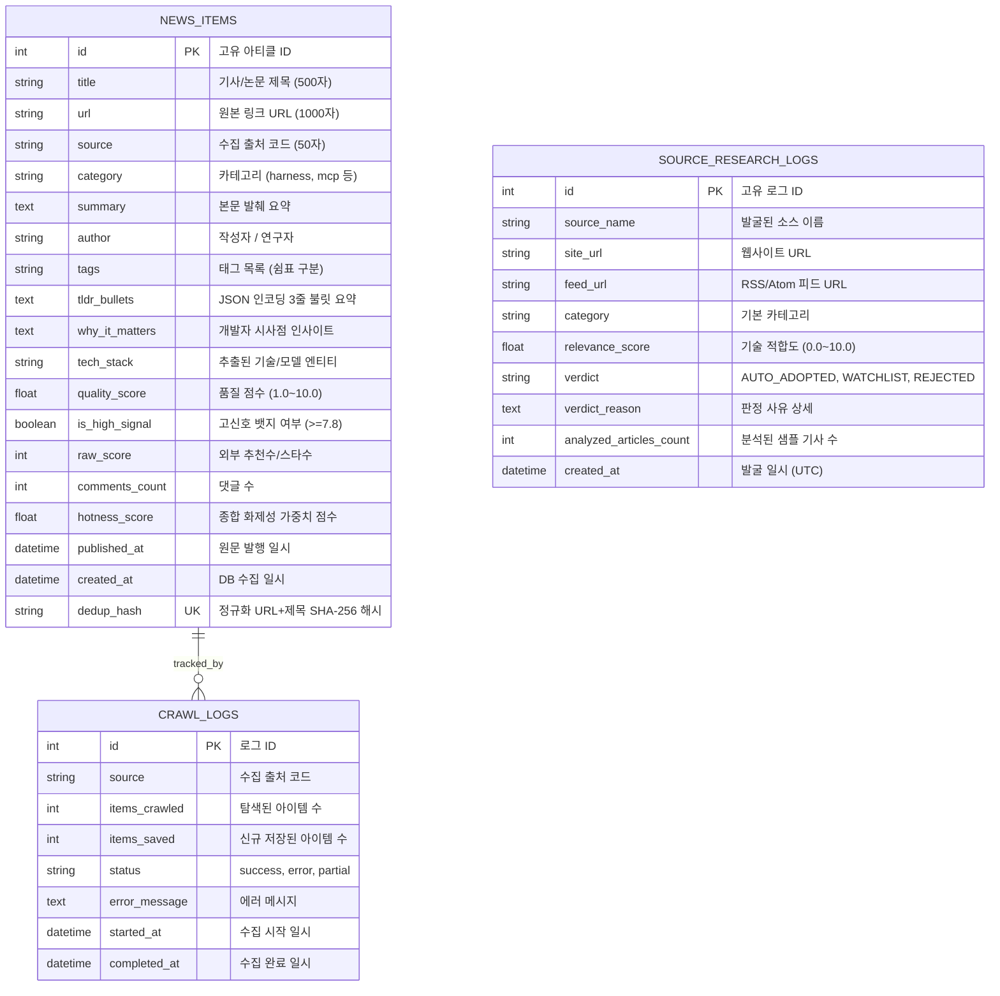

# AgentLens 백엔드 시스템 및 데이터베이스 설계서 (System Design & ERD)

- **작성일자**: 2026-09-15
- **작성자**: 백엔드 시스템 디자이너 (`system-designer`)
- **문서 버전**: v2.0
- **상태**: Approved

---

## 1. 백엔드 모듈 아키텍처 및 계층도 (Layered Architecture)

```
backend/
├── app/
│   ├── api/                 # FastAPI 엔드포인트 라우터 (REST API)
│   │   ├── news.py          # 피드 조회, 단건 상세, Ask AI, 즉시 수집
│   │   ├── briefing.py      # 일일 브리핑, Notion/이메일 익스포트, 연동 테스트
│   │   ├── sources.py       # RSS 피드 및 GitHub 레포 등록/토글/삭제
│   │   ├── research.py      # AI Deep Researcher 자율 소스 탐색 API
│   │   ├── schedule.py      # APScheduler 현황 조회 및 즉시 실행
│   │   ├── trends.py        # Tech Radar 트렌드 분석 데이터
│   │   ├── webhook.py       # 슬랙 및 디스코드 웹훅 설정/테스트
│   │   ├── stats.py         # 전체 통계 (카테고리별/출처별 수량)
│   │   ├── mcp.py           # FastMCP 서버 상태 및 설정 가이드
│   │   └── router.py        # /api 통합 프리픽스 라우터
│   ├── collectors/          # 데이터 수집기 엔진
│   │   ├── manager.py       # 병렬 비동기 수집 오케스트레이터
│   │   ├── rss.py           # RSS/Atom 피드 수집기
│   │   ├── github.py        # GitHub Releases/API 수집기
│   │   ├── arxiv.py         # arXiv 최신 AI 논문 수집기
│   │   ├── reddit.py        # Reddit AI 커뮤니티 수집기
│   │   ├── hackernews.py    # HackerNews AI 소식 수집기
│   │   └── huggingface.py   # HuggingFace 최신 모델/스페이스 수집기
│   ├── services/            # 순수 비즈니스 로직 서비스 레이어
│   │   ├── llm_processor.py # 듀얼 모드 LLM 품질 평가, 3줄 요약, 시사점 생성
│   │   ├── briefing_service.py # 일일 종합 브리핑 마크다운 합성
│   │   ├── notion_service.py   # Notion REST API 블록 생성
│   │   ├── email_service.py    # SMTP HTML 뉴스레터 전송
│   │   ├── webhook_service.py  # Slack/Discord 웹훅 디스패처
│   │   ├── sources_service.py  # sources.json 파일 CRUD 관리
│   │   ├── deep_researcher.py  # 자율 소스 발굴 및 자동 채택 엔진
│   │   └── trend_service.py    # Tech Radar 기술 스택 랭킹 산출
│   ├── models/              # SQLAlchemy 2.0 비동기 DB 엔티티
│   │   └── news.py          # NewsItem, CrawlLog, SourceResearchLog
│   ├── schemas/             # Pydantic v2 DTO 및 요청/응답 검증 스키마
│   │   └── news.py          # NewsItemResponse, DailyBriefingResponse 등
│   ├── mcp/                 # FastMCP 서버 구현체
│   │   └── server.py        # Claude Desktop 연동용 로컬 RPC 도구 세트
│   ├── config.py            # Pydantic BaseSettings 및 config.json 동적 바인딩
│   ├── database.py          # aiosqlite 비동기 엔진 및 세션 팩토리
│   ├── scheduler.py         # APScheduler 백그라운드 크론 작업
│   └── main.py              # FastAPI 메인 인스턴스, CORS, Lifespan
└── tests/                   # pytest 단위/통합 테스트 (49 passed)
```

---

## 2. 데이터베이스 엔티티 관계도 (Mermaid ERD)



---

## 3. 인덱싱 및 쿼리 최적화 전략 (Indexing Strategy)

| 테이블명 | 인덱스 컬럼 | 인덱스 유형 | 생성 목적 및 대상 쿼리 |
| :--- | :--- | :--- | :--- |
| `news_items` | `dedup_hash` | UNIQUE B-Tree | 수집 시 중복 아티클을 $O(1)$로 즉시 감지하여 버림 |
| `news_items` | `(category, published_at DESC)` | Composite B-Tree | 카테고리 필터링 후 최신순 목록 페이징 가속화 |
| `news_items` | `(category, hotness_score DESC)`| Composite B-Tree | 카테고리별 화제성 랭킹 순 정렬 가속화 |
| `news_items` | `(is_high_signal, hotness_score)` | Composite B-Tree | ⭐️ Must Read 전용 피드 정렬 가속화 |
| `source_research_logs` | `created_at DESC` | B-Tree | 자율 소스 리서처의 최근 발굴 이력 조회 최적화 |

---

## 4. 트랜잭션 및 동시성 제어 정책 (Concurrency & Transactions)

1. **SQLite WAL (Write-Ahead Logging) 모드 강제**:
   - `PRAGMA journal_mode=WAL;`을 적용하여 백그라운드 크롤러가 대량의 기사를 INSERT/UPDATE하는 동안에도 프론트엔드의 피드 SELECT 쿼리가 락(Lock)에 걸리지 않고 즉시 응답하도록 보장합니다.
2. **원자적 수집 트랜잭션**:
   - 수집 매니저는 각 출처별 수집 완료 시점마다 독립적인 `async with AsyncSessionLocal()` 세션을 열어 배치 단위로 커밋(Commit)하며, 특정 출처 파싱 에러가 타 출처 트랜잭션으로 전파되지 않도록 롤백 격리합니다.
3. **온디맨드 수집 동시성 방어 (Mutual Exclusion)**:
   - `collector_manager.is_running` 상태 플래그를 통해 다중 사용자가 동시에 "즉시 수집" 버튼을 누르더라도 409 Conflict를 반환하여 중복 프로세스 스폰을 차단합니다.

---

## 5. RESTful API 엔드포인트 카탈로그 (Endpoint Catalog)

상세 OpenAPI 스키마는 [`02_OPENAPI_SPEC.yaml`](./02_OPENAPI_SPEC.yaml)을 참조합니다.

| Method | Endpoint Path | Summary | Tags |
| :---: | :--- | :--- | :--- |
| `GET` | `/api/news` | 피드 목록 조회 (다차원 필터링, 정렬, 검색, 페이징) | news |
| `GET` | `/api/news/{id}` | 특정 아티클 단건 상세 조회 | news |
| `POST`| `/api/news/{id}/ask` | 특정 아티클 대상 대화형 AI 심층 질의응답 (Ask AI) | news |
| `POST`| `/api/news/reset` | 데이터베이스 초기화 및 초기 시드 수집 | news |
| `GET` | `/api/briefing/latest` | 오늘의 AI 종합 브리핑 조회 (없을 시 자동 생성) | briefing |
| `POST`| `/api/briefing/generate` | 오늘의 AI 종합 브리핑 강제 재생성 | briefing |
| `POST`| `/api/briefing/export/notion` | Notion 워크스페이스로 브리핑 페이지 생성 | briefing |
| `POST`| `/api/briefing/export/email` | 지정된 수신자에게 브리핑 이메일 발송 | briefing |
| `GET` | `/api/briefing/settings` | Notion, SMTP, Webhook 연동 설정값 조회 (마스킹) | briefing |
| `PUT` | `/api/briefing/settings` | 연동 설정값 갱신 및 config.json 저장 | briefing |
| `GET` | `/api/sources` | 등록된 모든 RSS/GitHub 소스 목록 및 활성 통계 | sources |
| `POST`| `/api/sources/rss` | 신규 RSS/Atom 피드 등록 | sources |
| `POST`| `/api/sources/github` | 신규 GitHub 모니터링 저장소 등록 | sources |
| `PATCH`| `/api/sources/{source_type}/{item_id}/toggle` | 소스 수집 활성화/비활성화 토글 | sources |
| `DELETE`| `/api/sources/{source_type}/{item_id}` | 등록된 소스 삭제 | sources |
| `GET` | `/api/research/logs` | AI Deep Researcher 탐색 이력 조회 | research |
| `POST`| `/api/research/run` | 키워드 기반 자율 소스 발굴/채택 작업 트리거 | research |
| `GET` | `/api/schedule` | 정기 수집 크론 현황 및 다음 실행 시간 조회 | schedule |
| `POST`| `/api/schedule/run-now` | 즉시 수동 수집 트리거 | schedule |
| `GET` | `/api/trends/tech-radar` | 4대 카테고리별 언급 기술 스택 랭킹 (Tech Radar) | trends |
| `POST`| `/api/webhook/test` | 슬랙/디스코드 웹훅 테스트 알림 전송 | webhook |
| `GET` | `/api/stats` | 전체 소식 수량, 카테고리별/출처별 통계 | stats |
| `GET` | `/api/mcp/status` | FastMCP 서버 가이드 및 설정 스니펫 | mcp |
| `GET` | `/health` | 서버 헬스체크 및 수집기 동작 상태 | system |
