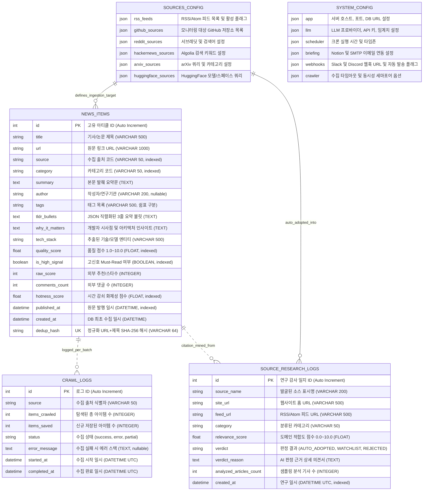

# AgentLens 백엔드 시스템 및 데이터베이스 설계서 (System Design & ERD)

- **작성일자**: 2026-09-16
- **작성자**: 백엔드 시스템 디자이너 (`system-designer`)
- **문서 버전**: v2.1
- **상태**: Approved
- **기반 규격**: [시스템 디자인 템플릿](file:///Users/wonyoung/workspace/ozplayground/agentlens/docs/templates/06_SYSTEM_DESIGN_TEMPLATE.md), [OpenAPI 3.1 스펙](file:///Users/wonyoung/workspace/ozplayground/agentlens/docs/system-designer/02_OPENAPI_SPEC.yaml)

---

## 1. 백엔드 모듈 아키텍처 및 계층도 (Layered Architecture)

AgentLens 백엔드는 관심사 분리(Separation of Concerns)와 단일 책임 원칙(Single Responsibility Principle)을 준수하는 **엄격한 3계층 아키텍처(Router -> Service -> Model/Storage)**를 채택하고 있습니다.

```
┌───────────────────────────────────────────────────────────────────────────────────┐
│                           1. Router Layer (FastAPI Routers)                       │
│  [app/api/] news, briefing, sources, research, schedule, trends, webhook, stats, mcp │
└────────────────────────────────────────┬──────────────────────────────────────────┘
                                         │ DTOs (Pydantic v2 Schemas)
                                         ▼
┌───────────────────────────────────────────────────────────────────────────────────┐
│                      2. Service & Collector Business Layer                        │
│  [app/services/]                                                                  │
│    ├── llm_processor.py   : 듀얼 모드 LLM 평가, 3줄 요약, 시사점, 엔티티 추출, Ask AI │
│    ├── briefing_service.py: 일일 4섹션 종합 브리핑 마크다운 합성 및 액션 아이템 생성  │
│    ├── deep_researcher.py : 자율 소스 인용 마이닝, 실증 검증, LLM 4축 채점, 자동 채택   │
│    ├── source_researcher.py: URL 피드 자동 감지(Probing) 및 키워드 소스 발굴          │
│    ├── sources_service.py : sources.json 단일 진실 소스 CRUD 및 활성/비활성 토글       │
│    ├── trend_service.py   : Tech Radar 4대 카테고리 집계 및 급상승(Velocity) 계산     │
│    ├── webhook_service.py : Slack Block Kit & Discord Rich Embeds 알림 디스패치    │
│    ├── notion_service.py  : Notion REST API 블록 생성 및 브리핑 페이지 발행          │
│    └── email_service.py   : SMTP TLS 기반 반응형 HTML 브리핑 뉴스레터 전송          │
│  [app/collectors/]                                                                │
│    └── manager.py (병렬 비동기 수집, 세마포어 제어, 소스별 즉시 배치 커밋, 실시간 진행도) │
│        ├── rss.py, github.py, arxiv.py, reddit.py, hackernews.py, huggingface.py  │
└────────────────────────────────────────┬──────────────────────────────────────────┘
                                         │ AsyncSession / File I/O
                                         ▼
┌───────────────────────────────────────────────────────────────────────────────────┐
│                     3. Model & Data Storage Layer (Persistence)                   │
│  [app/models/] news.py (SQLAlchemy 2.0 비동기 모델)                                 │
│    ├── NewsItem           : 정규화 아티클, 품질 점수, TL;DR, 시사점, Dedup 해시     │
│    ├── CrawlLog           : 출처별 수집 감사 일지, 성공/실패, 저장 건수               │
│    └── SourceResearchLog  : 자율 딥 리서치 평가 일지, 판정(AUTO_ADOPTED 등), 판정 사유 │
│  [app/database.py] aiosqlite 비동기 커넥션 풀 & SQLite WAL (Write-Ahead Logging)    │
│  [Config Files] sources.json (수집 소스 통합 관리), config.json (전역 런타임 설정)      │
└───────────────────────────────────────────────────────────────────────────────────┘
```

### 1.1 디렉토리 구조 및 계층별 책임

```
backend/
├── app/
│   ├── api/                      # 1계층: API 라우트 및 HTTP 핸들러 (FastAPI Routers)
│   │   ├── news.py               # 피드 조회, 단건 상세, Ask AI, 스트리밍, 전체 삭제, RSS XML
│   │   ├── briefing.py           # 오늘의 브리핑 조회/생성, Notion/Email 전송 및 설정 관리
│   │   ├── sources.py            # sources.json 소스 목록/통계, RSS/GitHub 등록, 토글, 삭제
│   │   ├── research.py           # URL 자동 감지, 키워드 발굴, 자율 딥 리서치 실행/상태/감사로그
│   │   ├── schedule.py           # 크론 스케줄 현황, 실시간 수집 진행도, 즉시 수집, 클린 초기화
│   │   ├── trends.py             # Tech Radar 기술 스택 랭킹 및 급상승(Surging) 지표
│   │   ├── webhook.py            # Slack/Discord 웹훅 테스트 및 브리핑 즉시 전송
│   │   ├── stats.py              # 카테고리별/출처별 전체 통계
│   │   ├── mcp.py                # FastMCP 서버 정보 및 Claude Desktop 연동 설정 가이드
│   │   └── router.py             # /api 통합 프리픽스 라우터 마운트
│   ├── services/                 # 2계층: 순수 비즈니스 로직 및 통합 서비스
│   │   ├── llm_processor.py      # 품질 평가 게이트, 3줄 요약, Why It Matters, Ask AI
│   │   ├── briefing_service.py   # 상위 10건 선별 기반 일일 종합 브리핑 마크다운 합성
│   │   ├── deep_researcher.py    # 5단계 자율 딥 리서치 파이프라인 (인용 마이닝, 실증, 4축 평가)
│   │   ├── source_researcher.py  # 단일 URL 피드 자동 감지 및 키워드 기반 후보 발굴
│   │   ├── sources_service.py    # sources.json 파일 CRUD 관리 및 싱글톤 접근자
│   │   ├── trend_service.py      # tech_stack 엔티티 파싱, 카테고리 매핑, 급상승률 계산
│   │   ├── webhook_service.py    # Slack Block Kit / Discord Embed 페이로드 빌더 및 HTTP 전송
│   │   ├── notion_service.py     # Notion 블록 변환 및 페이지 생성 API 연동
│   │   └── email_service.py      # SMTP 기반 반응형 HTML 브리핑 메일 전송
│   ├── collectors/               # 2계층: 비동기 데이터 수집 엔진
│   │   ├── manager.py            # CollectorManager (점진적 배치 커밋, 진행도 트래커, Mutex)
│   │   ├── categorizer.py        # 4대 카테고리 분류, AI 도메인 필터링, 정규화 해시 생성
│   │   ├── rss.py                # RSS/Atom 피드 비동기 병렬 수집기 (asyncio.gather, Semaphore)
│   │   ├── github.py             # GitHub Releases / Search API 수집기
│   │   ├── arxiv.py              # arXiv cs.AI/cs.CL 최신 에이전트 논문 수집기
│   │   ├── reddit.py             # Reddit r/LocalLLaMA, r/MachineLearning 수집기
│   │   ├── hackernews.py         # HackerNews Algolia AI 키워드 수집기
│   │   └── huggingface.py        # HuggingFace 최신 모델/스페이스 수집기
│   ├── models/                   # 3계층: 데이터베이스 엔티티 (SQLAlchemy 2.0)
│   │   ├── __init__.py           # 모델 익스포트
│   │   └── news.py               # NewsItem, CrawlLog, SourceResearchLog
│   ├── schemas/                  # 계층 간 데이터 교환 객체 (Pydantic v2 DTOs)
│   │   ├── __init__.py           # 스키마 익스포트
│   │   └── news.py               # 요청/응답 검증 스키마 정의
│   ├── mcp/                      # FastMCP 서버 구현체
│   │   └── server.py             # Claude Desktop 로컬 도구 (harness, mcp, search, crawl)
│   ├── config.py                 # Pydantic BaseSettings & config.json 계층형 설정 로더
│   ├── database.py               # aiosqlite 비동기 엔진, 세션 팩토리, WAL 모드 설정
│   ├── scheduler.py              # APScheduler 정기 크론 (수집: 0,6,12,18 UTC / 리서치: 03,15 UTC)
│   └── main.py                   # FastAPI 인스턴스, CORS, Lifespan 초기 시딩, 에러 핸들러
├── tests/                        # 단위 및 통합 테스트 슈트 (Pytest 51개 전 항목 통과)
├── sources.json                  # 수집 대상 소스 통합 관리 파일 (Single Source of Truth)
└── config.json                   # 시스템 전역 JSON 설정 파일
```

---

## 2. 데이터베이스 엔티티 관계도 (Mermaid ERD)

AgentLens의 데이터 저장소는 SQLAlchemy 2.0 비동기 모델(`aiosqlite`)로 영속화되는 관계형 테이블과, 사용자가 직접 편집 가능한 루트 영속 파일(`sources.json`, `config.json`)의 유기적 조합으로 구성됩니다.



---

## 3. 인덱싱 및 쿼리 최적화 전략 (Indexing Strategy)

AgentLens는 대량의 기술 소식을 실시간 수집하면서도 프론트엔드의 다차원 필터링 및 페이징 요청에 서브 밀리초(sub-millisecond) 단위로 응답하기 위해 전략적인 B-Tree 복합 인덱스를 구축했습니다.

| 테이블명 | 인덱스 식별자 | 인덱스 컬럼 | 인덱스 유형 | 생성 목적 및 대상 쿼리 |
| :--- | :--- | :--- | :--- | :--- |
| `news_items` | `sqlite_autoindex_news_items_1` | `id` | PRIMARY KEY B-Tree | 단건 상세 조회 (`GET /api/news/{id}`) 및 AI 질의응답 |
| `news_items` | `ix_news_items_dedup_hash` | `dedup_hash` | UNIQUE B-Tree | 수집 시 기수집 아티클을 $O(1)$로 중복 감지하여 DB INSERT 생략 |
| `news_items` | `idx_category_published` | `(category, published_at DESC)` | Composite B-Tree | 카테고리 탭 선택 시 최신순 피드 정렬 페이징 가속화 |
| `news_items` | `idx_category_hotness` | `(category, hotness_score DESC)`| Composite B-Tree | 카테고리 탭 내 트렌딩(Hot) 정렬 피드 페이징 가속화 |
| `news_items` | `idx_high_signal` | `(is_high_signal, hotness_score DESC)` | Composite B-Tree | ⭐️ `Must Read (High Signal)` 전용 피드 조회 최적화 |
| `news_items` | `ix_news_items_source` | `source` | B-Tree | 출처별 필터링 (`source=github`, `source=rss_kr` 등) |
| `news_items` | `ix_news_items_quality_score`| `quality_score` | B-Tree | 품질 점수 기준 정렬 (`sort=quality`) 가속화 |
| `news_items` | `ix_news_items_published_at` | `published_at DESC` | B-Tree | 전역 최신순 정렬 및 일일 브리핑 24시간 타임윈도우 스캔 |
| `source_research_logs` | `ix_source_research_logs_created_at` | `created_at DESC` | B-Tree | 자율 딥 리서치 감사 일지 최신순 페이징 (`GET /api/research/audit-logs`) |
| `crawl_logs` | `ix_crawl_logs_id` | `id DESC` | B-Tree | 최근 수집 성공/실패 감사 이력 상위 5건 조회 (`GET /api/schedule/status`) |

---

## 4. 트랜잭션 및 동시성 제어 정책 (Concurrency & Transactions)

### 4.1 SQLite WAL (Write-Ahead Logging) 모드
- `PRAGMA journal_mode=WAL;` 및 `PRAGMA synchronous=NORMAL;`을 적용합니다.
- **효과**: 백그라운드 수집기나 딥 리서처가 대량의 기사를 배치 저장(Write)하는 중에도, 프론트엔드의 피드 조회나 검색(Read)이 락 경합 없이 동시 수행됩니다.

### 4.2 소스별 점진적 배치 커밋 (Progressive Incremental Commit)
- 전체 6개 수집기(RSS, GitHub, arXiv 등)가 모두 완료될 때까지 기다리는 '올-오어-나씽' 방식을 배제합니다.
- 각 소스별 수집이 완료되는 즉시 `async with AsyncSessionLocal()` 트랜잭션을 생성하여 DB에 커밋하고 진행 상태(`collector_manager.get_progress()`)를 갱신합니다.
- 특정 외부 API(예: GitHub 토큰 소진)에서 실패하더라도 해당 소스만 롤백 격리되며, 기 수집된 타 소스 데이터는 안전하게 보존됩니다.

### 4.3 온디맨드 수집 상호 배제 (Mutual Exclusion)
- `collector_manager.is_running` 플래그 및 `asyncio.Lock`을 통해 동시에 다중 요청이 유입되더라도 중복 크롤러 프로세스가 스폰되지 않도록 방어합니다.
- 수집 진행 중 재요청 시 `{"status": "already_running"}`을 즉시 응답합니다.

### 4.4 데이터 완전 초기화 원자성 (Atomic Data Reset)
- `POST /api/schedule/reset-and-collect` 및 `DELETE /api/news/all` 호출 시 단일 트랜잭션 내에서 `news_items`와 `crawl_logs`를 삭제한 후 커밋하여 데이터 정합성을 보장합니다.

---

## 5. RESTful API 엔드포인트 카탈로그 (Endpoint Catalog)

상세 OpenAPI 3.1 스펙 명세는 [`02_OPENAPI_SPEC.yaml`](./02_OPENAPI_SPEC.yaml)을 참조합니다.

| 도메인 | Method | Endpoint Path | Summary & Description | Request Body | Response Body |
| :--- | :---: | :--- | :--- | :--- | :--- |
| **News** | `GET` | `/api/news` | 피드 목록 조회 (다차원 필터링, 정렬, 검색, 페이징) | - | `NewsListResponse` |
| | `GET` | `/api/news/{id}` | 특정 소식 단건 상세 조회 | - | `NewsItemResponse` |
| | `POST` | `/api/news/{id}/ask` | 특정 소식 대상 AI 대화형 심층 질의응답 (Ask AI) | `AskQuestionRequest` | `AskQuestionResponse` |
| | `POST` | `/api/news/{id}/ask/stream` | Ask AI 실시간 답변 스트리밍 (SSE) | `AskQuestionRequest` | `text/event-stream` |
| | `DELETE`| `/api/news/all` | 데이터베이스 내 모든 소식 데이터 일괄 영구 삭제 | - | `GenericSuccessResponse` |
| | `GET` | `/api/news/feed/rss.xml` | 에이전트 뉴스 RSS 2.0 XML 피드 내보내기 | - | `application/xml` |
| **Briefing** | `GET` | `/api/briefing/today` | 오늘의 AI 종합 인텔리전스 브리핑 조회 (자동 합성) | - | `DailyBriefingResponse` |
| | `POST` | `/api/briefing/generate` | 오늘의 AI 종합 브리핑 강제 재생성 트리거 | - | `DailyBriefingResponse` |
| | `POST` | `/api/briefing/export/notion` | Notion 워크스페이스에 브리핑 페이지 생성/내보내기 | `NotionExportRequest` | `NotionExportResponse` |
| | `POST` | `/api/briefing/send/email` | 지정된 수신자에게 반응형 HTML 브리핑 이메일 전송 | `EmailSendRequest` | `EmailSendResponse` |
| | `POST` | `/api/briefing/test/notion` | Notion API 키 및 부모 페이지 ID 연동 테스트 | `TestNotionRequest` | `GenericSuccessResponse` |
| | `POST` | `/api/briefing/test/email` | SMTP 호스트 및 메일 발송 연결 테스트 | `TestEmailRequest` | `GenericSuccessResponse` |
| | `GET` | `/api/briefing/settings` | Notion, Email, Webhook 연동 설정값 조회 (마스킹) | - | `BriefingSettingsResponse` |
| | `POST` | `/api/briefing/settings` | 연동 설정값 갱신 및 `config.json` 영속 저장 | `BriefingSettingsUpdate` | `GenericSuccessResponse` |
| **Sources** | `GET` | `/api/sources` | 등록된 모든 수집 대상 소스 목록 및 활성 통계 반환 | - | `SourcesResponse` |
| | `POST` | `/api/sources/rss` | 신규 RSS/Atom 피드를 `sources.json`에 등록 | `AddRssRequest` | `GenericSuccessResponse` |
| | `POST` | `/api/sources/github` | 신규 GitHub 모니터링 저장소를 `sources.json`에 등록 | `AddGitHubRepoRequest` | `GenericSuccessResponse` |
| | `PATCH`| `/api/sources/{source_type}/{item_id}/toggle` | 특정 소스 또는 소스 유형 수집 활성화/비활성화 토글 | - | `GenericSuccessResponse` |
| | `DELETE`| `/api/sources/{source_type}/{item_id}` | 등록된 소스를 `sources.json`에서 영구 제거 | - | `GenericSuccessResponse` |
| **Research**| `POST` | `/api/research/inspect-url` | 임의 URL에서 피드 자동 감지 및 최신 글 프리뷰/채점 | `InspectUrlRequest` | `InspectUrlResponse` |
| | `POST` | `/api/research/discover` | 키워드 기반 신규 고품질 소스 후보 AI 발굴 추천 | `DiscoverRequest` | `DiscoverResponse` |
| | `POST` | `/api/research/register-candidate`| 발굴된 추천 소스를 `sources.json`에 원클릭 등록 | `RegisterCandidateRequest` | `GenericSuccessResponse` |
| | `GET` | `/api/research/status` | 자율 딥 리서치 엔진 현재 실행 상태 및 통계 조회 | - | `ResearchStatusResponse` |
| | `GET` | `/api/research/audit-logs` | 자율 딥 리서치 소스 평가/판정 감사 이력 목록 조회 | - | `ResearchAuditLogsResponse` |
| | `POST` | `/api/research/run-deep` | 백엔드 자율 딥 리서치 파이프라인 즉시 가동 트리거 | - | `DeepResearchTriggerResponse` |
| **Schedule**| `GET` | `/api/schedule/status` | 정기 수집 크론 현황, 다음 실행 시간, 최근 로그 | - | `ScheduleStatusResponse` |
| | `GET` | `/api/schedule/progress` | 점진적 실시간 수집 진행률 및 단계별 상태 조회 | - | `CrawlProgressResponse` |
| | `POST` | `/api/schedule/trigger` | 백그라운드 실시간 점진적 수집 즉시 기동 | - | `ScheduleTriggerResponse` |
| | `POST` | `/api/schedule/reset-and-collect`| 데이터 일괄 삭제 후 클린 재수집 즉시 기동 | - | `ResetAndCollectResponse` |
| **Trends** | `GET` | `/api/trends/radar` | 4대 영역 기술 스택 랭킹 및 급상승(Surging) 지표 | - | `TechRadarResponse` |
| **Webhook** | `POST` | `/api/webhook/test` | Slack / Discord 웹훅 테스트 메시지 전송 | `WebhookTestRequest` | `GenericSuccessResponse` |
| | `POST` | `/api/webhook/send-briefing` | 오늘의 브리핑을 서식화하여 지정 웹훅으로 즉시 전송 | `WebhookBriefingRequest`| `GenericSuccessResponse` |
| **Stats** | `GET` | `/api/stats` | 전체 소식 수, 카테고리별/출처별 누적 통계 | - | `StatsResponse` |
| **MCP** | `GET` | `/api/mcp/info` | FastMCP 도구 설명 및 Claude Desktop 연동 가이드 | - | `McpInfoResponse` |
| **System** | `GET` | `/` | 루트 서비스 정보 및 문서 링크 | - | `RootResponse` |
| | `GET` | `/health` | 서버 헬스체크 및 크롤러 실행 여부 | - | `HealthResponse` |
