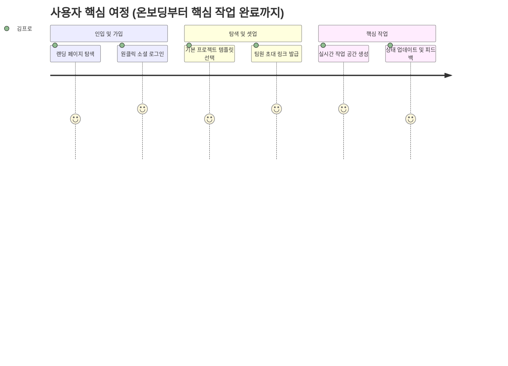

# [프로덕트명] 제품 요구사항 정의서 (Product Requirements Document - PRD)

- **작성일자**: YYYY-MM-DD
- **작성자**: 기획 명세 작성가 (`spec-writer`)
- **문서 버전**: v1.0
- **상태**: Draft / Review / Approved

---

## 1. 프로덕트 비전 및 문제 정의 (Problem Statement & Vision)
- **배경 (Background)**: 타깃 사용자가 겪고 있는 핵심 고통과 현재 대안들의 한계
- **문제 정의 (Problem Statement)**: 해결하고자 하는 본질적인 문제 2~3가지 정의
- **프로덕트 비전 (Vision)**: 문제를 해결함으로써 사용자에게 전달할 궁극적인 가치

---

## 2. 타깃 페르소나 및 유저 저니 맵 (Personas & User Journey)

### 2.1 대표 페르소나
- **페르소나명**: 김프로 (32세, 테크 리드 / 프로젝트 매니저)
- **주요 목표**: 팀원 간 커뮤니케이션 비용을 줄이고 작업 상태를 투명하게 추적
- **핵심 페인포인트**: 도구 간 데이터 파편화, 복잡한 설정, 잦은 컨텍스트 스위칭

### 2.2 핵심 유저 저니 (User Journey Map)

---

## 3. 기능 요구사항 및 MoSCoW 우선순위 매트릭스 (Feature Requirements)

| 요구사항 ID | 도메인 | 요구사항 명칭 및 상세 설명 | 우선순위 (MoSCoW) | 대응 비즈니스 가치 |
| :--- | :--- | :--- | :---: | :--- |
| `REQ-AUTH-001` | 계정/인증 | 소셜 로그인(구글/깃허브) 및 세션 유지 | **Must Have** | 진입 장벽 제거 |
| `REQ-CORE-001` | 핵심 작업 | 실시간 대시보드 및 카드 단위 상태 관리 | **Must Have** | 핵심 프로덕트 가치 제공 |
| `REQ-NOTI-001` | 알림/피드백 | 주요 상태 변경 시 인앱 토스트 및 실시간 알림 | **Should Have** | 팀 협업 반응성 극대화 |
| `REQ-SETT-001` | 설정/관리 | 다크모드 및 개인화 환경 설정 | **Could Have** | 사용자 사용 만족도 향상 |
| `REQ-ADV-001` | 확장/고급 | 서드파티 웹훅 및 외부 연동 API | **Won't Have (v1)** | v2 로드맵으로 이관 |

---

## 4. 핵심 성공 지표 (KPI / Success Metrics)

| 지표명 | 측정 방식 / 기준 | 목표치 (Target) |
| :--- | :--- | :--- |
| **온보딩 완료율** | 가입 시작 $\rightarrow$ 첫 프로젝트 생성 비율 | $\ge 80\%$ |
| **핵심 작업 활성도 (DAU/MAU)** | 주 3회 이상 핵심 대시보드 진입 사용자 비율 | $\ge 40\%$ |
| **작업 완수 소요시간** | 첫 작업 생성부터 완료까지의 평균 시간 | $\le 3\text{분}$ |
| **에러 발생률** | 전체 세션 대비 비정상 에러 경험 세션 비율 | $\le 0.5\%$ |

---

## 5. 비기능적 요구사항 (Non-Functional Requirements)
- **성능 (Performance)**: 주요 화면 첫 렌더링(LCP) 1.5초 이내, API 응답 시간 95th 백분위수 200ms 이하
- **보안 (Security)**: 전 구간 HTTPS 통신, 민감 정보 환경변수 분리, CSRF/XSS 방어
- **호환성 (Compatibility)**: 모바일(375px~), 태블릿, 데스크톱(최대 4K) 반응형 완전 지원
