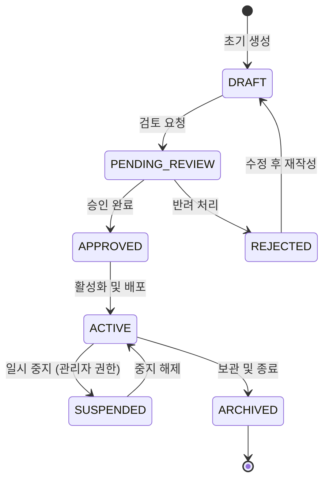

# [프로덕트명] 비즈니스 정책 및 전역 예외 처리 명세서 (Policy & Edge Cases)

- **작성일자**: YYYY-MM-DD
- **작성자**: 기획 명세 작성가 (`spec-writer`)
- **문서 버전**: v1.0
- **상태**: Draft / Review / Approved

---

## 1. 핵심 엔티티 상태 전이 머신 (State Machine Policies)

시스템 내 핵심 엔티티(예: 사용자 상태, 주문/작업 상태, 세션 상태)의 생명주기 및 전이 조건을 명세합니다.

### 상태 전이 매트릭스 및 권한 규칙
| 현재 상태 | 대상 상태 | 전이 트리거 이벤트 | 필수 사전 조건 | 실행 가능 권한 |
| :--- | :--- | :--- | :--- | :--- |
| `DRAFT` | `PENDING_REVIEW` | 검토 요청 버튼 클릭 | 필수 항목 100% 입력 완료 | 작성자 본인 |
| `PENDING_REVIEW` | `APPROVED` | 승인 버튼 클릭 | 관리자 리뷰 통과 | 워크스페이스 관리자 |
| `PENDING_REVIEW` | `REJECTED` | 반려 사유 입력 후 반려 | 반려 사유 10자 이상 기재 | 워크스페이스 관리자 |
| `APPROVED` | `ACTIVE` | 배포 트리거 발생 | 종속 리소스 검증 통과 | 시스템 자동 / 관리자 |

---

## 2. 공통 비즈니스 제약 및 유효성 검증 정책 (Global Business Policies)

### 2.1 문자열 및 텍스트 정책
- **특수문자 허용 범위**: 이름 및 제목은 알파벳, 숫자, 한글, 언더바(`_`), 하이픈(`-`)만 허용하며 스크립트 태그(`XSS 위험 문자`)는 자동 이스케이프 처리합니다.
- **공백 처리**: 시작과 끝의 공백(Trim)은 시스템 인입 시 자동 제거되며, 연속된 2개 이상의 공백은 단일 공백으로 치환합니다.

### 2.2 시간 및 타임존 정책
- 모든 데이터베이스 저장은 **UTC 기준 ISO 8601** 형식(`YYYY-MM-DDTHH:mm:ssZ`)으로 기록합니다.
- 클라이언트 화면 표시 시에는 사용자의 로컬 브라우저 타임존을 감지하여 표기합니다.

---

## 3. 전역 엣지 케이스 및 장애 복구 UX 가이드 (Global Edge Cases)

| 장애 / 예외 유형 | 감지 방식 | 사용자 경험(UX) 복구 처리 방식 |
| :--- | :--- | :--- |
| **오프라인 / 통신 단절** | 브라우저 `navigator.onLine` 감지 | 상단 고정 노란색 배너 노출, 로컬 변경사항 IndexedDB 임시 저장 |
| **토큰 만료 (401)** | API 인터셉터 응답 코드 | 백그라운드 Refresh Token 갱신 시도, 실패 시 작업 데이터 보존 후 로그인 모달 |
| **동시 편집 충돌 (409)** | 낙관적 락(Version mismatch) | "다른 사용자가 최신 상태를 수정했습니다" 얼럿 후 차이점(Diff) 비교 UI 노출 |
| **대량 데이터 부하** | 조회 건수 100건 초과 | 무한 스크롤 가상화(Virtualization) 적용으로 DOM 렌더링 성능 보호 |
