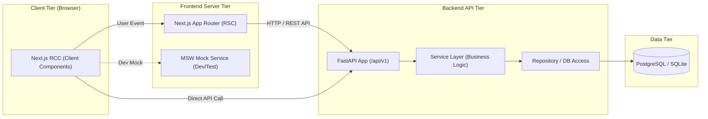

# [ADR-001] 풀스택 시스템 아키텍처 및 핵심 기술 스택 결정 레코드

- **작성일자**: YYYY-MM-DD
- **작성자**: 풀스택 아키텍트 (`fullstack-architect`)
- **상태**: PROPOSED / APPROVED / SUPERSEDED
- **영향 범위**: Frontend (Next.js), Backend (FastAPI), Database, Deployment

---

## 1. 배경 및 컨텍스트 (Context & Problem Statement)
- 기획 산출물(`01_PRD.md`, `02_FUNCTIONAL_SPECIFICATION.md`)을 충족하기 위한 기술적 요구사항 분석
- 확장성, 개발 생산성, 초기 로딩 성능(Core Web Vitals), 타입 안전성, 유지보수성을 동시에 확보할 풀스택 기술 스택 및 아키텍처 선정 필요

---

## 2. 고려된 기술 스택 후보군 (Considered Alternatives)

| 계층 | 후보 1 (선정안) | 후보 2 (대안) | 장단점 비교 및 선정 사유 |
| :--- | :--- | :--- | :--- |
| **Frontend** | **Next.js (React, TypeScript)** | SPA (Vite + React) | Next.js는 RSC(Server Components)를 통한 번들 최적화 및 SEO/초기 로딩 우위 |
| **Backend** | **Python (FastAPI)** | Node.js (Express / NestJS) | FastAPI는 비동기 처리, Pydantic 기반 엄격한 스키마 검증 및 자동 OpenAPI 문서화 탁월 |
| **데이터베이스** | **PostgreSQL (SQLite dev)** | MongoDB / NoSQL | 관계형 데이터 무결성 보장 및 추후 벡터/전문 검색 확장 용이 |
| **상태/통신** | **TanStack Query / MSW** | Redux Toolkit | 서버 상태 캐싱, 낙관적 업데이트, MSW 기반 프론트/백 격리 개발 극대화 |

---

## 3. 최종 아키텍처 결정 사항 (Decision)

### 3.1 풀스택 전체 시스템 토폴로지

### 3.2 핵심 아키텍처 원칙
1. **RSC vs RCC 경계 원칙**: 데이터 페칭 및 정적 마크업은 Server Component로 유지하고, 인터랙션(상태, 이벤트 리스너) 컴포넌트만 `'use client'` 선언
2. **계층형 백엔드 아키텍처 (Layered Architecture)**:
   - `Router (API Layer)` $\rightarrow$ `Service (Business Layer)` $\rightarrow$ `Model / Schema (Domain Layer)` 철저히 분리
3. **엄격한 환경변수 거버넌스**:
   - 백엔드는 `pydantic-settings`의 `BaseSettings`로 런타임 타입 검증
   - 프론트엔드는 Zod 기반의 스키마 검증 모듈을 통해 빌드 타임 환경변수 누락 차단

---

## 4. 결과 및 트레이드오프 (Consequences)
- **긍정적 영향**:
  - 프론트와 백엔드가 독립적으로 TDD 가능
  - OpenAPI 규격과 TypeScript 인터페이스의 100% 정합성 유지
  - 뛰어난 초기 로딩 속도와 유지보수성 확보
- **수용된 제약사항**:
  - React Server Components와 Client Components 간의 Props 직렬화 제약 고려 필요
