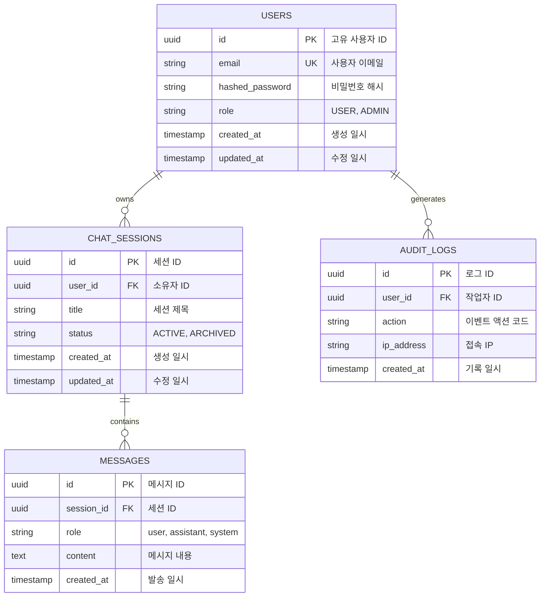

# [시스템명] 백엔드 시스템 및 데이터베이스 설계서 (System Design & ERD)

- **작성일자**: YYYY-MM-DD
- **작성자**: 백엔드 시스템 디자이너 (`system-designer`)
- **문서 버전**: v1.0
- **상태**: Draft / Review / Approved

---

## 1. 백엔드 모듈 아키텍처 및 계층도 (Layered Architecture)

```
backend/
├── src/
│   ├── api/             # API 라우트 및 엔드포인트 핸들러 (FastAPI Routers)
│   ├── core/            # 전역 설정(Settings), 보안, 의존성 주입(Dependencies)
│   ├── models/          # Pydantic Schemas & DB Entities
│   └── services/        # 순수 비즈니스 로직 및 트랜잭션 관리
└── tests/               # pytest 단위 및 통합 테스트 슈트
```

---

## 2. 데이터베이스 엔티티 관계도 (Mermaid ERD)



---

## 3. 인덱싱 및 쿼리 최적화 전략 (Indexing Strategy)

| 테이블명 | 인덱스 컬럼 | 인덱스 유형 | 생성 목적 및 대상 쿼리 |
| :--- | :--- | :--- | :--- |
| `USERS` | `email` | UNIQUE B-Tree | 로그인 시 이메일 단건 조회 가속화 |
| `CHAT_SESSIONS` | `(user_id, updated_at DESC)` | Composite B-Tree | 특정 사용자의 최근 세션 목록 역순 정렬 조회 |
| `MESSAGES` | `(session_id, created_at ASC)` | Composite B-Tree | 세션 내 대화 이력 시간순 페이징 조회 |

---

## 4. 트랜잭션 및 동시성 제어 정책 (Concurrency & Transactions)
- **트랜잭션 격리 수준**: Read Committed 기본 적용
- **동시 갱신 방어**: 세션 갱신 시 낙관적 락(Optimistic Lock - `version` 필드) 활용
- **원자성 보장**: 서비스 레이어 단위로 세션 컨텍스트 매니저를 통한 Commit/Rollback 일원화

---

## 5. RESTful API 엔드포인트 명세 목록 (Endpoint Catalog)

상세 YAML 스펙은 [`02_OPENAPI_SPEC.yaml`](./02_OPENAPI_SPEC.yaml)을 참조합니다.

| Method | Endpoint Path | Summary | Auth | Request Body | Response Body |
| :---: | :--- | :--- | :---: | :--- | :--- |
| `POST` | `/api/v1/auth/login` | 사용자 로그인 | Public | `LoginRequest` | `TokenResponse` |
| `GET` | `/api/v1/chats` | 사용자의 세션 목록 조회 | Bearer | - | `List[ChatSessionResponse]` |
| `POST` | `/api/v1/chats` | 신규 대화 세션 생성 | Bearer | `ChatCreateRequest` | `ChatSessionResponse` |
| `POST` | `/api/v1/chats/{id}/messages`| 메시지 전송 및 저장 | Bearer | `MessageCreateRequest` | `MessageResponse` |
