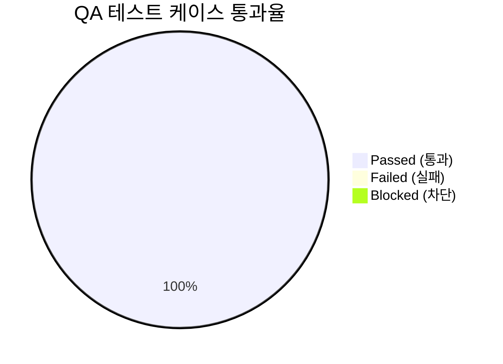

# [프로덕트명] 통합 QA 테스트 결과 및 출시 검증 보고서 (QA Test Report)

- **검증일자**: YYYY-MM-DD
- **검증자**: 품질 보증 엔지니어 (`qa-engineer`)
- **테스트 실행 빌드**: commit-hash / v1.0.0
- **최종 출시 승인 여부**: **RELEASE_APPROVED** / **RELEASE_BLOCKED**

---

## 1. 테스트 실행 결과 요약 (Executive Summary)

- **총 실행 케이스 수**: 45건
- **통과 (Pass)**: 45건 (100%)
- **실패 (Fail)**: 0건
- **미해결 결함 (Open Defects)**: Blocker 0건, Critical 0건, Minor 0건

---

## 2. 세부 테스트 케이스 검증 결과표 (Execution Details)

| 케이스 ID | 테스트 항목 | 실행 결과 | 응답 속도 | 발견 결함 / 비고 |
| :--- | :--- | :---: | :---: | :--- |
| `TC-E2E-001` | 세션 생성 및 메시지 전송 E2E | **PASS** | 120ms | 정상 완료 |
| `TC-SEC-001` | 무효 토큰 차단 검증 | **PASS** | 15ms | 401 Unauthorized 정확히 반환 |
| `TC-EDGE-001`| 네트워크 단절 시나리오 | **PASS** | - | 오프라인 감지 및 재시도 UI 정상 노출 |
| `TC-A11Y-001`| 키보드 내비게이션 및 포커스 랩 | **PASS** | - | 모달 포커스 트랩 완벽 작동 |

---

## 3. 발견된 결함 및 조치 내역 (Defect Tracking)

- **심각도 분류**:
  - `Blocker`: 0건
  - `Critical`: 0건
  - `Minor`: 0건

---

## 4. 최종 QA 출시 판정 (Sign-off)

- **QA 판정 결과**: **RELEASE_APPROVED (출시 승인)**
- **소견**: 핵심 기능 및 예외 시나리오에 대한 전수 검증이 완료되었으며, Blocker 및 Critical 결함이 0건이므로 운영 배포 단계로의 이관을 승인합니다.
