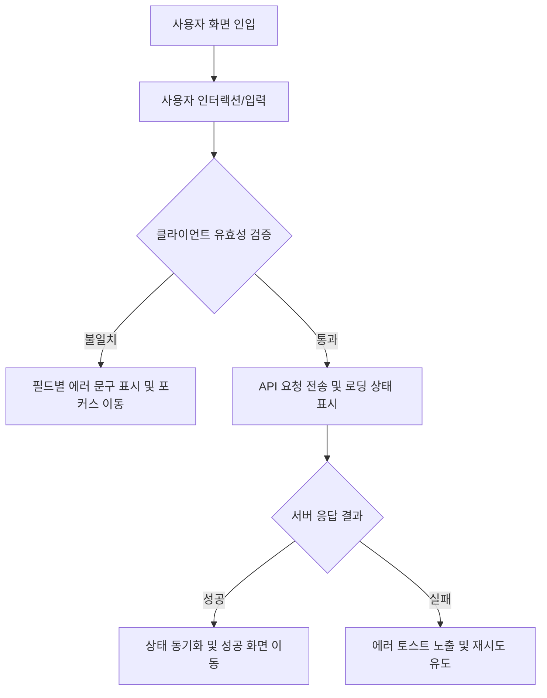

# [도메인명] 상세기능정의서 (Modular FSD)

- **도메인**: [예: 계정/인증, 메인 대시보드, 핵심 작업 등]
- **작성자**: 기획 명세 작성가 (`spec-writer`)
- **문서 버전**: v1.0
- **상태**: Draft / Review / Approved

---

## 단위 기능 상세 명세 (단위기능별 7대 상세 명세 완비)

---

### [FUNC-도메인-001] 기능명 기재

#### 1. 기본 정보
- **기능명**: [예: 소셜 간편 로그인 및 신규 회원 자동 가입]
- **기능 ID**: `FUNC-도메인-001`
- **대응 요구사항 ID**: `REQ-도메인-001`
- **대상 화면 코드**: `SCR-도메인-001`
- **우선순위**: Must Have / Should Have / Could Have
- **관련 액터 (Actor)**: 일반 사용자 / 관리자 / 비회원

#### 2. 사전 조건 (Pre-conditions)
1. 사용자가 해당 화면(`SCR-도메인-001`)에 정상 진입한 상태
2. 네트워크 통신이 가능한 상태
3. 선행 필수 데이터(예: 인증 토큰 또는 권한)가 유효한 상태

#### 3. 사용자 인터랙션 및 시스템 동작 흐름과 플로우차트 (Step-by-Step Flow & Flowchart)
1. 사용자가 특정 UI 요소(예: 버튼, 입력창)를 조작한다.
2. 시스템은 입력값의 정합성을 클라이언트 레벨에서 1차 검증한다.
3. 시스템은 백엔드 서비스로 비즈니스 요청을 전달한다.
4. 백엔드 처리 결과에 따라 시스템은 다음과 같이 분기한다:
   - **성공 시**: 상태를 갱신하고 대상 화면(`SCR-xxx-002`)으로 전환하며 성공 피드백(토스트/배너)을 노출한다.
   - **실패 시**: 기존 화면 상태를 유지하고 구체적인 오류 원인과 복구 액션을 사용자에게 안내한다.

#### 4. 화면 표시 및 입력 데이터 항목 명세 (UI Data Elements - 8대 표준 컬럼)
| 항목명 | 화면 표시/입력 구분 | UI 컴포넌트 | 필수 여부 | 데이터 타입 / 제약 | 기본값 | 유효성 검증 규칙 (Validation) | 노출/수정 조건 |
| :--- | :---: | :--- | :---: | :--- | :---: | :--- | :--- |
| [필드명 1] | 사용자 입력 | Text Input | 필수 | String / 2~50자 | 빈 값 | 정규식 `^[가-힣a-zA-Z0-9]+$` 준수 | 상시 활성화 |
| [필드명 2] | 선택 | Select Box | 필수 | Enum ('OPTION_A', 'OPTION_B') | OPTION_A | 유효한 옵션 코드값 매칭 | 권한 확인 후 활성화 |
| [필드명 3] | 노출 전용 | Badge / Label | - | String / 읽기 전용 | - | 서버 조회 데이터 바인딩 | 조회 결과 존재 시 |

#### 5. 비즈니스 규칙 (Business Rules)
- **BR-도메인-001-1**: [규칙 명세: 예 - 동일한 식별자로 중복 생성을 시도할 경우 중복 방지 규칙에 의해 거부되어야 함]
- **BR-도메인-001-2**: [규칙 명세: 예 - 입력 금액은 1회 최소 1,000원에서 최대 1,000,000원 한도를 초과할 수 없음]

#### 6. 예외 처리 및 엣지 케이스 (Edge Cases & Exception Handling)
| 발생 상황 (Edge Case Scenario) | 화면 반응 및 시스템 처리 방식 | 사용자 안내 메시지 |
| :--- | :--- | :--- |
| 네트워크 연결이 불안정하거나 단절된 경우 | 로딩 스피너 종료 후 재시도 버튼이 포함된 경고 모달 표시 | "네트워크 연결이 원활하지 않습니다. 다시 시도해주세요." |
| 버튼 연타로 인한 중복 요청 인입 | 1회 클릭 시 즉시 버튼 비활성화(Debounce) 및 로딩 처리 | (시스템 차단으로 중복 요청 방지) |
| 세션이 만료된 상태에서 작업 제출 시 | 현재 작업 내용을 로컬 스토리지에 임시 보존 후 로그인 모달 노출 | "로그인 세션이 만료되었습니다. 다시 로그인해주세요." |
| 데이터가 존재하지 않는 경우 (Empty State) | 빈 화면 대신 초기 유도 안내 일러스트와 생성 CTA 버튼 표시 | "아직 생성된 항목이 없습니다. 첫 항목을 등록해보세요." |

#### 7. 비즈니스 에러 코드 매핑
| 비즈니스 에러 코드 | 발생 사유 | HTTP 상태 코드 매핑 | 클라이언트 표시 형태 |
| :--- | :--- | :---: | :--- |
| `ERR_INVALID_PAYLOAD` | 요청 파라미터 유효성 검증 실패 | 400 Bad Request | 입력 필드 하단 인라인 붉은색 에러 |
| `ERR_UNAUTHORIZED` | 인증 토큰 부재 또는 세션 만료 | 401 Unauthorized | 로그인 유도 팝업 모달 |
| `ERR_DUPLICATE_RESOURCE` | 리소스 고유 키 중복 발생 | 409 Conflict | 토스트 메시지 알림 |
